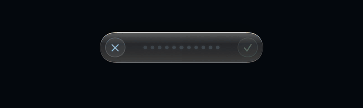
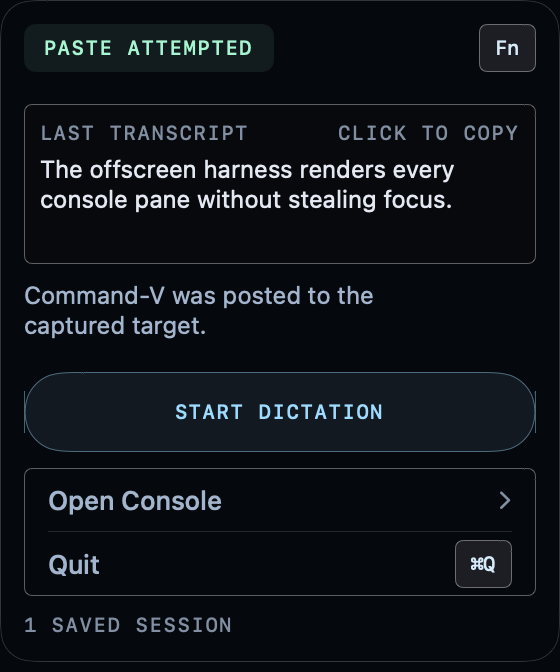

<div align="center">

# 👽 Voiceour

### Tap `fn` to dictate where your cursor is.

**Voiceour is a local-first dictation app for macOS.** It lives in the menu bar, records one utterance, transcribes it on your Mac, cleans it deterministically, and delivers it to the app you are using.

English only. No account, telemetry, credential, or cloud transcription.

<br>


[](../../actions/workflows/ci.yml)

<br>



<sub><i>The compact island follows the focused app and stays visible through delivery.<br>
On macOS 26 the live surface uses system Liquid Glass; older systems use the painted fallback.</i></sub>

</div>

---

## What happens when you tap `fn`

```text
   TAP       Tap Fn / Globe once. Do not hold it or combine it with another key.
    |
   SPEAK     A movable island appears near the focused window. It says WARMING
    |        until the selected microphone produces real signal, then shows a waveform.
    |
   STOP      Tap Fn / Globe again, press the finish control, or let auto-stop finish.
    |        Voiceour finalizes one WAV and performs one final decode.
    |
   CLEAN     Deterministic cleanup removes configured fillers and canonicalizes
    |        protected glossary terms such as kubectl, --no-config, p95, and codenames.
    |
   DELIVER   The text is written to the clipboard. Cmd-V is attempted only in a
             verified normal-text destination; risky destinations remain copy-only.
```

There is no wake word, background listener, live transcript line, or second model pass over the text.

## First real launch

A fresh install uses real local Parakeet ASR by default. The first launch downloads the pinned 1.26 GB English model and shows `Downloading model — N%` in the menu. When download and warmup finish, the model runs locally and ordinary dictation works offline.

The production model contract is:

- `ggml-org/parakeet-GGUF`
- revision `35156454d1a39de06863303dd209fd2bed6ee079`
- `ggml-parakeet-tdt-0.6b-v3-f16.bin`

Voiceour needs microphone permission to record. Accessibility trust lets it consume the solitary Fn/Globe tap before macOS handles it and post Cmd-V into an eligible target. Without that trust, the tap still works through a passive monitor, but macOS may also react and delivery falls back to clipboard-only.

## The three surfaces

| surface | purpose |
| --- | --- |
| **Menu bar** | Current state, model acquisition, last transcript/outcome, recovery action, start/stop, Open Voiceour, and Quit. |
| **Recording island** | Microphone warmup, live level, cancel/finish, and processing state. It follows app, display, and Space changes; a manual drag is stored relative to the display. |
| **Voiceour window** | Four native macOS tabs: **General**, **Glossary**, **History**, and **System**, on a system-glass ground. |

The window uses a native `TabView` and grouped Forms on a glass ground: the material is the system's (Liquid Glass on macOS 26, behind-window vibrancy below it), the controls are stock macOS, and Reduce Transparency swaps the material for a plain window background. General owns capture/cleanup/audio settings; Glossary owns terms and imports; History owns search, transcript detail, copy/delete, and Fix/Teach; System owns readiness, permissions, diagnostics, and destructive clears.

<div align="center">

<br>
<sub><i>The menu is 280 pt wide. The Fn keycap is a reminder, not a button.</i></sub>
</div>

## Delivery safety

Voiceour always writes the completed text to the clipboard. It posts Cmd-V only to a verified normal-text target.

| target | behavior |
| --- | --- |
| Normal text | Clipboard plus Cmd-V when permission and focus identity checks pass. |
| Terminal | Copy-only; strip one trailing newline so a command cannot execute on paste. |
| Code editor | Copy-only. |
| Secure field | Concealed copy-only and never saved in History. |
| Unknown/unreadable | Copy-only; treat it like a possible terminal for trailing newline safety. |

The target is checked immediately before the pasteboard write and again before Cmd-V. A late focus change can only degrade to copy-only; it cannot redirect a paste into an unverified destination.

Voiceour never reads, saves, or restores the previous clipboard. Secure copy uses the macOS concealed marker.

## Local data and network

- **Network:** exactly one path — acquiring the pinned model from Hugging Face. There is no network text processing.
- **Processes:** exactly one child — the signed sibling `voiceour-asr` helper. It receives an environment allowlist rather than the full parent environment.
- **History:** `recent-sessions.json` stores the newest 500 non-secure transcripts, newest first. Clear History removes it.
- **Corrupt files:** unreadable settings or history are moved alongside themselves with a `.corrupt-<timestamp>` suffix before defaults are used.
- **Audio:** temporary WAVs are removed after success, cancellation, or failure; audio history does not exist.
- **Secrets:** Voiceour has no credential UI or secret store.

## Glossary and Fix/Teach

The glossary protects exact technical terms through cleanup. Add a canonical spelling with one or more ways the recognizer may hear it, import a project word list, or select a mistake in History and teach the intended term. History detail also names the word the recognizer was least sure of, with a Teach… shortcut, so a wrong word can be corrected with the evidence attached.

Alias collisions are rejected. Canonicalization is one pass over the original transcript with longest-then-leftmost overlap resolution, so one replacement cannot cascade into another term.

## Measured baseline

Measured 2026-08-15 on an Apple M4 Pro, macOS 26.5.2, with zero error rows:

| tier | rows | U-WER | CER | ASR p50 / p95 |
| --- | ---: | ---: | ---: | ---: |
| LibriSpeech | 128 | 2.807% | 0.882% | 201.0 / 274.3 ms |
| FLEURS | 64 | 4.416% | 1.929% | 90.5 / 125.3 ms |

FLEURS also measured case F1 0.9218 and punctuation micro-F1 0.8380. See [`docs/benchmarks.md`](docs/benchmarks.md) for methodology, row-integrity requirements, and the A/B decision that left Parakeet as the only real backend.

## Sixty-second development start

The development path deliberately uses synthetic audio/transcripts. It does not open the microphone or download the model.

```sh
scripts/run_dev.sh --self-test
scripts/run_dev.sh
```

You need macOS 14+ and Command Line Tools (`xcode-select --install`). SwiftPM builds the app and sidecar; [`uv`](https://docs.astral.sh/uv/) is needed only for benchmark tooling in `bench/`.

For the exact contributor gate list, use [`CONTRIBUTING.md`](CONTRIBUTING.md). For real launch, signing, UI, benchmark, and release commands, use [`docs/developer-setup.md`](docs/developer-setup.md).

## Common questions

<details>
<summary><b>Does it work without internet?</b></summary>

Yes, after the first model acquisition. Recording, recognition, cleanup, glossary, history, and delivery are local.

</details>

<details>
<summary><b>Why did my text copy instead of paste?</b></summary>

Voiceour copies when Accessibility/event-post permission is absent, the destination is risky, or focus changed after the delivery snapshot. The menu reports the reason. Grant permission or paste manually; unsafe classes cannot be opted into automatic paste.

</details>

<details>
<summary><b>Why does the island say WARMING?</b></summary>

The capture session has started but the microphone has not produced a non-zero buffer yet. Cold Bluetooth routes can deliver digital silence for more than a second. Voiceour waits for real signal before claiming that recording is live.

It cannot say WARMING forever. If no real signal arrives within 6 seconds, the session ends and reports which microphone heard nothing — including the case where a closed lid has silenced the built-in one.

</details>

<details>
<summary><b>Can I choose another language?</b></summary>

No. The pinned model and current product are English-only.

</details>

## Shipping

[`docs/developer-setup.md`](docs/developer-setup.md) documents bundling, stable local signing, verification, and notarization. The bundle carries `voiceour-asr` beside `Voiceour`; both are signed and verified.

## Documentation

| document | purpose |
| --- | --- |
| [`docs/architecture.md`](docs/architecture.md) | Runtime boundaries, protocol, persistence, capture, safety, and failure mapping. |
| [`docs/developer-setup.md`](docs/developer-setup.md) | Build, launch, bundle, signing, real-hardware, and benchmark commands. |
| [`docs/permissions.md`](docs/permissions.md) | Permission behavior and manual insertion matrices. |
| [`docs/ui-harness.md`](docs/ui-harness.md) | Offscreen scene/flow contracts and measured limitations. |
| [`docs/benchmarks.md`](docs/benchmarks.md) | Dataset, metrics, provenance, baselines, and gates. |
| [`docs/design-bible.md`](docs/design-bible.md) | Native-window scope and surviving menu/overlay visual rules. |
| [`docs/performance-roadmap.md`](docs/performance-roadmap.md) | Current measured performance and next evidence to collect. |

## License

See [LICENSE](LICENSE) for MIT terms. [NOTICE](NOTICE) attributes third-party source and model artifacts.
