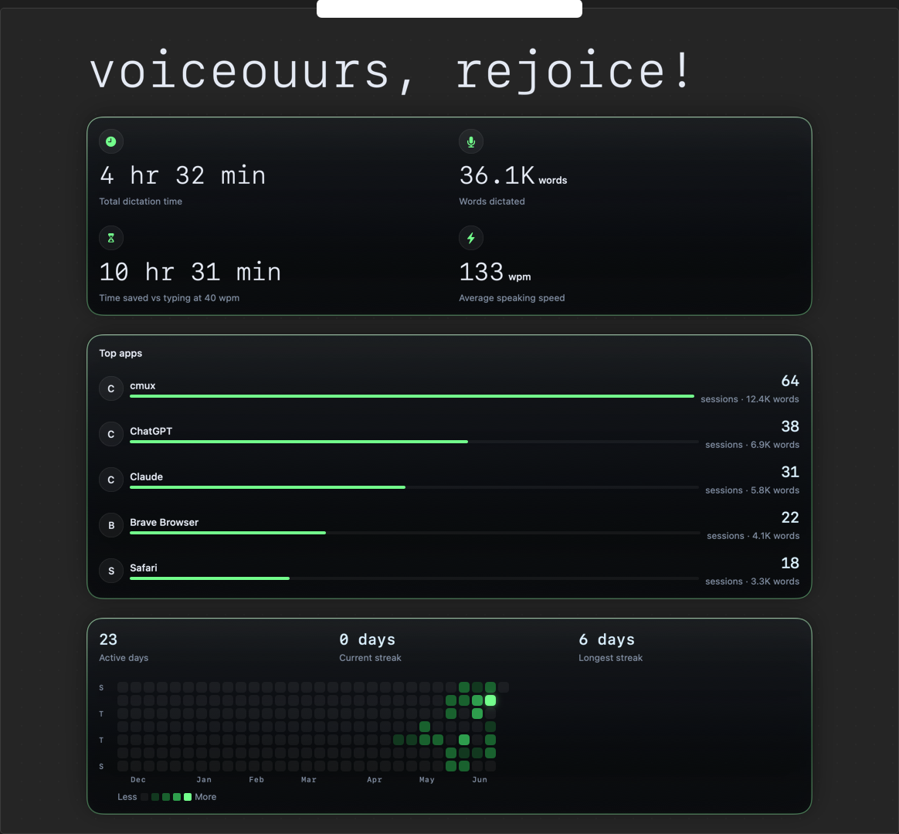

<div align="center">


# Voiceour

<p><strong>Tap <code>fn</code> to dictate where your cursor is.</strong></p>


<sub>macOS 14+ · Apple Silicon only · English only · initial 1.26 GB model download</sub>

</div>

## How it works

Tap Fn once and speak. Tap again and the text lands in the app you were already using — recorded, recognized, and cleaned up entirely on your Mac. Ordinary text fields get the paste; a terminal, a code editor, a password field, or a target Voiceour could not read gets the transcript on the clipboard instead, and no setting widens that. [Permissions and delivery safety](docs/permissions.md) has the matrix.
The mercury recording island is synchronized to the display it occupies: 120 fps on a ProMotion screen, the native rate on lower-refresh displays, capped at 120.

No account, no telemetry, no cloud transcription. The only network request fetches the recognition model, pinned to `ggml-org/parakeet-GGUF` revision `35156454d1a39de06863303dd209fd2bed6ee079`. Settings offers a Compact version of that same model — 0.67 GB on disk instead of 1.26 GB, a little slower to transcribe, applied the next time Voiceour starts.

Home keeps the running totals: how long you have spoken, how much typing it saved, and which apps the words went to.

<div align="center">



</div>

## Contributing

Voiceour is MIT licensed, so you're free to read it, fork it, and build your own version.

It's maintained by one person, so I keep the scope tight and won't merge every pull request. Please open an issue before starting anything large, so we can agree on the approach first. Bug reports and ideas are always welcome.

Two things that are especially welcome:

- **Documentation fixes.** Wrong commands, dead links, anything out of date.
- **Fixes under `Vendor/parakeet/`.** That directory is a copy of [ggml-org/whisper.cpp](https://github.com/ggml-org/whisper.cpp). Send those upstream instead — they'll reach every project using it, and they'll survive the next time Voiceour updates its copy.

[CONTRIBUTING.md](CONTRIBUTING.md) has the checks to run before opening a PR.

## Build it

There is no signed release yet, so build from source. You need macOS 14 or newer on Apple Silicon and a Swift 6 toolchain — Xcode 16 or newer, or just its Command Line Tools.

```sh
git clone https://github.com/joswha/voiceour.git
cd voiceour
make build
```

`make` on its own prints every target.

Start on the fake backend. It needs no model download and no permission grant: synthetic audio through the real pipeline, real UI.

```sh
make dev
```

Then run the real app. This assembles `.build/Voiceour.app`, downloads the pinned model on first launch — 1.26 GB, with progress in the menu bar — and asks for Microphone at the first recording, plus Accessibility if you want the paste rather than a clipboard copy. The first launch opens the console on Home, where a first-run card states the tap gesture, the download's progress, and which of those two permissions is required — it retires itself once you have dictated once.

```sh
make run
```

That bundle is ad-hoc signed, not notarized, so its code identity can change when you rebuild and macOS may ask for both grants again. Run `make signing` once for a stable local identity; [developer setup](docs/developer-setup.md) covers signing, notarization, and the rest of the commands.

## FAQ

<details>
<summary><strong>Why Apple Silicon only?</strong></summary>

The vendored parakeet.cpp/ggml code is arm64-only, and `Vendor/parakeet/ggml/embed/ggml-metal-embed.c` enforces that at compile time. Supporting Intel would mean vendoring upstream's x86 sources and splitting `Package.swift` into per-architecture targets, since SwiftPM has no architecture build condition.

It's a deliberate choice, not something on the roadmap — see [non-goals](docs/non-goals.md).

</details>

<details>
<summary><strong>What network requests does Voiceour make?</strong></summary>

Exactly one: downloading the recognition model. Transcription itself is entirely local. No telemetry, no account, no analytics, no update checks.

That request goes to `huggingface.co`, for the repository `ggml-org/parakeet-GGUF` at revision `35156454d1a39de06863303dd209fd2bed6ee079`, and fetches one of two files:

| file | size | when |
| --- | --- | --- |
| `ggml-parakeet-tdt-0.6b-v3-f16.bin` | 1.26 GB | Balanced (default) |
| `ggml-parakeet-tdt-0.6b-v3-q8_0.bin` | 0.67 GB | Compact |

The revision is pinned so you can fetch and hash those exact bytes yourself, and Voiceour verifies the download against a SHA-256 built into the app before loading it.

Worth being clear about one thing: like any download, that HTTPS request tells Hugging Face and its CDN your IP address and User-Agent. Local transcription doesn't change that.

You can block Voiceour in a firewall such as Little Snitch if you'd rather it didn't happen. Without the model there's no transcription, but the fake backend still works, since it downloads nothing.

</details>

<details>
<summary><strong>Where does Voiceour keep my data?</strong></summary>

On your Mac, and nowhere else. Audio is never saved — the recording is deleted as soon as it's transcribed. Transcripts stay in a local history file capped at the newest 500, and a secure field like a password box records nothing at all.

Settings has a Clear History button that erases the transcripts and the lifetime counters together. [Permissions and delivery safety](docs/permissions.md) covers the rest.

</details>

<details>
<summary><strong>Which languages does it support?</strong></summary>

English only. The model is `parakeet-tdt-0.6b-v3` and there's no language picker — see [non-goals](docs/non-goals.md).

</details>

<details>
<summary><strong>Is there a Homebrew install?</strong></summary>

Not yet. A Homebrew cask has to pass macOS Gatekeeper checks, which needs a notarized build, and notarizing needs a paid Apple Developer account this project doesn't have. Building from source is the supported path for now.

</details>

## Troubleshooting

<details>
<summary><strong>The build fails on an older toolchain</strong></summary>

Swift 6 is required: Xcode 16 or newer, or just its Command Line Tools.

</details>

<details>
<summary><strong>macOS keeps asking for Microphone or Accessibility after a rebuild</strong></summary>

macOS ties a permission to the app's code signature, and an ad-hoc development build gets a new one each time. Run `scripts/setup_local_signing.sh` once for a stable local certificate; `scripts/bundle.sh` picks it up automatically.

</details>

<details>
<summary><strong>A permission is stuck</strong></summary>

Quit Voiceour, reset it, and it'll ask again on the next recording.

```sh
tccutil reset Microphone com.voiceour.app
tccutil reset Accessibility com.voiceour.app
```

</details>

<details>
<summary><strong>Dictation pastes into some apps but only copies in others</strong></summary>

That's deliberate. Ordinary text fields get the paste; terminals, code editors, password fields, and any target Voiceour couldn't inspect get the transcript on the clipboard instead, and no setting widens it. [Permissions and delivery safety](docs/permissions.md) has the full matrix.

</details>

## Documentation

[Architecture](docs/architecture.md) · [Permissions and delivery safety](docs/permissions.md) · [Benchmarks](docs/benchmarks.md) · [Non-goals](docs/non-goals.md) · [UI design](docs/design-bible.md) · [Developer setup](docs/developer-setup.md) · [Contributing](CONTRIBUTING.md) · [Changelog](CHANGELOG.md)

[](../../actions/workflows/ci.yml)

MIT licensed. That covers Voiceour's own code; third-party components keep their own terms. [NOTICE](NOTICE) credits the vendored sources and the speech model, and [benchmarks/DATA-LICENSE.md](benchmarks/DATA-LICENSE.md) covers the CC BY 4.0 corpus transcripts quoted in the committed benchmark reports.

Voiceour is an independent macOS dictation app, not affiliated with, sponsored by, or endorsed by Apple Inc.
