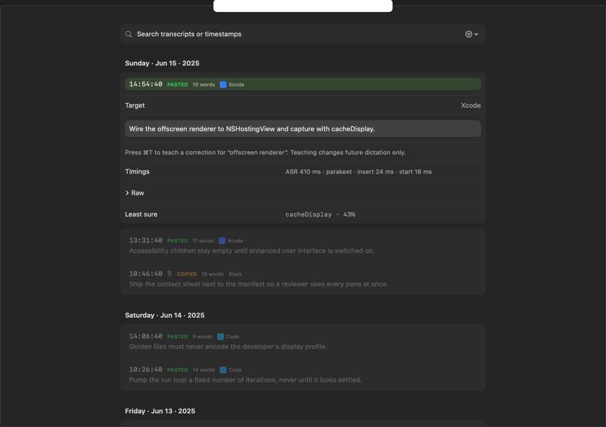
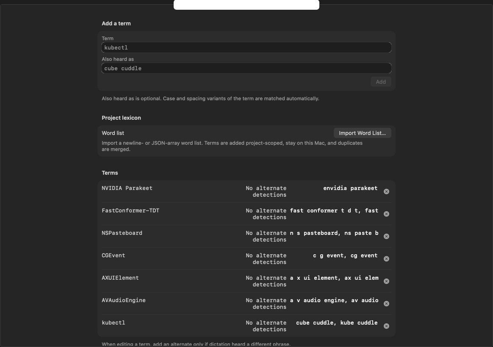

<div align="center">


# Voiceour

<p><strong>Tap <code>fn</code> to dictate where your cursor is.</strong></p>

**Private, local dictation for macOS.** Voiceour records one utterance, transcribes it on your Mac, applies optional deterministic cleanup, and delivers the result to the app you are using.

[**Download Voiceour**](https://github.com/joswha/voiceour/releases/latest)

<sub>macOS 14+ · English only · signed and notarized · initial 1.26 GB model download</sub>

<br><br>


<sub><i>The recording island follows the focused app and remains visible through delivery. Deterministic still rendered from current app code.</i></sub>

</div>

## How it works

- **Tap.** Press Fn or Globe once. A rising tone confirms capture.
- **Speak.** The recording island follows the active app and shows a live waveform once usable microphone signal arrives.
- **Stop.** Tap again, choose Finish, or let auto-stop end the utterance. Voiceour finalizes one WAV and performs one final local decode.
- **Clean.** With **Clean up after capture** enabled—the default—deterministic cleanup removes configured fillers and canonicalizes glossary aliases.
- **Deliver.** The completed text always reaches the clipboard. Voiceour posts Cmd-V only to a verified normal-text target.

No wake word. No live transcript while you speak.

## Private by construction

- No account, telemetry, credential store, or cloud transcription.
- Network access is limited to acquiring the pinned model. Temporary audio is removed after success, cancellation, and failure.
- History keeps the newest 500 non-secure transcripts in one local file. Aggregate statistics contain no transcript text or session IDs.

Model: `ggml-org/parakeet-GGUF` · revision `35156454d1a39de06863303dd209fd2bed6ee079` · file `ggml-parakeet-tdt-0.6b-v3-f16.bin`

[Architecture](docs/architecture.md) · [Permissions and delivery safety](docs/permissions.md)

### Delivery you can trust

- **Normal text:** clipboard plus Cmd-V after permission and target-identity checks.
- **Terminal, code editor, secure, or unknown target:** copy-only. Secure delivery is not retained in History; terminal and unknown-risky copies lose one trailing newline.
- A focus change after the delivery snapshot degrades to copy-only. A move before that snapshot selects the new delivery target.

## Watch it add up

Home shows total dictation time, words, time saved versus typing at 40 wpm, speaking speed, and the apps that receive the most dictation. It also tracks active days, current and longest streaks, and a 30-week activity heatmap from aggregate local counts.

<div align="center">

<br>
<sub><i>Sample local analytics: active days, current and longest streaks, and the activity heatmap. Deterministic sample data; app names are example dictation destinations, not integrations or endorsements.</i></sub>
</div>

## Make every word yours

### History — Find it. Copy it. Teach it.

Search and filter local sessions, open one transcript in place, click it to copy, or select a correction and press Command-T.

### Glossary — Protect the words that matter.

With cleanup enabled, add a canonical term and the ways it may be heard. Voiceour can deterministically turn `cube cuddle` into `kubectl` on future dictations.

<div align="center">
<a href="docs/media/history-sample.png"></a>
<a href="docs/media/glossary-sample.png"></a>
<br>
<sub><i>Sample History data. Sample Glossary data. These are independent deterministic fixtures.</i></sub>
</div>

## Measured accuracy

Measured 2026-08-15 on an Apple M4 Pro running macOS 26.5.2; both runs used the pinned f16 artifact, identical deterministic row selection, and zero error rows.

| tier | rows | U-WER | CER | case F1 | punctuation micro F1 | ASR p50 / p95 | RTFx |
| --- | ---: | ---: | ---: | ---: | ---: | ---: | ---: |
| LibriSpeech | 128 | 2.807% | 0.882% | n/a | n/a | 201.0 / 274.3 ms | 112.96 |
| FLEURS | 64 | 4.416% | 1.929% | 0.9218 | 0.8380 | 90.5 / 125.3 ms | 99.93 |

U-WER and CER are uncased word and character error rates; lower is better. Case and punctuation F1 measure restoration quality; higher is better. RTFx is speed relative to real time.

These are corpus baselines, not universal product claims. [Read the methodology and reports.](docs/benchmarks.md)

## What Voiceour won’t do

- **Listen in the background.** One tap starts one utterance; one stop performs one final decode.
- **Send speech or text to a transcription cloud.** Network access is limited to model acquisition, and dictation is offline while the artifact remains cached.
- **Rewrite your words with another model.** Optional cleanup is deterministic filler removal and glossary canonicalization.
- **Paste automatically into risky targets.** Terminal, code-editor, secure, and unknown targets remain copy-only, with no override.

These are product decisions, not roadmap teasers. [See the v0 non-goals.](docs/v0-non-goals.md)

## Download and first launch

[**Download Voiceour**](https://github.com/joswha/voiceour/releases/latest)

<sub>macOS 14+ · English only · signed and notarized · initial 1.26 GB model download</sub>

1. Download `Voiceour.zip`, unzip it, and move `Voiceour.app` to Applications.
2. Open Voiceour. It acquires the pinned English model and keeps progress visible in the menu.
3. Start your first dictation and grant Microphone access when asked. Accessibility is optional; it enables clean Fn interception and verified automatic paste. Without it, delivery remains copy-only.

## Common questions

<details>
<summary><b>Does it work without internet?</b></summary>

Yes, while the model remains cached after its initial acquisition. Recording, recognition, cleanup, glossary, history, and delivery are local.

</details>

<details>
<summary><b>Why did my text copy instead of paste?</b></summary>

Voiceour copies when Accessibility permission is absent, the target is risky, or focus changed after the delivery snapshot. The menu reports the reason; unsafe classes cannot opt into automatic paste.

</details>

<details>
<summary><b>Why does the island say WARMING?</b></summary>

Capture started, but usable microphone signal has not arrived yet. WARMING resolves when samples arrive or reports a named microphone error after six seconds.

</details>

<details>
<summary><b>What sounds does Voiceour make?</b></summary>

A rising cue starts listening, a falling cue ends capture, and two clipped falling tones confirm discard. General settings can turn the cues off.

</details>

<details>
<summary><b>Does it support other languages?</b></summary>

No. Voiceour is English-only.

</details>

## Build it with us

Development is fake-first. The fake runtime uses synthetic audio and does not request Microphone access or acquire the ASR model; a fresh SwiftPM build may fetch pinned package dependencies.

```sh
scripts/run_dev.sh --self-test
scripts/run_dev.sh
```

[Contributing](CONTRIBUTING.md) · [Developer setup](docs/developer-setup.md) · [Architecture](docs/architecture.md) · [Permissions](docs/permissions.md) · [Benchmarks](docs/benchmarks.md) · [UI design](docs/design-bible.md)

[](../../actions/workflows/ci.yml)

MIT licensed. [NOTICE](NOTICE) credits third-party source and model artifacts.
