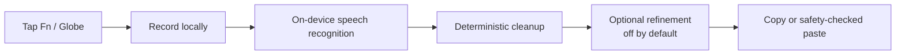

<div align="center">

# 👽 Voiceour

### Tap `fn` to dictate where your cursor is.

**Voiceour is a local-first dictation app for macOS.** It runs in the menu bar. One tap of
Fn starts recording. Transcription runs on your Mac, and the result goes to the app you were using.

Microphone access lets Voiceour record speech, and Accessibility trust lets it consume the Fn tap
before macOS sees it. Posting Cmd-V needs event-post permission, which Accessibility trust also
satisfies. Without that permission, delivery falls back to copy-only.

<br>


[](../../actions/workflows/ci.yml)

<br>


<sub><i>The offscreen UI harness renders these frames from the app's SwiftUI views.<br>
It captures the app's painted path without screen recording or mockups. Offscreen capture cannot<br>
rasterise system Liquid Glass. On macOS 26, the live island uses Liquid Glass against the desktop.</i></sub>

</div>

---

## 👽 What happens when you tap `fn`

```text
   👆  TAP       Tap Fn / 🌐 once. Do not hold it or combine it with another key.
   ┃             With Accessibility granted, Voiceour consumes the tap so macOS
   ┃             does not open its emoji picker.
   ┃
   🎤  SPEAK     A graphite pill appears next to the focused window and draws
   ┃             a live waveform while recording.
   ┃             ✓ finishes · ✕ discards · Esc discards · drag it anywhere.
   ┃
   👽  DECODE    Parakeet TDT 0.6B runs on Apple silicon through a persistent
   ┃             Python sidecar. Median latency is ~347 ms on an M4 Pro.
   ┃             ARK-ASR 0.6B, ARK-ASR 3B, and Apple's on-device model are
   ┃             also selectable. Airplane mode is supported.
   ┃
   🧼  CLEAN     Cleanup removes fillers and preserves protected terms such as
   ┃             kubectl, --no-config, p95, and your internal codenames.
   ┃             Later stages preserve them character for character.
   ┃
   ✨  REFINE    Refinement is optional and off by default. Network refinement
   ┃             runs only through the locally installed omp CLI, which owns
   ┃             its credentials. Voiceour stores none. An on-device refiner
   ┃             is also available.
   ┃
   📋  DELIVER   Voiceour writes the transcript to the clipboard and attempts
                 Cmd-V only in a verified normal text target. Terminals, code
                 editors, and password fields remain copy-only.
```

Voiceour does not use a wake word, a separate listening button, or a privacy modal. One tap
records one utterance.

---

## ⚡ Sixty-second start

This development setup does not download a model, open the microphone, or require an API key.
It uses the deterministic fake ASR backend. This is the only backend that works on a machine that
has never run Voiceour.

```sh
git clone https://github.com/joswha/vociea.git voiceour && cd voiceour

scripts/run_dev.sh --self-test   # build + run cleanup and safety checks
scripts/run_dev.sh               # launch Voiceour in the menu bar
```

You need macOS 14+, Command Line Tools (`xcode-select --install`), and
[`uv`](https://docs.astral.sh/uv/) for the Python sidecar. Full Xcode is not required.

For the real-ASR, signing, UI, benchmark, and release recipes, see
[`docs/developer-setup.md`](docs/developer-setup.md). Contributors should use the exact gate list in
[`CONTRIBUTING.md`](CONTRIBUTING.md).

---

## 🎛 The three surfaces

|  | Surface | What it is |
|---|---|---|
| 👽 | **Menu bar** | The status item. A cyan dot means working, a pulsing cyan dot means recording, and crimson means an error. Click it to see the last transcript (click to copy), the current target, `START DICTATION`, and the number of saved sessions. |
| 🎤 | **The island** | The pill in the GIF above. It appears on the focused window's display and follows app, display, and Space changes during a session. A manual drag is stored relative to a display instead of pinning the island to one monitor. |
| 🖥️ | **The console** | Seven panes: **Home**, **Sessions**, **Voice**, **Glossary**, **Refinement**, **System**, and **Diagnostics**. Diagnostics is hidden unless you launch with `--debug`. |

<div align="center">

<br>
<sub><i>Home shows words dictated, time saved against your typing speed, busiest hours, and top destinations.</i></sub>
</div>

**How Home calculates time saved.** *Time saved* is the estimated typing time for the dictated
words minus the actual dictation time. Actual time includes speech, microphone startup,
transcription, and insertion. Only dictations with recorded timing count. Older sessions without
timing are omitted rather than estimated, and the card shows how many remain before they age out.

The initial typing speed is **52 wpm**. This is the average from 168,000 people and 136 million
keystrokes in Dhakal, Feit, Kristensson & Oulasvirta, *Observations on Typing from 136 Million
Keystrokes*, CHI 2018. You can edit the value on the card next to the TYPING gauge. Every figure on
the pane updates to use it. *Fastest spoken* is your speaking record and is not used to calculate
time saved. All-time counters continue after old transcripts are dropped, so they never plateau or
decrease.

<br>

<div align="center">

<br>
<sub><i>The popover is 280 pt wide. The <code>Fn</code> keycap is a reminder, not a button.<br>
Every image on this page is an offscreen harness render of the real views and uses the painted path. None is a mockup.</i></sub>
</div>

---

## 🚦 Where your text is allowed to go

Voiceour always writes the transcript to the clipboard. It attempts `Cmd-V` only for a verified
normal text target; terminals, code editors, secure fields, and targets it cannot classify remain
copy-only. The target is checked again at delivery so a late focus change cannot redirect a paste
into an unverified control.

The complete permission model, refinement policy, pasteboard metadata, insertion-safety matrix,
and manual E2E checklists live in
[`docs/permissions.md`](docs/permissions.md).

---

## 🔒 Privacy, storage, and delivery

Voiceour applies these rules in code:

- 🚫 **Voiceour never reads, snapshots, restores, or inspects your previous clipboard.** It writes
  the dictated text and nothing else.
- 🧹 **After a successful paste, Voiceour clears the dictated text from the clipboard about one
  second later.** If you copy something else first, the app leaves it alone. It detects this with
  the pasteboard *change count* and never reads the contents.
- 📡 **The network is reachable in exactly two situations:** the first model download and optional
  network refinement that you enabled and configured. Network refinement is brokered by the local
  `omp` CLI, which owns its credentials. Voiceour has no telemetry, analytics, crash reporter, or
  account.
- 🗂️ **Recent transcripts stay on your Mac** in the Sessions pane. System ▸ Clear history removes
  them. **Audio is never persisted.** Temporary files are deleted after success, cancellation, and
  errors.
- 🧮 **Counters are stored separately from transcripts.** `recent-sessions.json` keeps the newest
  500 transcripts and drops older ones. `dictation-stats.json` keeps the running tally, so all-time
  figures survive transcript eviction. The tally contains counts and durations. The only
  transcript text it can contain is one 320-character quote from your longest dictation. Clearing
  history erases both files. Deleting one transcript preserves lifetime counts and removes that
  quote. Diagnostics ▸ STORAGE lists both paths.
- 🔤 **Only cloud-eligible, non-project-scoped glossary terms** can enter a network refiner prompt.
  Project-scoped and imported terms never leave the Mac. On-device refiners receive the full set.
- ⌨️ **Insertion uses the pasteboard and synthetic `Cmd-V`.** It never mutates text through
  Accessibility. Without event-post permission, delivery is copy-only and the app gives a reason.

---

## 🧠 Under the hood



For the code-target diagram, layering boundaries, session state machine, persistence model, and ASR
boundary, read [`docs/architecture.md`](docs/architecture.md).

**Reading order for a first change:** `Sources/Voiceour/DictationCoordinator.swift`, then the
port protocols in `Sources/VoiceCore/CorePorts.swift`, then whichever adapter you are touching.

<details>
<summary><b>Vocabulary</b></summary>

<br>

Voiceour keeps a local vocabulary of protected technical terms. It preserves commands, flags,
paths, versions, and product names through cleanup and refinement. Basic dictation does not require
a custom vocabulary.

- **Fix and Teach.** In Sessions, select incorrect words in a transcript to show the TEACH bar.
  Enter the canonical spelling and, optionally, the `DETECTED AS` text it should replace. Choose
  Global, This app, or This project scope. You can also right-click.
- **Suggestions.** Accepting a suggestion teaches the term for future dictation. It does not edit
  text that was already pasted.
- **Project lexicons.** Glossary ▸ `IMPORT WORD LIST…` accepts a one-term-per-line file or JSON.
  Imported terms are sanitized, scoped to the active project, and ineligible for cloud refinement.
- **Literal composition.** Say "spell that" or "literal" to dictate letters verbatim. Say "snake
  case" or "dash dash" to join words. Say "capital X" to force casing.
- **Clear vocabulary** in System requires typed confirmation. It removes terms you added and
  restores the bundled defaults, including any `DETECTED AS` text taught for those defaults.

Automatic term correction and decoder biasing are **experimental and off**
(`Settings.automaticTermCorrectionEnabled`, `Settings.decoderBiasEnabled`). The only measurements
so far are from a text-to-speech smoke tier, where unconditional biasing showed no recall gain.
The vocabulary features above do not depend on either experimental setting.

</details>

<details>
<summary><b>Optional refinement</b></summary>

<br>

In Refinement, select `Enable refiner`, then choose one of two providers:

| Provider | Notes |
|---|---|
| **Oh My Pi** | Default. Refines through the locally installed `omp` CLI, which brokers whichever subscription you signed into. |
| **Apple on-device** | macOS 26 + Apple Intelligence. Nothing leaves the Mac. |

Voiceour has no API-key field and creates no keychain item for either provider. OMP owns its
credentials, and the on-device model needs none.

`Model` is a picker, not a text field. Its options come from `omp models --json` and reflect the
models available through your OMP installation. Use the filter to narrow the list. Select
`REFRESH` after connecting an account. Leave the selection empty to use the provider default.

The Oh My Pi pane lists connected providers first. ChatGPT, Claude, Gemini, and Kimi remain visible
when disconnected. `CONNECT` and `RECONNECT` open OMP's interactive login in a temporary Terminal
window. `ADD` adds another account. `BROWSE` opens OMP's live provider list.

`REFRESH` reads aggregate provider and account status from `omp usage --json --redact`. OMP keeps
all credentials in its own vault. Voiceour does not read OAuth tokens, API keys, or account
identities from this flow. A persistent `omp --mode rpc` child provides a warm refine in roughly
1.4–2.7 s, depending on the model.

Use `RESTART TO APPLY` in the Voice pane after changing the backend. This action preserves the
current launch context.

</details>

---

## 📈 Measured performance

Measurements used one Apple M4 Pro (10P+4E, 24 GB), macOS 26.5.2, `mlx 0.31.2`,
`parakeet-mlx 0.5.2`, and Apple on-device Foundation Models. Latency percentiles come from
**353 real dictation sessions**. Controlled A/B results come from **~1,240 timed on-device model
calls**. [`docs/performance-roadmap.md`](docs/performance-roadmap.md) contains the full methodology,
negative results, and statistics.

These results describe one machine. They are not a specification, guarantee, or target.

| stage | p50 | p90 | p95 | n |
|---|---:|---:|---:|---:|
| ASR | **347 ms** | 843 ms | 1052 ms | 167 |
| refinement | 2257 ms | 3995 ms | 5426 ms | 155 |
| insertion | **4 ms** | 32 ms | 43 ms | 188 |
| start latency (hotkey → first audio buffer) | **188 ms** | 219 ms | 231 ms | 43 |

Refinement accounts for roughly 87% of post-speech latency and is optional. This percentage sums
independently measured stage medians rather than one end-to-end stopwatch span. Those sessions
predate the per-session `stopReleaseToInsertionOutcomeMs` timing that the app now records.

The start-latency row measures arrival of the first buffer, not the first buffer containing sound.
A Bluetooth headset can provide more than one second of digital silence first. Voiceour now times
from the hotkey to the first real audio and uses the Mac's built-in microphone when the default
input is a Bluetooth headset. Earlier and later measurements are not comparable.

### Accuracy

| tier | metric | Parakeet TDT 0.6B v3 (default) | Apple SpeechTranscriber (opt-in) |
|---|---|---:|---:|
| LibriSpeech (n=128) | U-WER | **2.845%** | 3.133% |
| LibriSpeech | CER | **0.920%** | 1.137% |
| LibriSpeech | ASR p95 | **348 ms** | 802 ms |
| LibriSpeech | RTFx | **85.6x** | 48.3x |
| FLEURS (n=64) | U-WER | **4.416%** | 6.125% |
| FLEURS | F-WER | **10.284%** | 12.997% |
| FLEURS | punctuation micro-F1 | 0.833 | **0.870** |
| FLEURS | case F1 | **0.921** | 0.848 |
| TechTerms (*TTS, inadmissible*) | U-WER | 6.731% | 13.462% |
| TechTerms (*TTS, inadmissible*) | canonical-term recall | 63.6% | 27.3% |

Both tiers are **row-matched**. Each backend transcribed the same manifest rows on the same machine
with the same scorer. The 2026-08-11 reports are
`20260811T114019Z`/`20260811T114143Z` for LibriSpeech and
`20260811T114301Z`/`20260811T114320Z` for FLEURS.

The LibriSpeech U-WER delta is **+0.288 pp**, inside the project's +0.35 pp gate. The FLEURS delta is
**+1.71 pp**, outside the gate. These results replace the 2026-07-17 runs, which compared 128 mlx
rows with 64 Apple rows and used n=8 for FLEURS. At n=64, the FLEURS result reverses.

The TechTerms rows are excluded from production evidence because the tier uses `macos-say` TTS.
[`docs/benchmarks.md`](docs/benchmarks.md) states that these rows "must not be used as evidence for …
technical term accuracy, or the production gate". The result is 7/11 vs 3/11 utterances
(exact McNemar p ≥ 0.125).

On row-matched read speech, **`mlx` leads every content axis on both tiers**. Its earlier latency
tail is no longer present. Apple retains two measured advantages: punctuation micro-F1
(0.870 vs 0.833) and post-stop latency from its fused live engine (**15.9 ms vs 119 ms** on the
same 10.56 s audio). The live engine transcribes during capture. Neither tier contains real-speaker
dictation audio. The default remains `mlx` based on the read-speech evidence and previous default.
[`docs/benchmarks.md`](docs/benchmarks.md) records that a consented corpus does not yet exist.

#### ARK-ASR, opt-in

`ARK 0.6B` and `ARK 3B` are selectable in the Voice pane but are not the default. The table below
comes from a separate run on 2026-08-13 using an M4 Pro and the same scorer. The LibriSpeech rows
are matched at n=112 because ARK rejects clips longer than 30 s.

| tier | metric | Parakeet (default) | ARK 0.6B | ARK 3B |
|---|---|---:|---:|---:|
| FLEURS (n=64) | U-WER | 4.416% | **4.202%** | **3.632%** |
| FLEURS | F-WER | **10.284%** | **9.590%** | 23.470% |
| FLEURS | case F1 | **0.921** | 0.914 | **0.000** |
| FLEURS | round trip p50 | **119.9 ms** | 322.3 ms | n/a |
| LibriSpeech (n=112) | U-WER | **2.716%** | 2.925% | **2.194%** |
| any | peak memory | **1.9–2.6 GB** | 2.3–2.9 GB | 7.1–7.7 GB |

Across the two admissible tiers, ARK-0.6B differs by +0.214 pp on FLEURS and −0.209 pp on
LibriSpeech, with 2.7x the latency. ARK-3B has lower word error on both tiers. It emits **no
capitalization** and spells numbers as words, so its pasted output has F-WER 23.470% compared with
10.284% for Parakeet. This behavior comes from the upstream model, not the conversion code.
**Selecting ARK 3B downloads about 7 GB** and uses 7.1–7.7 GB of resident memory. ARK 0.6B
downloads 2.2 GB.

Both ARK backends return plain text without word alignments, confidence, or n-best results.
Automatic term correction therefore stays off, and glossary biasing has no effect. Clips longer
than 30 s are rejected instead of truncated.

[`docs/performance-roadmap.md`](docs/performance-roadmap.md) contains the full method, per-stage
timings, and rejected runtime options for native Swift/MLX, GGUF, and Rust. Run the benchmark with
`make bench-stt BACKEND=ark-0.6b N=64`.

<details>
<summary><b>Refinement cost and rejected approaches</b></summary>

<br>

Apple's on-device model benefits from prewarming shortly before use. This test held idle time at
30 s and changed only the prewarm time. It included 240 accepted trials, globally shuffled, with
8 trials per transcript in each arm.

| prewarm placement | median |
|---|---:|
| before the idle (previous behaviour) | 1849.6 ms |
| **after the idle, ~400 ms before use (current)** | **1455.6 ms** |
| never | 1888.0 ms |

**−383.5 ms paired median** (95% CI [−399.0, −361.6], 10/10 transcripts, sign p = 0.002).
Voiceour therefore prewarms at recording stop, where recorder finalization plus ASR supply the
lead time.

| quantity | value |
|---|---:|
| refiner system prompt | 677 tokens |
| user message (58-term glossary) | 1085 tokens |
| output for a 45-word transcript | ~59 tokens |
| context window | 4096 tokens |
| time to first token | ~60% of the call |
| refines returning byte-identical text | **29.2%** |
| emitted words that differ from the model's input | **8.56%** |

Prefill is the bottleneck: ~1,762 input tokens produce ~59 output tokens. Decode runs at
~131 tok/s, and ASR runs at RTFx 44. Model computation is not the limiting factor.

The following measurements ruled out other approaches:

| idea | measured result |
|---|---|
| Emit a structured diff/patch instead of the full rewrite | **+873 ms slower** (+88%), 30/50 patch-application failures |
| Streaming Parakeet (`transcribe_stream`) | **+66 ms slower** at the 10.5 s median, 5.56% of words changed |
| Trimming the glossary out of the prompt | 55–464 ms available, but every variant produced worse output |
| Shorter system prompt | −331 ms, but caused command-as-text execution failures |
| Encoder `mx.compile` | +1.7 ms fixed-shape win, −5.9 ms penalty per unseen input length |
| INT8 quantization | −32 ms, but unvalidated for accuracy and needs a new model pin |
| MLX 0.31.2 → 0.32.0 | 0.35 ms, within measurement noise |
| Wired memory / residency | 0.3–1.4 ms *slower* |
| Replacing the Python sidecar IPC | non-inference overhead is 0.8–0.9 ms p50, measured at the protocol |
| Rust or hand-written Metal kernels | no viable path; see the roadmap for the constraints |

</details>

---

## 🧪 How this repo is verified

The required fake-backed CI path needs no model, microphone, TCC grant, or credential.
[`CONTRIBUTING.md`](CONTRIBUTING.md) lists the required and advisory gates.
[`docs/developer-setup.md`](docs/developer-setup.md) lists every command and run recipe.

Offscreen UI review needs neither Screen Recording nor Accessibility permission. The harness
renders the real SwiftUI views and dumps their accessibility trees. It compares both outputs with
committed goldens. [`docs/ui-harness.md`](docs/ui-harness.md) documents the process.

---

## 🙋 Common questions

<details>
<summary><b>Does it work with no internet?</b></summary>
<br>
Yes, after the model is cached. Once the cache manifest exists, the sidecar loads with
<code>HF_HUB_OFFLINE=1</code>. After that, only optional OMP refinement can use the network, and it
is off by default.
</details>

<details>
<summary><b>Why did my text only get copied instead of pasted?</b></summary>
<br>
Voiceour pastes only into a verified normal text target and only when Accessibility permits
synthetic `Cmd-V`. All other cases are copy-only. See the troubleshooting guide and target matrix
in [`docs/permissions.md`](docs/permissions.md).
</details>

<details>
<summary><b>macOS keeps opening its emoji picker when I tap Fn.</b></summary>
<br>
Without Accessibility permission, the passive fallback can observe the Fn tap but cannot prevent
macOS from handling it. [`docs/permissions.md`](docs/permissions.md) documents permission behavior
and the active event tap.
</details>

<details>
<summary><b>Do I need an API key?</b></summary>
<br>
No. Voiceour has no API-key field and stores no credentials. The optional network refiner uses the
`omp` CLI, which owns its credentials. The on-device provider and transcription do not need a key.
</details>

<details>
<summary><b>Is my audio uploaded or stored?</b></summary>
<br>
Neither. Inference runs locally. Temporary audio files are deleted after success, cancellation, and
errors. Text transcripts stay on the Mac until you remove them in Sessions.
</details>

<details>
<summary><b>Can I change the hotkey?</b></summary>
<br>
No. The Voice pane shows <code>STANDALONE TAP</code> as read-only. Reassignment is reserved for a
later release. The binder is a small, replaceable, first-party
Carbon/<code>CGEventTap</code> implementation.
</details>

<details>
<summary><b>What is MLX? Is it Apple's CUDA?</b></summary>
<br>
MLX is closer to PyTorch. CUDA is NVIDIA's low-level GPU programming layer. Metal fills that role
on Apple platforms. MLX is an array and neural-network framework on top of Metal. Models written in
MLX compile to Metal kernels. The stacks are MLX → Metal → GPU on Apple silicon and
PyTorch → CUDA → GPU on NVIDIA hardware.
<br><br>
A discrete NVIDIA GPU has its own VRAM, so inference copies weights and activations across PCIe.
Apple silicon uses <b>unified memory</b>. The CPU and GPU address the same physical RAM, with no
copy and no separate device for tensors. A 7 GB model therefore uses 7 GB of system RAM, and
<code>out of VRAM</code> is not a separate failure mode. MLX evaluates lazily. It builds a graph
and computes when a result is requested. The first inference after launch pays the kernel
compilation cost; later inferences do not.
</details>

<details>
<summary><b>Why a Python sidecar instead of Rust, or pure Swift?</b></summary>
<br>
Transport overhead is small, and MLX performs the model computation.
<br><br>
Measurements on this machine used the real sidecar and its real protocol. They compared the
caller-visible round trip with inference time reported inside the sidecar. The mechanism adds
<b>0.8–0.9 ms at p50 and 1.3 ms at p95</b>, or 0.68% of a 119.9 ms Parakeet round trip. This
includes the process boundary, JSON encoding and decoding, and pipe traffic. Audio passes as a file
path and is not copied through the pipe. Python builds the graph, then the MLX call releases
Python's GIL while Metal runs the model. Python waits for the GPU. Rewriting the transport in Rust
would recover less than one millisecond from a 120 ms operation.
<br><br>
The model runtimes are Python packages. This includes `parakeet-mlx` and the ARK MLX port. A Rust
implementation would need to reimplement the models. Candle has no Parakeet or ARK implementation.
Its Voxtral example forces CPU execution on non-CUDA builds, and it has open Metal K-quant
correctness bugs. mistral.rs has no C or Swift ABI. Native Swift/MLX has a separate constraint: its
Metal shaders require Xcode instead of the SwiftPM CLI, and this repository keeps a shell-first build
that does not require Xcode.
<br><br>
This answers why the sidecar is Python <i>today</i>, not why it should stay Python. A no-Python C/Metal
runtime for the same checkpoint is measured, faster, and recommended; see the 2026-08-14 pass in
[`docs/performance-roadmap.md`](docs/performance-roadmap.md).
<br><br>
Sidecar startup takes ~130–320 ms from spawn to `hello`. The first transcription also loads the
model and compiles kernels. These one-time costs occur before the first dictation.
`VOICEOUR_PRELOAD=1` moves model loading and kernel compilation out of the first dictation.
</details>

---

## 🧰 Shipping it

[`docs/developer-setup.md`](docs/developer-setup.md) documents bundling, stable local signing,
bundle verification, and release notarization. `Resources/Voiceour.entitlements` is a signing
input, not a resource copied into the app bundle. Its entitlements are embedded in the code
signature.

[`docs/permissions.md`](docs/permissions.md) documents permission and insertion behavior.
[Dependency notes](CONTRIBUTING.md#dependency-notes) records the contributor constraint behind the
first-party hotkey binder.

---

## 📚 Docs

| | |
|---|---|
| [CONTRIBUTING.md](CONTRIBUTING.md) | contributor workflow, local checks, subsystem rules |
| [SECURITY.md](SECURITY.md) | supported versions and how to report a vulnerability |
| [docs/architecture.md](docs/architecture.md) | architecture diagram, target layering, session state machine and design contracts |
| [docs/developer-setup.md](docs/developer-setup.md) | complete command inventory plus setup and run recipes |
| [docs/ui-harness.md](docs/ui-harness.md) | the offscreen SwiftUI harness, its goldens and film reels |
| [docs/permissions.md](docs/permissions.md) | permission model, insertion safety matrix and E2E checklists |
| [docs/benchmarks.md](docs/benchmarks.md) | accuracy and latency benchmarks |
| [docs/performance-roadmap.md](docs/performance-roadmap.md) | measured state, ranked candidates, rejected optimizations |
| [docs/design-bible.md](docs/design-bible.md) | the visual language the UI is held to |
| [docs/v0-non-goals.md](docs/v0-non-goals.md) | what v0 deliberately does not do |

---

## License

See [LICENSE](LICENSE) for the MIT license. [NOTICE](NOTICE) attributes third-party components and
model artifacts.

<div align="center">
<br>
<sub>Local-first dictation for macOS</sub>
</div>
