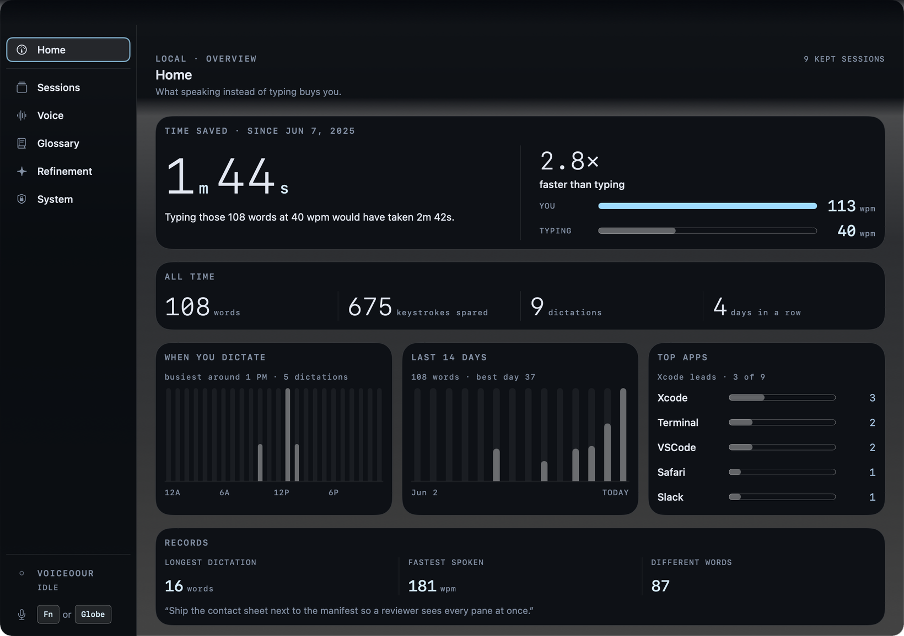
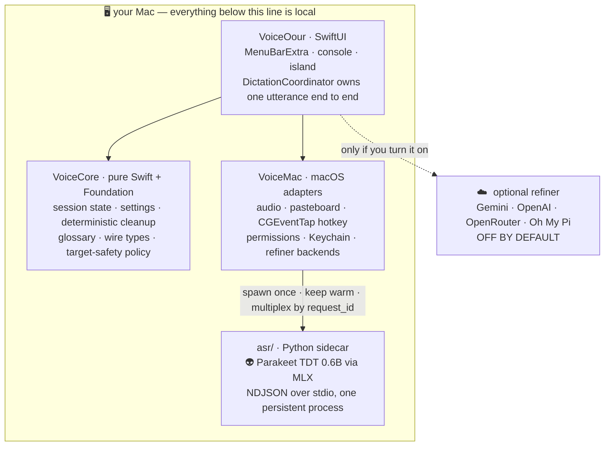

<div align="center">

# 👽 VoiceOour

### Tap `fn`. Say the thing. It lands where your cursor already was.

**Local-first dictation for macOS.** The alien lives in your menu bar, wakes on one keystroke,
transcribes on your own silicon, and never phones home.

<br>


[](../../actions/workflows/ci.yml)

<br>


<sub><i>The island, rendered frame by frame from the app's real SwiftUI views by the offscreen UI harness —<br>
no screen recording, no faked mockup. Real glass looks glassier than an offscreen raster can show.</i></sub>

</div>

---

## 👽 What happens when you tap `fn`

```text
   👆  TAP       One standalone tap of Fn / 🌐. Not held, not a chord.
   ┃             With Accessibility granted the tap is eaten, so macOS
   ┃             never gets to pop its own emoji picker over your work.
   ┃
   🎤  SPEAK     A graphite pill appears next to whatever you are typing in
   ┃             and draws your voice, live, while it listens.
   ┃             ✓ finishes · ✕ discards · Esc discards · drag it anywhere.
   ┃
   👽  DECODE    Parakeet TDT 0.6B runs on your own Apple silicon through a
   ┃             persistent Python sidecar. ~347 ms median on an M4 Pro.
   ┃             Airplane mode is a supported configuration.
   ┃
   🧼  CLEAN     Fillers out. Protected terms in — kubectl, --no-config, p95,
   ┃             that internal codename you taught it last Tuesday — kept
   ┃             character for character, before and after every later stage.
   ┃
   ✨  REFINE    Optional. Off by default. The only stage that can reach a
   ┃             network at all, and only after you switch it on, pick a
   ┃             provider and give it a key. On-device refiners exist too.
   ┃
   📋  DELIVER   Cmd-V into the app you were already in. Terminal, code editor
                 or password field? Copy-only, on purpose. See the table below.
```

No wake word. No "start listening" button. No modal telling you your privacy matters.
One key, one utterance, text.

---

## ⚡ Sixty-second start

Nothing here downloads a model, opens your microphone, or needs an API key. The default
ASR backend is a deterministic fake — it is the only backend that works on a machine that
has never run this app.

```sh
git clone https://github.com/joswha/vociea.git voiceoour && cd voiceoour

scripts/run_dev.sh --self-test   # build + smoke the whole pipeline
scripts/run_dev.sh               # put the alien in your menu bar
```

You need macOS 14+, Command Line Tools (`xcode-select --install`), and
[`uv`](https://docs.astral.sh/uv/) for the Python sidecar. Full Xcode is not required.

<details>
<summary><b>Then: real speech, real model</b></summary>

<br>

Real ASR is `parakeet-mlx` running `mlx-community/parakeet-tdt-0.6b-v3`, pinned at revision
`ed2b7e8c15f9aaa0b5772e2efb986255eaef7e15`. Apple silicon required. The first launch downloads
and caches the model; after the cache manifest exists the sidecar loads with `HF_HUB_OFFLINE=1`.

```sh
scripts/setup_local_signing.sh   # once — a stable identity keeps your TCC grants alive
scripts/run_real.sh              # bundles, then opens .build/VoiceOour.app with --asr-backend mlx
```

`run_real.sh` launches the real `.app` bundle so macOS can attribute the microphone prompt to
VoiceOour. That prompt appears when you first *record*, not when the app launches. The sidecar is
a persistent process: the model loads once per app run and preloading starts at launch, so
dictation latency after warm-up is inference only.

Already granted permissions and just want the existing bundle back?
`scripts/restart_real.sh` reopens it without rebuilding, which avoids invalidating the local
macOS TCC entry. Add `--debug` to reveal the machine-facing Diagnostics pane.

</details>

<details>
<summary><b>Prove the model works without any GUI at all</b></summary>

<br>

```sh
scripts/make_fixture.sh
cd asr && uv --no-config run python ../scripts/phase0_asr_proof.py ../fixtures/audio/hello_16k_mono.wav
```

Example output on Apple silicon after the model downloads:

```text
transcript=Hello world testing NVIDIA Parakeet NN Spaceport.
cold_load_ms=193738 warm_inference_ms=4360 rss_kb=1743880192
```

</details>

---

## 🎛 The three surfaces

|  | Surface | What it is |
|---|---|---|
| 👽 | **Menu bar** | The alien itself. A cyan dot means working, a pulsing cyan dot means recording, crimson means something broke. Click it for the last transcript (click to copy), the current target, `START DICTATION`, and how many sessions you have saved. |
| 🎤 | **The island** | The pill in the GIF above. Appears on the focused window's display, follows app/display/Space changes mid-session, and remembers a manual drag *relative* to a display instead of pinning itself to one monitor. |
| 🖥️ | **The console** | Seven panes: **Home**, **Sessions**, **Voice**, **Glossary**, **Refinement**, **System**, and **Diagnostics** (hidden unless you launch with `--debug`). |

<div align="center">

<br>
<sub><i>Home keeps score: words dictated, time saved against your typing speed, busiest hours, top destinations.</i></sub>
</div>

<br>

<div align="center">

<br>
<sub><i>The popover, at its true 280 pt width. The <code>Fn</code> keycap is a reminder, not a button.<br>
Every image on this page is an offscreen harness render of the real views — none of them is a mockup.</i></sub>
</div>

---

## 🚦 Where your text is allowed to go

VoiceOour looks at what is focused *immediately before* it delivers, and refuses to paste into
places where a stray `Cmd-V` would be a bad day. Refusing is a feature, not a failure — the text
is on your clipboard either way.

| | Target | Paste | Refine | Why |
|---|---|---|---|---|
| ✅ | Normal text field | yes | yes | Nothing to be careful about. |
| 🖥️ | Terminal | **copy only** | yes | A pasted newline executes a command. VoiceOour also strips exactly one trailing newline so a copied command cannot run itself. |
| 👨‍💻 | Code editor | **copy only** | **never** | Your code is not prose and must not be "improved" by a language model. |
| 🔐 | Secure field | **copy only** | no | Password managers, secure keyboard entry. Detected via Accessibility *and* `IsSecureEventInputEnabled()`, because AX cannot see every one of them. |
| ❓ | Unknown | **copy only** | no | If we cannot classify it, we do not type into it. |

Copy-only text is flagged `org.nspasteboard.ConcealedType`; pasted text is flagged
`org.nspasteboard.TransientType`, so your clipboard-history manager can skip both. The plain
`.string` type is always written too, because that is how pasting works.

---

## 🔒 House rules

These are enforced in code and in review, not aspirations in a marketing page.

- 🚫 **Your old clipboard is never read, snapshotted, restored, or inspected.** Not once, not to
  "be helpful". VoiceOour writes the dictated text and nothing else.
- 🧹 **After a successful paste the dictated text is cleared from the clipboard about a second
  later** — unless you copied something else in the meantime, which is detected by pasteboard
  *change count*, never by reading contents.
- 📡 **The network is reachable in exactly two situations:** the first model download, and an
  optional refiner you explicitly enabled and configured. There is no telemetry, no analytics,
  no crash reporter, no account.
- 🗂️ **Recent transcripts stay on your Mac**, live in the Sessions pane, and are wiped by
  System ▸ Clear history. **Audio is never persisted** — temp files are deleted on success,
  cancel and error alike.
- 🔤 **Only cloud-eligible, non-project-scoped glossary terms** are ever put in a network
  refiner's prompt. Project-scoped and imported terms never leave the machine. On-device
  refiners get the full set.
- ⌨️ **Insertion is pasteboard + synthetic `Cmd-V`**, never Accessibility text mutation. If the
  event-post permission is missing, you get copy-only and a reason — not a silent no-op.

---

## 🧠 Under the hood



`VoiceCore` imports no AppKit, no AVFoundation, no Accessibility, no pasteboard and no
process-launch APIs — which is why the fake path needs no hardware and the tests need no
permissions. Everything the coordinator touches is injected.

The session is a state machine, and every arrow is observable in the UI:

```text
idle → checkingPermissions → recording → finalizingAudio → transcribing
     → cleaning → refining → readyToInsert → pasteAttempted / copiedOnly → idle
```

**Reading order for a first change:** `Sources/VoiceOour/DictationCoordinator.swift`, then the
port protocols in `Sources/VoiceCore/CorePorts.swift`, then whichever adapter you are touching.

<details>
<summary><b>The ASR wire protocol</b></summary>

<br>

Newline-delimited JSON over stdio, `protocol_version: 1`.

- **stdout is protocol-only.** No logs, no progress bars, no tracebacks, no dependency chatter.
  Diagnostics go to stderr.
- Startup emits `hello`. Requests are `health`, `transcribe`, `cancel`.
- Every `transcribe` produces exactly one terminal `result`, `error` or `cancelled`.
- Python runs `transcribe` on a worker thread, so `cancel` is actionable mid-request.
- `VOICEOOUR_PRELOAD=1` preloads the model after `hello` and runs one warm-up inference, so the
  first dictation skips MLX lazy kernel compilation.
- Wire changes land in Swift models, Python models and `fixtures/protocol/` **in one commit**;
  both test suites decode the same fixtures.

</details>

<details>
<summary><b>Teaching it your vocabulary</b></summary>

<br>

VoiceOour keeps a local vocabulary of protected technical terms so commands, flags, paths,
versions and product names survive cleanup *and* refinement. None of it is required for basic
dictation.

- **Fix and Teach.** In Sessions, select the mangled words in a transcript and a TEACH bar
  appears. Give the canonical spelling, optionally the `DETECTED AS` surface it should replace,
  and a scope: Global, This app, or This project. Right-click works too.
- **Suggestions.** Accepting one teaches the term for *future* dictation. It never edits text
  that was already pasted.
- **Project lexicons.** Glossary ▸ `IMPORT WORD LIST…` takes a one-term-per-line file or JSON.
  Imported terms are sanitized, scoped to the active project and cloud-ineligible.
- **Literal composition.** Say "spell that" or "literal" to dictate letters verbatim, "snake
  case" or "dash dash" to join words, "capital X" to force casing.
- **Clear vocabulary** (System, type-to-confirm) removes what you added and restores the bundled
  defaults, including any `DETECTED AS` surface you taught onto one of them.

Automatic term correction and decoder biasing are **experimental and off**
(`Settings.automaticTermCorrectionEnabled`, `Settings.decoderBiasEnabled`). Their gains are
unproven: the only measurements so far come from a text-to-speech smoke tier, on which
unconditional biasing showed no recall gain. Everything above works regardless.

</details>

<details>
<summary><b>Turning on the optional refiner</b></summary>

<br>

Refinement ▸ `Enable refiner`, then pick a provider:

| Provider | Notes |
|---|---|
| **Google Gemini** | Default. `GEMINI_API_KEY` or paste a key. |
| **OpenAI** | `OPENAI_API_KEY`. |
| **OpenRouter** | Fastest models in practice — e.g. `meta-llama/llama-3.3-70b-instruct` routed to Groq. `OPENROUTER_API_KEY`. |
| **Oh My Pi** | Subscription-backed refinement through the installed `omp` CLI. |
| **Apple on-device** | macOS 26 + Apple Intelligence. Local, no key. |
| **Custom** | The only provider that asks for a base URL; must be OpenAI-compatible. |

Base URLs for Gemini, OpenAI and OpenRouter are derived, not typed. Keys go to the Keychain.

For Oh My Pi, the pane groups connected providers first and keeps ChatGPT, Claude, Gemini and
Kimi visible even when disconnected. `CONNECT` / `RECONNECT` open OMP's own interactive login in
a temporary Terminal window; `ADD` adds another account; `BROWSE` delegates to OMP's live
provider list. `REFRESH` reads only aggregate provider/account status from
`omp usage --json --redact` — OMP keeps every credential in its own vault and VoiceOour never
reads OAuth tokens, API keys or account identities from that flow. A persistent `omp --mode rpc`
child gives a warm refine of roughly 1.4–2.7 s depending on model.

Backend changes in the Voice pane apply through its one-click `RESTART TO APPLY` action, which
preserves the current launch context.

</details>

---

## 📈 Numbers, measured

One Apple M4 Pro (10P+4E, 24 GB), macOS 26.5.2, `mlx 0.31.2` / `parakeet-mlx 0.5.2`, Apple
on-device Foundation Models. Latency percentiles from **353 real dictation sessions**; the
controlled A/B numbers from **~1,240 timed on-device model calls**. Full methodology, the dead
ends and the statistics live in [`docs/performance-roadmap.md`](docs/performance-roadmap.md).

These are one machine's observations, recorded to justify specific engineering decisions. They
are not a specification, a guarantee, or a target.

| stage | p50 | p90 | p95 | n |
|---|---:|---:|---:|---:|
| ASR | **347 ms** | 843 ms | 1052 ms | 167 |
| refinement | 2257 ms | 3995 ms | 5426 ms | 155 |
| insertion | **4 ms** | 32 ms | 43 ms | 188 |
| start latency (hotkey → capture) | **188 ms** | 219 ms | 231 ms | 43 |

Refinement is roughly 87% of post-speech latency — which is exactly why it is optional. Note this
is a sum of independently measured stage medians, not one stopwatch span; those sessions predate
the per-session `stopReleaseToInsertionOutcomeMs` timing the app now records.

### Accuracy

| tier | metric | Parakeet TDT 0.6B v3 (default) | Apple SpeechTranscriber (opt-in) |
|---|---|---:|---:|
| LibriSpeech | U-WER | **2.845%** (n=128) | 3.070% (n=64) |
| LibriSpeech | CER | **0.920%** | 1.106% |
| LibriSpeech | RTFx | 44.6x | — |
| TechTerms — *TTS, inadmissible* | U-WER | 6.731% | 13.462% |
| TechTerms — *TTS, inadmissible* | canonical-term recall | 63.6% | 27.3% |

LibriSpeech figures are reports `20260717T132024Z` (mlx) and `20260717T132040Z` (apple-speech):
a **+0.2247 pp** U-WER delta against this project's +0.35 pp gate. The runs are not row-matched
(128 vs 64), so treat the delta as indicative.

The TechTerms rows **carry no weight**: that tier is entirely `macos-say` TTS, and
[`docs/benchmarks.md`](docs/benchmarks.md) states such rows "must not be used as evidence for …
technical term accuracy, or the production gate". The gap is 7/11 vs 3/11 utterances
(exact McNemar p ≥ 0.125).

So: **`mlx` is the default as status quo, not as a demonstrated accuracy win.** Apple's fused
engine is markedly faster post-stop (**15.9 ms vs 119 ms** on identical 10.56 s audio, because it
transcribes *during* capture). Which backend should be default is **unsettled**, pending the
consented real-speaker corpus `docs/benchmarks.md` records as not yet existing.

<details>
<summary><b>Where the cost actually is, and what we tried and threw away</b></summary>

<br>

Apple's on-device model benefits from a session prewarmed shortly before use. Holding idle time
constant at 30 s and varying only *when* the prewarm happens (240 accepted trials, globally
shuffled, 8 per transcript × arm):

| prewarm placement | median |
|---|---:|
| before the idle (previous behaviour) | 1849.6 ms |
| **after the idle, ~400 ms before use (current)** | **1455.6 ms** |
| never | 1888.0 ms |

**−383.5 ms paired median** (95% CI [−399.0, −361.6], 10/10 transcripts, sign p = 0.002).
VoiceOour therefore prewarms at recording stop, where recorder finalization plus ASR supply the
lead time.

| quantity | value |
|---|---:|
| refiner system prompt | 677 tokens |
| user message (58-term glossary) | 1085 tokens |
| output for a 45-word transcript | ~59 tokens |
| context window | 4096 tokens |
| time to first token | ~60% of the call |
| refines returning byte-identical text | **29.2%** |
| emitted words that differ from the model's input | **8.56%** |

The bottleneck is prefill, not generation: ~1,762 tokens in for ~59 out. Decode runs at
~131 tok/s and ASR at RTFx 44 — the model math is not the limiting factor.

Negative results are load-bearing, so they are kept:

| idea | measured result |
|---|---|
| Emit a structured diff/patch instead of the full rewrite | **+873 ms slower** (+88%), 30/50 patch-application failures |
| Streaming Parakeet (`transcribe_stream`) | **+66 ms slower** at the 10.5 s median, 5.56% of words changed |
| Trimming the glossary out of the prompt | 55–464 ms available, but every variant produced worse output |
| Shorter system prompt | −331 ms, but caused command-as-text execution failures |
| Encoder `mx.compile` | +1.7 ms fixed-shape win, −5.9 ms penalty per unseen input length |
| INT8 quantization | −32 ms, but unvalidated for accuracy and needs a new model pin |
| MLX 0.31.2 → 0.32.0 | 0.35 ms — noise |
| Wired memory / residency | 0.3–1.4 ms *slower* |
| Replacing the Python sidecar IPC | total non-inference overhead is only 1.2–1.6 ms |
| Rust or hand-written Metal kernels | no viable path; see the roadmap for why |

</details>

---

## 🧪 How this repo is verified

Everything in the top block is fake-backed: no model, no microphone, no TCC grant, no credential.

| Command | Covers | CI |
|---|---|---|
| `swift build` | compiles the package, warnings as errors | ✅ enforced |
| `make test` | Swift unit tests including the UI harness suites | ✅ enforced |
| `cd asr && uv --no-config run pytest` | sidecar protocol, cache manifest, process behaviour | ✅ enforced |
| `cd bench && uv --no-config run pytest` | benchmark scoring and reporting logic | ✅ enforced |
| `scripts/run_dev.sh --self-test` | app smoke: cleanup and safety classification | ✅ enforced |
| `make bench-smoke` | end-to-end benchmark on the fake backend | ✅ enforced |
| `make ui-flow` | deterministic interactive journeys, host-independent journals | ✅ enforced |
| `make ui-coverage` | required UI surface / state / journey coverage ratchet | ✅ enforced |
| `make ui-snap` | 36 portable offscreen UI scenes against committed goldens | 🟡 non-blocking |
| `make ui-flow-frames` | flow rasters and AX dumps against committed goldens | 🟡 non-blocking |
| `make ui-all` | portable scenes then flows with frame reconciliation | local full gate |
| `make ui-snap-os26` | 12 native Liquid Glass scenes | macOS 26 host |
| `make ui-film` | rebuilds the GIF at the top of this README | local media |
| `VOICEOOUR_MLX_INTEGRATION=1 swift test` | real MLX sidecar | needs model download |
| `VOICEOOUR_OMP_INTEGRATION=1 swift test` | real Oh My Pi RPC refiner | needs `omp` signed in |
| `VOICEOOUR_FM_INTEGRATION=1 swift test` | Apple on-device refiner | macOS 26 + Apple Intelligence |
| `VOICEOOUR_APPLE_SPEECH_INTEGRATION=1 swift test` | Apple SpeechAnalyzer backend | macOS 26 |
| `make bench-stt` / `bench-e2e` | accuracy and latency on real corpora | model + datasets |
| `scripts/sign_notarize.sh` | signed and notarized release | Developer ID credentials |

The env-gated integration tests are deliberately **not** in CI: each needs a credential, a model
download, or a newer OS than the runner has. They skip, they do not fail.

### 👀 Look at the UI without a window ever appearing

```sh
make ui-snap     # render every scene offscreen, diff against fixtures/ui/
make ui-flow     # drive real journeys through the real coordinator
make ui-film     # re-record the GIF at the top of this file
```

`VoiceOour --ui-harness` renders SwiftUI into a borderless window parked at −30000,−30000, dumps
the in-process accessibility tree, lints both and diffs against goldens. No Screen Recording
permission, no Accessibility permission, no window on your display, no change to the frontmost
app. It is how the GIF above was made and it is the intended way to review UI changes.
Full reference: [`docs/ui-harness.md`](docs/ui-harness.md).

---

## 🙋 Questions people actually ask

<details>
<summary><b>Does it work with no internet?</b></summary>
<br>
Yes, once the model is cached. After the cache manifest exists the sidecar loads with
<code>HF_HUB_OFFLINE=1</code>. The refiner is the only networked stage and it is off by default.
</details>

<details>
<summary><b>Why did my text only get copied instead of pasted?</b></summary>
<br>
Either the focused target is a terminal, code editor, secure or unclassifiable target — which is
deliberate, see the table above — or the macOS event-post/Accessibility permission is missing.
Grant it in System Settings ▸ Privacy & Security ▸ Accessibility and retry. The menu popover and
Sessions history both tell you which one happened.
</details>

<details>
<summary><b>macOS keeps opening its emoji picker when I tap Fn.</b></summary>
<br>
That is the passive fallback. Without Accessibility permission VoiceOour can observe the Fn tap
but cannot consume it, so macOS reacts too. With permission, the active
<code>CGEventTap</code> eats the Globe "assigned action" key event and the picker never appears.
Fn combined with any other key is always passed straight through.
</details>

<details>
<summary><b>Do I need an API key?</b></summary>
<br>
No. Keys exist only for the optional network refiner. Transcription itself never uses one.
</details>

<details>
<summary><b>Is my audio uploaded or stored?</b></summary>
<br>
Neither. Inference is local, and temporary audio files are deleted on success, cancellation and
error paths alike. Only text transcripts are kept, locally, and Sessions can wipe them.
</details>

<details>
<summary><b>Can I change the hotkey?</b></summary>
<br>
Not yet — the Voice pane shows <code>STANDALONE TAP</code> read-only, with reassignment reserved
for a later release. The binder is a small first-party Carbon/<code>CGEventTap</code>
implementation and is intentionally replaceable.
</details>

<details>
<summary><b>Why a Python sidecar instead of pure Swift?</b></summary>
<br>
Because MLX + Parakeet lives in Python and the IPC is not the bottleneck: total non-inference
overhead was measured at 1.2–1.6 ms. Replacing it was evaluated and rejected on those numbers.
</details>

---

## 🧰 Shipping it

<details>
<summary><b>Build an app bundle</b></summary>

<br>

```sh
scripts/bundle.sh
scripts/verify_bundle.sh
open .build/VoiceOour.app
```

The bundle uses `Resources/Info.plist` with `LSUIElement=true` and the microphone usage string,
plus `Resources/VoiceOour.entitlements` with audio input only — it is deliberately not sandboxed.

Run `scripts/setup_local_signing.sh` once for password-free local rebuilds; it creates a
dedicated `voiceoour-dev` identity that `scripts/bundle.sh` prefers automatically. An explicit
`VOICEOOUR_CODESIGN_IDENTITY` overrides it, and the bundler falls back to ad-hoc signing when
neither exists. The stable identity is what keeps the macOS Accessibility/TCC designated
requirement unchanged across rebuilds; ad-hoc signing does not.

`scripts/verify_bundle.sh` is a non-credentialed local check of plist values, signature validity
and shipped entitlements.

</details>

<details>
<summary><b>Release signing and notarization</b></summary>

<br>

`scripts/sign_notarize.sh` builds with the configured Developer ID identity, signs with hardened
runtime, verifies signature and entitlements, submits to notarytool, staples and validates,
assesses Gatekeeper, writes `.build/VoiceOour-release-manifest.txt` and prints a SHA-256.

Preferred flow — store notary credentials in the login keychain once:

```sh
xcrun notarytool store-credentials "VoiceOour-notary"

export DEVELOPER_ID_APPLICATION="Developer ID Application: ..."
export NOTARY_KEYCHAIN_PROFILE="VoiceOour-notary"
scripts/sign_notarize.sh
```

Direct `APPLE_ID` / `APPLE_TEAM_ID` / `APPLE_APP_SPECIFIC_PASSWORD` credentials still work, but
expose the app-specific password in the process table while `notarytool` runs.

Signing is the only v0 task intentionally gated on credentials.

</details>

<details>
<summary><b>Why a hand-rolled hotkey binder</b></summary>

<br>

`sindresorhus/KeyboardShortcuts` 2.x was evaluated and cannot compile under the command-line
toolchain: its SwiftUI `#Preview` macro requires a missing `PreviewsMacros` plugin. VoiceOour
therefore uses a small first-party Carbon/`CGEventTap` binder — an active session-level
`CGEventTap` (`.cgSessionEventTap`) with pure, unit-tested detectors.

With Accessibility granted it toggles on a standalone Fn/Globe tap and consumes the Globe
"assigned action" key event, so macOS never shows its emoji/dictation popup, while Fn+other-key
combinations pass through untouched. While a session is live it also claims an unmodified,
non-repeating Escape to discard that session, swallowing both the keyDown and its keyUp so the
focused app never sees the press; modified, repeating and orphan Escapes are left alone. Without
Accessibility it falls back to a passive monitor that still toggles but cannot suppress.

Do not add `KeyboardShortcuts` back without first verifying that toolchain issue is resolved.

</details>

---

## 📚 Docs

| | |
|---|---|
| [CONTRIBUTING.md](CONTRIBUTING.md) | contributor workflow, local checks, subsystem rules |
| [SECURITY.md](SECURITY.md) | supported versions and how to report a vulnerability |
| [docs/architecture.md](docs/architecture.md) | design contracts and layering boundaries |
| [docs/developer-setup.md](docs/developer-setup.md) | setup and run instructions |
| [docs/ui-harness.md](docs/ui-harness.md) | the offscreen SwiftUI harness, its goldens and film reels |
| [docs/permissions.md](docs/permissions.md) | macOS microphone and Accessibility permissions |
| [docs/benchmarks.md](docs/benchmarks.md) | accuracy and latency benchmarks |
| [docs/performance-roadmap.md](docs/performance-roadmap.md) | measured state, ranked candidates, rejected optimizations |
| [docs/design-bible.md](docs/design-bible.md) | the visual language the UI is held to |
| [docs/v0-non-goals.md](docs/v0-non-goals.md) | what v0 deliberately does not do |

---

## License

MIT — see [LICENSE](LICENSE). Third-party components and model artifacts are attributed in
[NOTICE](NOTICE).

<div align="center">
<br>
<sub>👽 built to be boring, local, and fast — in that order</sub>
</div>
