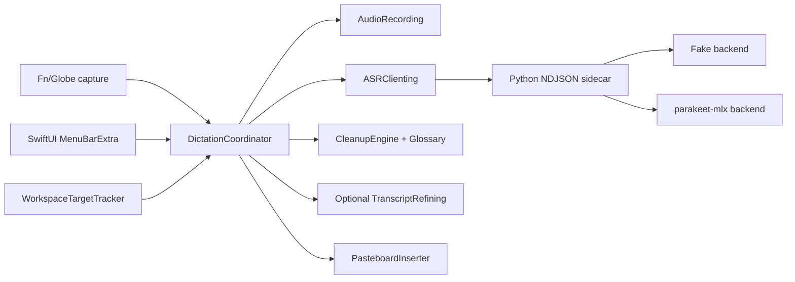

# Architecture

VoiceOour is split into three app Swift targets (plus the `voiceoour-bench` and `voiceoour-capture-bench` executables) and one Python sidecar.

## Swift targets

- `VoiceCore`: pure Swift contracts, ASR protocol wire types, session state, settings, deterministic cleanup, glossary persistence, and target safety classification. It imports Foundation only.
- `VoiceMac`: macOS adapters for audio capture, synthetic fake audio, sidecar process management, frontmost-app tracking, pasteboard insertion, permissions, Fn/Globe hotkey capture and Escape-to-cancel via CGEventTap, and the optional refiner backends (`OmpRpcRefiner` for a persistent `omp --mode rpc` child process and `FoundationModelsRefiner` for Apple's on-device system model on macOS 26+), dispatched by provider through `RefinerProviderRegistry`.
- `VoiceOour`: SwiftUI `MenuBarExtra`, settings UI, and `DictationCoordinator` orchestration.

## Session flow

`idle → checkingPermissions → recording → finalizingAudio → transcribing → cleaning → refining → readyToInsert → pasteAttempted/copiedOnly → idle`.

Each utterance has two target snapshots with separate jobs. The capture target is taken before recording and remains the context for app-scoped vocabulary, decoder bias, cleanup, and refinement. Immediately before insertion, `DictationCoordinator` takes a fresh delivery-target snapshot from the frontmost app; insertion safety, the target label, and recent-session destination metadata use that latest snapshot. A user may therefore move from app A to app B during transcription or refinement and deliver into B without changing the linguistic context captured for the utterance.

Recent-session state is normalized on the main actor, then complete snapshots are persisted off-main through one FIFO tail. Dictation awaits the pre-insertion checkpoint and the final outcome checkpoint; destructive clear/delete actions report completion only after their exact snapshot is durable. Termination rejects new starts and drains the captured persistence tail before exit.

`RecordingOverlayFocusTracker` places the recording island on the display containing the frontmost app's leading window, with the pointer display as a fallback. While the session is active it reacts to global clicks, app activation, active-Space changes, and display reconfiguration. A dragged island position is normalized within one display's visible frame and translated to the focused display, so saved coordinates never pin it to the monitor where it was first moved.

`refining` is skipped unless the refiner is enabled, configured, and the target is not terminal, code-editor, or secure. `TranscriptRefining` has two production backends. `OmpRpcRefiner` is the only one that reaches the network, and it does so through a subprocess rather than an HTTP client of its own: it keeps one persistent `omp --mode rpc` child alive (when OMP refinement is enabled and configured, the child is spawned lazily by recording-stop `warmUp()` or by a first direct refine, and respawned lazily on exit) and drives it over newline-delimited JSON: `prompt` → `agent_end` → `get_last_assistant_text` → `new_session`. The awaited `new_session` reset (~12ms) makes every refine a fresh conversation, so utterances never contaminate each other. The child runs in a hermetic profile directory (`~/Library/Application Support/VoiceOour/omp-rpc/.omp/settings.json`) that disables omp memory, hides MCP/builtin tool schemas, and turns off marketplace traffic — measured request context drops from ~22k tokens (inherited interactive config) to ~0.3k, and warm refine latency from 2.7–11.6s (old spawn-per-dictation print mode) to ~1–2s. On timeout the turn is aborted, the session reset, and deterministic cleanup text is used; a child that stops responding is terminated and respawned on the next refine. Both backends apply `RefinementGuards.passesFaithfulnessGuards` (length, glossary, and number preservation) and use deterministic cleanup fallback on guard failure or backend error.

OMP authentication remains owned by OMP. `OmpOnboarding` asks `omp auth-broker list --json` for the current login catalog, creates a mode-`0700` one-shot `.command` file in a unique app-support directory, and opens it through `NSWorkspace` so Terminal supplies the TTY required by OMP's browser, device-code, paste-code, and key prompts. The command runs with the same credential-shadowed environment as refinement, writes only its integer exit status back to VoiceOour, and deletes itself; VoiceOour never reads `~/.omp/agent/agent.db` or receives a token. After a successful login, the app reads only the provider-scoped `omp models <provider> --json` catalog, selects a matching fast model for ChatGPT, Claude, Gemini, or Kimi, publishes the resulting reachability verdict, and removes the temporary session directory. `Other` delegates provider selection to OMP's live list.

`OmpProviderStatusProbe` runs `omp usage --json --redact` plus the public provider catalog in the same credential-shadowed profile. It discards every identity and quota payload, aggregates only active/reporting/disabled account counts by provider, and feeds the Refinement pane's connected/attention/available groups. The four common subscriptions are UI constants so disconnected providers remain actionable; additional connected providers come from OMP's live catalog. Refresh generations prevent a stale subprocess result from overwriting a newer account inventory.

The Model field is a picker, not a text field, because the valid ids belong to OMP rather than to this app. `DictationCoordinator.refreshOmpModelCatalog()` reads `omp models --json` in the same hermetic profile and publishes the catalog as `ompModels` with an `ompModelCatalogState` of `idle`, `loading`, `loaded`, or `failed`; the Refinement pane filters that list and `selectRefinerModel(_:)` stores the chosen selector, where an empty selector means the provider default. A model id the user typed by hand could only be validated by failing a refine, so it is not offered.

That catalog query is the one `omp` call that deliberately runs with `shadowCredentials: false`. Every other call replaces each direct-provider credential with a single-space tombstone so OMP's dotenv loader cannot refill it, but OMP decides which providers to *advertise* by asking whether the variable is set and only trims the tombstone back to absent later, when it resolves a credential to use. Measured against the hermetic profile: shadowed, `omp models --json` answers with 50 providers and 1.2 MB of models the refiner cannot reach; unshadowed, it answers with the ~15 KB the signed-in accounts actually serve. Shadowed it also does not always answer at all — `GITLAB_TOKEN=" "` hangs the process indefinitely with nothing on stderr, where both an empty value and a real-looking `glpat-…` return in about a second. Dropping the names instead of tombstoning them keeps the leak closed either way: a credential inherited from the launching shell is not in `OmpEnvironment.preservedNames` and never reaches the child. `OmpModelsProbe` shares the loader, so the CHECK verdict and the picker always describe the same list.

A failed refine only overwrites that Status row when its reason names a durable OMP fault — the `launch failed:`, `omp not ready:`, `omp exited:`, and `omp protocol error:` prefixes in `DictationCoordinator.durableRefinerFailurePrefixes`. A timeout, a superseded turn, a cancellation, an empty answer, or a faithfulness-guard rejection says nothing about whether OMP is reachable, so it leaves the last probe verdict standing rather than reporting the provider as broken.

`FoundationModelsRefiner` (provider "Apple On-Device", macOS 26+ with Apple Intelligence enabled) runs Apple's system language model locally: no network, no API key, no app-managed model memory, measured p50 ~1.6-2.0s per refine on M4 Pro with the production glossary (`docs/performance-roadmap.md`). Each utterance checks out a pristine `LanguageModelSession` with `RefinerPolicy.onDeviceSystemPrompt` (the shared contract plus hard rules against its two measured failure modes) and the permissive content-transformation guardrails exactly once; the refiner retains at most one prewarmed spare and falls back to a cold session when none is ready. Prewarming is timing-sensitive and is driven from recording stop, not app launch: a session prepared long before use keeps little of its value across the idle gap, so preparing at launch — or right after the previous refine — buys almost nothing by the time the user dictates. `SingleUsePrewarmedSessionSlot.prepareFresh()` is therefore the only routine preparation path; it replaces an unused stale spare rather than no-op'ing on a `ready` slot, finishing a refine deliberately leaves the slot empty, and a preparation deferred past an in-flight checkout still lands when that checkout settles so back-to-back dictations recover. That yields exactly one preparation per refined utterance instead of one wasted spare plus one useful one. `DictationCoordinator` fires the hook unstructured as the stop path begins, so recorder finalization plus ASR supply the lead time without adding an `await` to the post-ASR critical path. Measured with idle held constant at 30s and only prewarm placement varied (240 accepted trials, shuffled schedule): preparing after the idle with a ~400ms lead is **383.5ms faster (paired median)** than preparing before it, 10/10 transcripts, 95% CI [361.6, 399.0], sign p=0.002; versus never prewarming the gain is 419.1ms, while a pre-idle spare retains only 37.2ms. Benefit saturates at roughly `min(lead, 300ms)`, and the opt-in Apple ASR backend leaves only ~16ms of lead so it gains little. Measured 12/14 battery passes; the residual failure shapes — conversational preambles and answered questions — are rejected by `RefinementGuards.looksLikeAssistantArtifact` (a guard shared by every backend), so they degrade to deterministic cleanup instead of being pasted. On macOS < 26 the factory installs `UnsupportedRefiner`, which skips with `requires_macos_26`.

`SystemLanguageModel` is a moving target, and that is a prompt-stability problem rather than a version-support one. Apple swaps the backing on-device model on OS updates — three versions so far, aligned with macOS 26.0-26.3, 26.4, and 27.0 — and publishes no API to pin one. The macOS 27 `SystemLanguageModel.variant` getter only distinguishes AFM 3 Core from AFM 3 Core Advanced, and there is no initializer or option that accepts a `Variant`, so the app cannot request a variant either; the system picks by hardware. The loaded model is nonetheless identifiable after the fact, and that is what makes a regression attributable: every response's `transcriptEntries` carry `Transcript.Response.assetIDs`, measured on macOS 26.5.2 as three version-stamped `com.apple.fm.language.instruct_3b.…` ids (generative, draft, tokenizer) that change when the model does. `FoundationModelsRefiner.lastModelIdentity()` reports them, cleared before every attempt so a call that never reached the model cannot inherit the previous one, and the pipeline stores them in `RefinementTrace.model`. A refinement recorded before an OS update and one recorded after are therefore distinguishable in `recent-sessions.json`, where both used to read `appleOnDevice:on-device` — the configured selector is a constant and says nothing. Nothing parses the ids: Apple documents no format for them, and a parser would be one more thing to break in exactly the release whose model swap the field exists to catch. A macOS 27 upgrade still replaces the model `RefinerPolicy` was tuned against, in place, with no code change and nothing announcing it in advance, and Apple's own guidance is to diff prompt output across model versions. `foundationModelsPreservesDictatedIntentIntegration` is that diff: it pins the two semantic behaviours the shared-rules exemplars buy, measured against the real model. Both were wrong before those exemplars landed — `use terminal no use text edit` refined to "Use terminal.", the alternative the speaker rejected, and `type the words git status into the note` lost "type the words" — and the faithfulness guards passed both, because a short rewrite that inverts intent stays lexically close to its transcript. Nothing downstream can catch that class of error, which is why it is pinned here and not left to the guards.

## Dictation history and statistics

Two durable files back dictation history, bounded for different reasons. `recent-sessions.json` is the transcript corpus: `RecentSessionStore` keeps the newest 500 and the user clears it from System ▸ Clear history. `dictation-stats.json` holds `DictationStatsLedger`, an uncapped aggregate tally. Retention is the right bound for text a person may want to re-read and the wrong bound for a lifetime count — derived from the ring, every "all time" figure was a rolling window: totals plateaued at the cap, "since <date>" walked forward as old sessions were evicted, and the dictation count froze at exactly 500.

`DictationStatsLedger.ingest(_:calendar:)` folds each session exactly once, keyed by session id, so one function serves the first-run seed over the retained corpus, the per-dictation append, the in-place outcome amendment (a second `settled` phase carrying the destination bundle id and the post-release wait), and reconciliation after a crash or a deleted stats file. Its rings are bounded: 512 remembered session ids — necessarily above the transcript cap, or a relaunch would recount sessions it had already folded — 400 daily rows, and a 320-character record preview. `DictationStatsStore.init(besideRecentSessionsAt:)` derives the stats path from the transcript path, so redirecting one never leaves the other pointed at the user's real Application Support directory; a missing or future-versioned file reads as an empty ledger and the next seed rebuilds it from whatever transcripts remain.

`RecentSessionJournal` funnels every mutation through `foldStatistics()` and one snapshot FIFO that writes both files, and the durability acknowledgement is the conjunction of the two results — otherwise a `clearRecentSessions()` that erased the transcripts and failed to erase the tally would report success.

Privacy follows the same split. Clearing history calls `reset()`, so the tally goes with the text; a lifetime word count and a per-app breakdown are still a record of what the user asked to erase. Deleting one transcript calls `forget(sessionID:)`, which keeps the lifetime counts — the dictation still happened — and drops the quoted record if that session held it. Apart from that one 320-character preview the ledger stores no transcript text: counts, milliseconds, per-hour and per-day rows, per-bundle-id tallies, and two personal bests.

`DictationInsights(ledger:keptSessions:calendar:now:)` is the single digest over both halves. Lifetime figures come from the ledger; `uniqueWordCount` and `keptTranscriptCount` need the text itself and are therefore named for the kept-transcript window they cover. The time economy is measured-only: a session without `stages.captureMs` contributes nothing to it rather than an assumed speaking rate, and Home discloses how many such dictations exist until the last of them ages out (`isFullyMeasured`).

Time saved is `max(0, typedMs - elapsedMs)`, clamped once at the aggregate — clamping per session would discard every slow dictation's cost while keeping every fast one's saving. `typedMs` is `measuredWords / typingWPM × 60_000`, and `elapsedMs = spokenMs + waitMs`, where `waitMs` is recorder start latency plus, at settle time, `stopReleaseToInsertionOutcomeMs` when the outcome recorded it and `asrMs + insertMs` otherwise. `dictationWPM` is end to end on the same basis as the baseline; `spokenWPM` and the `peakSpokenWPM` record are speech alone and are labelled as speaking rates wherever they render.

The baseline is `Settings.typingSpeedWPM` (`typing_speed_wpm`), default `DictationInsights.defaultTypingWPM` = 52, clamped to `typingWPMRange` 10...200 on decode and on write, and edited on Home itself. 52 wpm is the mean of 168,000 volunteers over 136 million keystrokes (Dhakal, Feit, Kristensson & Oulasvirta, *Observations on Typing from 136 Million Keystrokes*, CHI 2018 — 51.56 wpm, SD 20.2). The 40 wpm this dashboard used before had no measurement behind it. Every baseline-dependent figure is a function taking the rate as an argument — `typedMs(typingWPM:)`, `timeSavedMs(typingWPM:)`, `speedMultiplier(typingWPM:)` — rather than a property reading a constant.

Home has no digest of its own: it renders `coordinator.insights`, which the journal republishes on every change. The view-side cache this replaced keyed on `recentSessions.map(\.id)`, which cannot observe `updateRecentSessionOutcome` amending a session in place, so TOP APPS was permanently one dictation behind. `refreshInsights()` also runs when Home appears, because the streak and the fourteen-day window are relative to now.

`RecentSessionQuery.totals(of:calendar:now:)` counts the Sessions pane's today and this-month figures from the ledger's daily rows rather than the retained transcripts, so a month busier than the retention cap no longer undercounts. Diagnostics ▸ STORAGE lists all three paths, the stats file as `Dictation stats` (`copy.dictation-stats-path`).

## Microphone capture

Both real backends record through one front-end. `MicrophoneCapture` is an `AVCaptureSession` plus an `AVCaptureAudioDataOutput`, pinned to a chosen input device UID, handing raw PCM buffers to a consumer on a private serial queue. `MicrophoneRecorder` wraps it as the `AudioRecording` adapter for the `mlx` backend and the macOS-below-26 `apple` fallback, and the Apple streaming session consumes the same buffers, so both backends report capture liveness identically and `CaptureConverter` is the single place a source format becomes the 16 kHz mono Int16 that the WAV file and the analyzer both want.

It is not an `AVAudioEngine`, and it cannot be. An engine's input and output share a single AUHAL on macOS, so pinning the input to the built-in microphone while the output stays on a Bluetooth headset fails graph initialisation with `-10868` (`kAudioUnitErr_FormatNotSupported`). Measured twice, once with the device set after the input node had materialised and once before any format was read: in both orderings `setDeviceID` reports success, the node keeps the *old* device's format, and `engine.start()` throws. `AVCaptureSession` selects its device explicitly and has no output side to conflict with. An engine input tap is the shorter code path and is not an option here; do not restore one.

A Bluetooth headset microphone is not merely slow to open, it is absent for over a second. Measured on AirPods Max through the identical capture code path:

| pinned device | first buffer | first non-zero buffer | all-zero buffers |
|---|---|---|---|
| MacBook Pro Microphone | 99 ms | 99 ms | 0 of 375 |
| AirPods Max, cold | 143 ms | 1422 ms | 64 of 197 |

Those 64 buffers are digital zeros, not quiet audio: macOS opens the capture immediately and pads it with silence until the HFP/SCO link finishes negotiating, so speech in that window is not faint, it is unrecorded. Nothing is blocked while it happens — a plain `AVAudioRecorder` probe returns from `record()` in 126 ms and reads exactly `-120.0 dB` of average power through the gap before jumping to -66 dB — and a warm link, captured one second after a previous session, reaches audio in 114 ms.

`CoreAudioInputDevice.preferredCaptureUID()` is the one policy decision about which microphone a dictation opens. It answers with a built-in microphone's UID only when the system default input is a Bluetooth device *and* a built-in input exists, and with `nil` — record from the system default — in every other case. It is deliberately narrow: a USB interface, an aggregate device, or a virtual microphone is the user's considered choice and is never redirected. Never opening the headset microphone buys two things beyond the missing second: there is no HFP negotiation to wait for, and the link stays in A2DP, so playback keeps its music-quality codec for the length of the dictation. The tradeoff is real and is not hidden — the dictation is captured from the Mac rather than from the headset, which is the wrong answer for a user speaking from across the room. A pinned UID that no longer resolves falls back to the system default rather than failing the dictation.

Capture is live at the first buffer containing a non-zero sample, never at the first buffer to arrive. `MicrophoneCapture.hasReceivedAudio()` and `AudioRecording.captureIsLive()` answer that question, and `startLatencyMs()` measures start to first *real* audio. Keying on buffer arrival is precisely what let the recording island draw a live waveform while the microphone did not yet exist, and it is what made the telemetry look healthy: `startLatencyMs` reported a p50 of 188 ms across the 80 real sessions that recorded it while over a second of speech was being dropped from each Bluetooth one. Exact zero is the discriminator instead of a decibel threshold because the table above settles it rather than guessing — the all-zero column is the whole argument. `SessionStageTimings.startLatencyMs` therefore changed meaning rather than accuracy: it was start-to-first-buffer and is now start-to-first-non-silent-buffer, so values recorded before this change cannot be compared with values recorded after it.

Which microphone a dictation used is not persisted. `MicrophoneCapture.Source` carries the uid, the device name, and an `isRedirected` flag in-process, and the Apple path's stderr session-init line names the device it opened; `SessionStageTimings` gains no field for it, because the input device is not worth writing to disk once per utterance.

## ASR protocol v1

The sidecar speaks newline-delimited JSON on stdio. stdout is protocol-only; logs go to stderr. Every message carries `protocol_version: 1`. The sidecar emits `hello` at startup, accepts `health`, `transcribe`, and `cancel`, and returns exactly one terminal `result`, `error`, or `cancelled` per `transcribe` request.

The sidecar is a persistent process. `SidecarASRClient` spawns it once (lazily, or eagerly via `warmUp()` at app launch), validates the `hello` handshake, keeps stdin/stdout open, and multiplexes requests by `request_id`; the MLX model therefore loads once per app run, not once per utterance. On the Python side the stdin reader stays live while `transcribe` runs on a worker thread, so a `cancel` for the in-flight request id takes effect immediately. `VOICEOOUR_PRELOAD=1` (set by the client) makes the MLX backend load the model right after `hello` and then run one throwaway inference on silence, because MLX is lazy and the first `generate()` otherwise pays ~0.9s of kernel compilation on the first dictation. Transcribe requests for the app's native recordings (16 kHz mono 16-bit WAV) decode in-process via `load_pcm16_mono_wav` instead of parakeet's per-request ffmpeg subprocess; other formats fall back to `parakeet_mlx.load_audio`. Timeouts send `cancel`, wait briefly for a terminal message, then terminate the process; the next request respawns it. Sidecar stderr is drained continuously and forwarded to the app's stderr.

The process boundary is not a latency cost worth optimising, and this is measured rather than
assumed. Driving the real sidecar over its real stdio protocol on an M4 Pro (FLEURS, n=32), the
caller-visible round trip exceeds the `inference` time the sidecar reports from inside itself by
**0.8 ms at p50 and 1.3 ms at p95** — 0.68% of a 119.9 ms Parakeet round trip, and 0.27% of a
322.3 ms ARK-0.6B one. Everything the mechanism adds is in that number: `fork`/`exec` is already
paid, the JSON encode/decode is small, the pipe is local, and the WAV is handed over by path rather
than copied through the pipe. Python's GIL does not appear because the MLX call releases it into
Metal for the duration. What the mechanism *does* cost is one-time and hidden: ~130-320 ms from
spawn to `hello`, and a first transcribe of ~1.3-1.5 s that absorbs model load plus MLX kernel
compilation, which is exactly what `VOICEOOUR_PRELOAD=1` exists to move off the first dictation.
So when an ASR backend is slow here, the model and its framework are the reason; rewriting the
transport would buy back under a millisecond.

The client sends the model its backend pins, not one global model: `SidecarASRClient` is constructed with the `expectedModel` its `ASRBackendDescriptor` carries (`ASRModelContract` for `mlx`, the ARK repo id and revision for `ark-0.6b`/`ark-3b`, none for `fake`). The MLX backend rejects mismatched `model_id` or `revision` with `MANIFEST_MISMATCH` (empty strings act as wildcards); an absent `expected_model` is accepted, which is what a backend with no model to pin sends.

Transcribe results carry additive optional evidence fields, all decoded permissively so `protocol_version` stays `1` (no version bump): per-`ASRWord` and per-segment `words` (text, time range, confidence), a transcript `confidence` with a `confidenceMode` tag (`greedy_entropy`, `beam_logprob`, or `none`), a ranked list of `ASRHypothesis` each carrying a pre-bias `rawScore`, and an `ASRDecoderInfo` block. Requests may carry `biasPhrases` and a `biasSnapshotId`; an oversized bias list is rejected with the `biasListTooLarge` error. The fields are optional, so sidecars and clients that omit them decode unchanged. The fake backend and `fixtures/protocol/` exercise every field.

Golden protocol fixtures live in `fixtures/protocol/` and are decoded by both Swift and Python tests.

## Where the ASR boundary is going

Researched 2026-08-13 against four competing designs and four scoring lenses, then partly overtaken
by measurement on 2026-08-14. Recorded here because the current boundary is adequate for five
backends of three families and will not survive the fourth family. The invariants below are the
direction; nothing about the boundary itself is built yet.

**The non-abstraction work came first, and it was not where it was predicted to be.** The design pass
claimed ~130 ms of non-ASR overhead sat in both the `mlx` and `apple` paths, and prescribed deferring
the journal write, statistics folding and audio-route restoration past the paste. Measurement
contradicted most of that:

- Overhead is not shared between the paths. Segmenting real sessions by backend and mute state —
  `parakeet-mlx`, refinement skipped — gives non-ASR overhead of **72 ms p50 unmuted (n=13)** against
  **199 ms muted (n=92)**. Mute state, not the path, was the variable.
- The 127 ms difference was `SystemAudioMuter.restore()`, whose `fadeDuration` is **120 ms** (not the
  105 ms the design pass cited) and which `processStop` awaited *before* the ASR call. 80.1% of
  real-backend sessions were muted, so four in five dictations paid it in front of a 117.8 ms
  inference. The fix was to **detach** it so the fade ramps under the transcription, not to defer it
  past the paste: the user wants their audio back promptly, and nothing about transcription depends on
  the fade having finished.
- The journal write, the largest of the prescribed deferrals, measures **1.5 ms**. Not worth moving.

`Sources/VoiceOour/StopPathSignposts.swift` now carries an `OSSignposter` with six intervals over the
stop path, which previously had none — that absence is why a 120 ms fade had to be found by reading
source rather than by measuring. Emission is verified only as far as `OSSignposter.isEnabled`;
signposts are ephemeral and need Instruments to collect, as that file records.

**Streaming is a property of the checkpoint, and the boundary must be able to say so.** Encoded as a
type, not a setting: a backend may not advertise capture-time operation unless it declares a finite
lookahead. `parakeet-tdt-0.6b-v3` cannot, which is why `transcribe_stream` lost. Four
streaming-trained candidates were then measured and all lost too — a streaming model must drain its
trained delay before it can finalise, and at these utterance lengths that drain costs more than
decoding the whole utterance once. Streaming is **not enabled in any shipping path**; see the
performance roadmap for the full grid and the conditions under which it becomes interesting again.

**Evidence must be earned, not asserted.** Today a backend states its evidence implicitly by which
optional fields it fills, and `biasEnabled` already showed how a defaulted field turns "unknown"
into a false negative. The durable shape is a three-way distinction — what a backend *claims*, what
it has been *certified* to produce against falsification probes (uniform-spread timestamps, constant
confidence, duplicated n-best), and what a given result actually *used* — with each signal naming
the quantity behind it. A transducer joint posterior, an AED average logprob and an audio-LLM
sequence logprob are three different numbers and must never share one `confidence` field without a
`basis` and a calibration identity.

**One boundary crossing per utterance.** Metal dispatch on this host costs ~90-116 us per separate
command-buffer commit against ~0.7-3 us batched, and a TDT decode makes 40-60 joint calls. Any
abstraction that puts a process, serialisation or materialisation boundary *inside* a decode loop
forfeits more than the runtime choice wins. Iteration belongs inside a stage.

**Do not hard-code a compute unit.** ANE is reachable only through CoreML, its specialization cache
is invalidated by every OS update, and its int4 is storage-only (weights dequantize to fp16 before
matmul). Meanwhile M5 puts a Neural Accelerator in every GPU core and MLX reaches them through
Metal 4 tensor ops, so the ANE-versus-GPU seam this design might have optimised around is being
dissolved by Apple. FluidAudio already ships this model on the GPU rather than the ANE.
Compute placement is a per-artifact hint to be measured, never an architectural commitment.

## Apple Speech backend (opt-in, macOS 26+)

`--asr-backend apple` selects the native on-device SpeechAnalyzer/SpeechTranscriber path instead of the Python sidecar. No Python process, no model download managed by VoiceOour (speech assets are system-managed per locale via `AssetInventory`), and no speech-recognition authorization prompt (the API is fully on-device; microphone permission is unchanged).

The backend is a fused recorder + ASR: `AppleSpeechDictationEngine` is injected as BOTH `AudioRecording` and `ASRClienting`, and transcribes WHILE recording. Each dictation is one single-use streaming session (probing showed a finished `SpeechAnalyzer` cannot be restarted): a `MicrophoneCapture` session feeds `CaptureConverter`, which converts its buffers once to 16 kHz mono Int16 — simultaneously the WAV file format and `SpeechAnalyzer.bestAvailableAudioFormat` — and hands them to an incrementally written WAV (fallback + existing cleanup invariants) and a live analyzer input stream. `stop()` drains the converter tail (mandatory; up to ~220 frames), transfers WAV ownership to the coordinator, and starts finalization; `transcribe()` awaits it — measured stop-to-result 43-285ms versus 220-900ms for batch file transcription. Any streaming failure falls back to batch transcription of the recorded WAV; foreign files (bench CLI, tests) always use the batch path (`AppleSpeechASRClient`). `SpeechAnalyzer.Options(modelRetention: .processLifetime)` plus a `prepareToAnalyze` warm-up keep the system model resident between dictations. On macOS < 26 the factory installs `UnsupportedASRClient`, which fails with `backend_unavailable`.

Module choice is measured, not assumed: `DictationTranscriber` (which supports `AnalysisContext.contextualStrings` vocabulary biasing and a `.punctuation` option) scored 10.64% WER vs SpeechTranscriber's 3.74% on the same LibriSpeech subset and ran 54% slower, so SpeechTranscriber is used and glossary recovery stays in the cleanup/refiner layers. SpeechTranscriber ignores `AnalysisContext` on macOS 26.5.

SpeechTranscriber also emits per-word evidence: each finalized result carries per-word time-range and confidence run attributes, surfaced through the same optional protocol fields with `confidenceMode` `none` (the module exposes no calibrated score). It stays the primary Apple transcriber, and its alignment/confidence data feeds the same evidence pipeline as Parakeet.

Benchmarked against Parakeet on this hardware (M4 Pro, macOS 26.5.2), row-matched over identical manifest rows (2026-08-11): LibriSpeech n=128 U-WER 3.13% vs 2.84% and CER 1.14% vs 0.92%; FLEURS n=64 U-WER 6.13% vs 4.42%, F-WER 13.00% vs 10.28%, case F1 0.848 vs 0.921. Parakeet wins every content axis; Apple wins exactly one, punctuation micro-F1 0.870 vs 0.833. Batch latency now favours Parakeet as well — ASR p95 348ms vs 802ms on LibriSpeech, 167ms vs 236ms on FLEURS. This supersedes the 2026-07-17 figures (LibriSpeech 128 vs 64 rows, FLEURS n=8, Apple p95 885ms against a 2327ms Parakeet tail): those runs were not row-matched, the FLEURS verdict flipped once n grew from 8 to 64, and the Parakeet latency tail disappeared when the sidecar became persistent and preloaded. `mlx` remains the default backend.

The live-session transcriber runs with `reportingOptions: [.volatileResults, .fastResults]`: an A/B over the same LibriSpeech n=64 subset measured fast-mode final U-WER 2.82% vs 3.07% for finals-only, so fast mode ships (verdict FAST). Only finalized results are collected — volatile results are intentionally ignored (a live transcript preview was built and then removed on user feedback; the reporting options stay as measured). The engine takes a `locale:` at init (from the `speech_locale` setting, default `en_US`, applied at next launch) and threads it through the streaming session, prewarm, and the composed batch client. The recording overlay gates its "listening" presentation on real capture liveness: `AudioRecording.captureIsLive()` — the first non-silent buffer, never the first buffer to arrive — is polled by the coordinator's meter loop into a published `captureLive`, and the island holds a static `WARMING` label until real audio arrives, so the waveform's appearance means the microphone is actually hearing you.

`speech_locale` is normalised through `VoiceCore.SpeechLocale.canonical` when `Settings` decodes, so an identifier Foundation cannot resolve falls back to `en_US` instead of reaching `SpeechTranscriber`. That fallback is load-bearing rather than cosmetic: `SpeechTranscriber.supportedLocale(equivalentTo:)` answers an unresolvable identifier with nil, and every `transcribe` then fails `backend_unavailable`, so one bad string takes the entire Apple backend down with no in-app way back. A build that persisted the settings field on every keystroke left `" "` on disk and did exactly that. The settings pane commits on submit or focus loss through the same canonicaliser, and the batch client names the offending identifier in its error detail.

Reliability and observability around the session: a device or route switch mid-dictation is followed from the data rather than announced by a notification. `CaptureConverter` reads each sample buffer's own format description, and on a change it drains the previous converter before building its replacement, so the resampling tail is kept at the seam instead of dropped; `AVCaptureSession` re-negotiates its device itself, and the buffer's format description is the earliest reliable notice that anything moved. A source format no `AVAudioConverter` can be built for sets `CaptureConverter.didFailToFollowFormat`, which `StreamingSession.consume` latches into `routeRecoveryFailed` and which forces `transcribe()` onto the batch path over the WAV — a switch that could not be followed would otherwise finalize only pre-switch audio while reporting a healthy `streamed` result. A startup scavenger (`RecordingScavenger.sweep`) deletes WAVs older than one hour from the app's temporary recording directory, so crashes and sleep interruptions cannot accumulate orphans. Per-session stage timings (`SessionStageTimings`: ASR ms, insert ms, mic start-latency ms, and the served path `streamed`/`batch`) are recorded with each recent session and shown in the Sessions view. Optional hands-free auto-stop (`auto_stop_enabled`, default off; dwell `auto_stop_silence_ms`, default 2500) consumes the coordinator's meter levels and stops the recording after sustained silence following speech, with a 3 s minimum session.

Start latency: the system-audio mute runs concurrently with recorder startup (accepting a few tens of milliseconds of speaker bleed at capture start) instead of serializing ahead of it; muter operations are FIFO-chained in the coordinator so a stale session's restore can never reorder after — and undo — a newer session's mute, and the stop path awaits the in-flight mute decision so session metadata records the true muted state. `StreamingSession.init` logs a one-line stderr breakdown (`session init breakdown total=…`) per session, naming the capture device it opened; measured init is ~134–216 ms, dominated by audio-HAL spin-up, which cannot shrink further without pre-arming the microphone before user intent. On a Bluetooth default input that figure was never the number that mattered, which is what *Microphone capture* above is about. The Sessions view also offers a `FIX / TEACH` affordance that appends a canonical to the glossary directly from a transcript (derived aliases make it effective immediately). Noise robustness is benchmarked (see `docs/benchmarks.md`): U-WER is flat at 20 dB SNR, ~2x at 10 dB, and degrades sharply at or below 5 dB.

Refinement is gated deterministically before any model call: `DictationPolicy.assessTranscript` skips the refiner for clean transcripts (reason `clean_transcript`) and for transcripts over 350 words (reason `transcript_too_long`); repair markers, filler density, repeats, length ≥ 40 words, bare glossary components, or a phonetic near-miss of a glossary alias trigger refinement. The refine prompt adapts per target app via `DictationPolicy.refinementStyle(forBundleId:)` — casual for chat apps, formal for mail clients, standard otherwise.

Technical jargon is recovered in three layers, none of which touch the ASR model (vocabulary biasing is a measured dead end on this stack). Layer 1, deterministic: `Glossary.derivedAliases(for:)` derives spoken variants from each canonical by case/acronym/digit/separator tokenization (`NSPasteboard` → "ns pasteboard", "n s pasteboard"), so typing a canonical in the Glossary pane is sufficient — hand-written surfaces are only needed for true mishearings like "cube cuddle" → `kubectl`. Those surfaces live in two stores: `spokenAliases` for what the user typed, `labeledAliases` for observed surfaces the user confirmed or rejected. `Glossary.userAliases(for:)` is the one read accessor over both, so the ledger's DETECTED AS column, `matchingAliases`, cleanup's disfluency shelter (which keeps filler stripping and repeat collapsing from eating a surface that spells a hesitation or stutter as part of itself), the refiner prompt, and the decoder-bias list cannot disagree about what a term has been taught; the inline editor commits through `TermMutation.settingAliases(_:on:)`, which reconciles both stores so deleting a surface actually stops it matching. Layer 2, routing: `assessTranscript` flags 1–4-word n-grams within a bounded edit distance of any alias as a near-miss, forcing the refine path even for otherwise clean utterances (a false positive costs one refine, never a wrong paste). Layer 3, model: refiner prompts render each term as `canonical (heard as: …)` with an explicit mishearing-repair instruction, and the existing term-lock/faithfulness guards validate the output.

## Model pin

The default backend uses `mlx-community/parakeet-tdt-0.6b-v3` pinned at Hugging Face revision `ed2b7e8c15f9aaa0b5772e2efb986255eaef7e15`, recorded in `asr/src/voiceoour_asr/cache.py` as `PARAKEET` (still exported as `MODEL_ID`/`MODEL_REVISION`). The opt-in ARK backends pin `leope/ark-asr-0.6B-mlx` at `6ec069bd68cbbe165aa42728eac482c90cb58d2f` and `leope/ark-asr-3B-mlx` at `63d9fb8ba352c5c7c65ff2336019048170563d63` as `ARK_06B` and `ARK_3B`.

Each pin is a `cache.ModelSpec` — repo id, revision, its own directory under `~/Library/Caches/VoiceOour/`, and for ARK an allow-list that fetches weights and tokenizer assets only, never the Python runtime the ARK repos ship (that runtime is vendored verbatim under `asr/src/voiceoour_asr/backends/ark_mlx/`, so the app never imports code downloaded at runtime). `cache.ensure_model(spec)` writes a manifest containing model id, revision, and snapshot path. Once a manifest exists, the sidecar sets `HF_HUB_OFFLINE=1` before loading.

## Parakeet decoding

The MLX Parakeet backend has two decoding modes. The default greedy path now emits per-token alignments, `words`, and a transcript `confidence` tagged `greedy_entropy`, at unchanged latency — the evidence is a byproduct of the existing greedy pass, not a second decode. An opt-in beam path (`VOICEOOUR_ASR_DECODING=beam`) returns ranked n-best `ASRHypothesis` with raw beam scores. Both modes preserve an unbiased (zero-boost) `rawScore` baseline for every hypothesis, so downstream authority decisions can always compare against a score that no decoder bias touched.

## Vocabulary model

Vocabulary is trust-separated. A persistent `ProtectedTerm` carries a stable `termId`, a `source` (`TermSource`: `explicitCorrection`, `manualImport`, `appProfile`, or `bundled`), a `scope` (`VocabularyScope`: `global`, `bundleID`, or `projectID`), a `cloudEligible` flag, `labeledAliases`, and a `tombstonedAt` for soft deletion. Low-trust, in-session hints are held as in-memory-only `EphemeralContextCandidate`s that never persist. Legacy `settings.json` glossary state still loads through an additive, fully defaulted decode, so older installs upgrade in place.

For each utterance, `VocabularyCompiler` compiles a bounded active snapshot — at most 100 terms — scoped to the captured target's bundle id plus the active project, so only terminology relevant to where the text will land is in play. That snapshot is the single active set consumed by refinement, biasing, and the risk authorizer.

Two boundaries protect this vocabulary. The cloud boundary: only `cloudEligible`, non-tombstoned, non-`projectID`-scoped terms are placed in the network-bound `OmpRpcRefiner` prompt; the on-device `FoundationModelsRefiner` keeps the full active set, so project-private terminology never leaves the device. The refinement boundary: a word-boundary term-lock protects accepted terminology through refinement, matching whole tokens rather than substrings (fixing a prior substring false-pass that let a locked term be altered inside a larger word).

## Term correction and biasing

A deterministic risk authorizer maps each candidate term correction to `KEEP`, `suggest`, or `replace`. It is wired end to end, but automatic replacement is off by default (`Settings.automaticTermCorrectionEnabled = false`): with it off, the authorizer only ever surfaces suggestions and never rewrites the transcript. Even when enabled, a `replace` requires independent n-best support, non-decoder-biased evidence (the preserved unbiased `rawScore`), and calibrated absolute-plus-margin thresholds; critical terms — commands, flags, paths, and versions — are vetoed from auto-replacement whenever the evidence is ambiguous.

Decoder bias is likewise off by default (`Settings.decoderBiasEnabled = false`). When enabled it applies trie shallow-fusion over a term-to-BPE segmenter during decoding while preserving the unbiased (zero-boost) `rawScore` baseline invariant, so biased and unbiased scores stay independently available for the authorizer. On the current smoke tier, unconditional bias produced no term-recall gain and regressed both hard-negative false-replacement and U-WER well past the approved +0.35 pp U-WER budget, so it stays off pending real-speaker calibration.

Every automatic-authority path — auto-correction, decoder bias, and keyword spotting — is gated on a consented real-speaker TechTerms corpus that does not yet exist; current TechTerms coverage is TTS smoke-only. Stage 5 keyword spotting is deferred: CTC word-spotting is blocked because the pinned checkpoint has no CTC head, and a separate local KWS model needs real-speaker plus resource and false-accept justification before it ships.

## Why VoiceOour holds no credentials

This app stores no secret. Refinement has exactly two destinations, and neither
takes a credential from VoiceOour: `omp` keeps every provider token in its own
vault and brokers whichever subscription the user signed into, and Apple's
on-device model needs no credential at all. There is no API-key field, no
`api-key-<provider>` keychain item, no credential environment variable, and no
user-typed base URL that a key could be bound to.

That is a measurement as much as a preference, and the measurement is worth
keeping after the code that motivated it. While the app did hold a refiner API
key, the data protection keychain could not store it at all: on macOS that
keychain resolves an item's access group from a code-signing entitlement which
must be authorized by a provisioning profile, and this bundle ships neither —
`Resources/VoiceOour.entitlements` is audio-input only and `scripts/bundle.sh`
embeds no profile. `SecItemAdd` answered `errSecMissingEntitlement` (-34018),
and adding `keychain-access-groups` to an ad-hoc signature instead got the
process killed by AMFI (`"adhoc signed but contains restricted entitlements"`).
Both outcomes were measured, not assumed, so a bundle in this shape has no
first-class place to keep a secret. A future feature that appears to need one
should broker it through a process that already owns a vault, the way
refinement does, rather than reintroduce a keychain here.

## Refiner settings and migration

`refiner_provider` persists exactly `omp` or `appleOnDevice`. `refiner_model`
holds a selection from OMP's catalog, and `RefinerResolved.model(_:)` resolves
what the refiner actually uses: for `omp`, the stored selection or the provider
default when it is empty; for `appleOnDevice`, always `on-device`, because that
provider has exactly one model whatever the file says. Switching providers
therefore clears nothing — a model chosen for OMP survives a detour through the
on-device provider. `refiner_base_url` is gone with the providers that needed
it: no refinement destination is user-typed any more.

A settings file naming one of the retired direct-vendor providers (`gemini`,
`openAI`, `openRouter`, `custom`) decodes to `omp` with `refiner_model` cleared
and `refiner_enabled` forced to `false`. The clear is required because a Gemini
or OpenAI model id means nothing to OMP; the forced opt-out is a consent
decision, because those installs were sending text to a provider the user chose
with a key the user supplied, and quietly redirecting a live refiner to a
different network destination is not a migration detail.

## Insertion policy

`DictationCoordinator` passes the just-captured delivery target to `PasteboardInserter`, which writes plain text to `NSPasteboard.general` and posts Cmd-V only after two identity checks:

1. Safety class must be `.normalText`. `InsertionSafetyPolicy` owns that mapping and takes no parameter to widen it.
2. Synthetic paste permission must be granted.
3. `TargetTracking.stillMatches` must pass before clipboard write.
4. Clipboard is written.
5. `stillMatches` must pass again before Cmd-V.

`stillMatches` compares bundle id, pid **and** safety class. Safety is part of the identity because a focus change inside one process — a web page auto-focusing a password input while the inserter awaits the permission request — keeps the first two and would otherwise receive synthetic Cmd-V.

Terminal, code-editor, secure, and unknown-risky targets are copy-only, unconditionally — there is no setting, launch flag, or constructor argument that makes any of them pasteable. An AX inspection that cannot be completed classifies the target `.unknownRisky` rather than ordinary text, so an unreadable focus is copy-only rather than pasteable, and that is precisely why the class cannot be opted out of. The previous clipboard is never read or restored.

AX role and bundle id are not the only secure-target signal. `WorkspaceTargetTracker` also samples
`IsSecureEventInputEnabled()`, the system-wide flag macOS raises whenever any process has secure
keyboard entry active, and an active flag classifies the target `.secure` regardless of what AX
reported. Without it a custom or AX-opaque password UI classified as ordinary text, so dictated
speech could be pasted into a password field. It fails closed by design: the flag is global, so a
false positive costs one copy-only delivery.

Copy-only writes carry the `org.nspasteboard.ConcealedType` marker alongside the string, and text
delivered by Cmd-V carries `org.nspasteboard.TransientType`, so clipboard-history managers can skip
archiving dictated text to their own on-disk stores. Both are advisory community conventions that
managers opt into — they are not enforcement, and the `.string` type is always written so the user
can still paste manually.

Past the pasteboard write the clipboard is the delivery mechanism, so a Cmd-V that cannot be posted (`post_event_failed`) and cancellation after the write (`cancelled_after_copy`) both report copy-only. `insertFailed` is reserved for genuine pre-write failures.

After Cmd-V is posted successfully, a deferred task (~1500 ms) clears the dictated text from the pasteboard via a change-count guard (`GeneralPasteboard.clearIfUnchanged(since:)`): if any other writer touched the pasteboard after our write, the clear is skipped without inspecting contents. Copy-only outcomes never schedule the clear — the clipboard is the delivery mechanism there.

## Test strategy

- Swift: `make test` covers cleanup fixtures, glossary term-lock, protocol fixture decoding, classifier mapping, persistent sidecar client lifecycle (process reuse, timeout kill, stderr flood, cancel, respawn, request encoding) against stub processes, copy-only insertion paths, focus-race insertion, omp RPC refiner lifecycle (JSONL stub session, process reuse across refines, guard fallback, launch failure, mid-turn death, hung-turn timeout), refinement guards, and pure dictation policy (launch options, refinement eligibility, outcome mapping).
- Python: `cd asr && uv --no-config run pytest` covers protocol fixtures, cache manifest corruption/recovery, and process-level sidecar behavior (health, persistence across requests, cancel-during-transcribe, stdout protocol purity, malformed-line recovery).
- Real ASR: `scripts/phase0_asr_proof.py` validates the pinned model on a generated WAV fixture and prints latency/RSS.
- Benchmarks: `docs/benchmarks.md` describes the accuracy/speed benchmark suite (`voiceoour-bench` + `bench/`).
- Packaging: `scripts/verify_bundle.sh` checks bundle plist values, signature validity, and entitlement metadata after `scripts/bundle.sh`.
