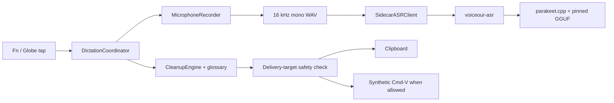

# Architecture

Voiceour is a macOS menu-bar dictation app with one production speech path: microphone capture, a local Parakeet sidecar, deterministic cleanup, glossary canonicalization, and safety-checked delivery. The pinned model download is the only network path. The `voiceour-asr` helper is the only subprocess.



## Swift targets and products

- `VoiceCore` is Foundation-only domain logic: settings, session state, ASR wire types, cleanup, glossary, recent-session models, failure presentation, and target-safety policy.
- `VoiceMac` contains macOS adapters: capture, fake audio, sidecar process management, target tracking, pasteboard delivery, permissions, hotkeys, and system-audio muting.
- `Voiceour` owns the SwiftUI menu, recording overlay, native console window, and `DictationCoordinator` orchestration.
- `ASRSidecarCore` owns model acquisition, WAV loading, the Parakeet context, token mapping, fake and Parakeet sidecar backends, and the NDJSON server.
- `VoiceourASR` builds the `voiceour-asr` executable. `ASRSidecarStub` supports process-contract tests.
- `VoiceourBench` builds `voiceour-bench`, which runs the production ASR-and-cleanup path over manifests.
- `CGgml` and `CParakeet` compile the vendored C/C++ implementation under `Vendor/parakeet/`.

The package products are `Voiceour`, `voiceour-asr`, `voiceour-bench`, `VoiceCore`, and `VoiceMac`.

## Session flow

The observable state machine is:

```text
idle -> checkingPermissions -> recording -> finalizingAudio -> transcribing -> cleaning
     -> readyToInsert -> pasteAttempted | copiedOnly | insertFailed -> idle
```

`error` and `cancelled` are terminal outcomes before the coordinator returns to `idle`.

Each utterance uses two target snapshots. The capture target is taken before recording and selects app-scoped vocabulary. A fresh delivery target is taken immediately before persistence and insertion. The inserter checks identity again before writing the pasteboard and again before posting Cmd-V, so a focus race can only degrade to copy-only.

Stopping always finalizes one WAV and performs one final decode. `CleanupEngine.clean` then removes configured fillers and performs glossary canonicalization. There is no probabilistic text-processing stage after ASR.

## Microphone capture and recorder ownership

`MicrophoneCapture` is an `AVCaptureSession` pinned to a selected input-device UID. It has no output graph, avoiding the measured AUHAL failure where `AVAudioEngine` could not combine a pinned built-in input with Bluetooth output (`kAudioUnitErr_FormatNotSupported`, -10868).

`CoreAudioInputDevice.preferredCaptureUID()` selects that UID. A Bluetooth default input is redirected to the built-in microphone, which skips the HFP/SCO warmup and keeps playback in A2DP. The redirect is withdrawn when the lid is closed: in clamshell the built-in array is enumerated, alive, unmuted and unsuspended, and every sample it delivers is exactly zero (552 of 552 and 366 of 366 all-zero buffers in six-second captures). `LidState` reads `AppleClamshellState` from `IOPMrootDomain` because no audio-stack property reports that state. Non-Bluetooth defaults are never redirected.

Capture callbacks run on a private serial queue. Blocking `startRunning()` and `stopRunning()` run on a second dedicated serial queue; measured startup was 134–216 ms, and serialization prevents a stop overtaking its start.

Liveness means the first buffer containing a non-zero sample, not merely the first callback. In measurements, the built-in microphone produced its first and first-non-zero buffer at 99 ms with 0 all-zero buffers out of 375. Cold AirPods Max produced a first buffer at 143 ms but the first non-zero buffer at 1,422 ms, with 64 all-zero buffers out of 197. The overlay therefore says the microphone is warming until actual signal arrives.

A capture that never becomes live is bounded rather than endless. The coordinator's input-metering loop ends the session after `captureWarmUpDeadline` (6 s) without a non-zero sample, through the ordinary stop path. Nothing else would: `AutoStopDetector` cannot arm until it has heard speech, so a silent device left the session recording zeros indefinitely.

The capture object latches the first `AVCaptureSession.runtimeErrorNotification` or active-device disconnect. `MicrophoneRecorder.stop()` rejects a latched failure, a recording whose capture never heard a non-zero sample, or a recording with zero successfully written frames; it deletes the WAV and reports a capture failure naming the device, and names a closed lid when the silent device was the built-in microphone. Frame counts advance only after a successful WAV write.

Recorder teardown is identity-checked: a stop or discard may clear only the capture it claimed. A failed start removes the newly created WAV. Once finalization begins, the processing pipeline owns cleanup; cancellation cannot race a second discard against it. Audio telemetry analysis runs off the main actor. The launch scavenger removes abandoned temporary recordings.

## ASR protocol v1

The sidecar speaks newline-delimited JSON over stdin/stdout. Stdout is protocol-only; logs go to stderr. Every request and response carries `protocol_version: 1`, and the client rejects every mismatched frame.

The server emits `hello`, accepts `health`, `transcribe`, and `cancel`, and returns one terminal `result`, `error`, or `cancelled` for a decode request. `health` reports readiness, model/cache state, `download_fraction` while acquiring the artifact, and `warming` while loading it. `transcribe` carries the WAV metadata, expected model identity, timeout, and request id. The result carries model identity, transcript data, confidence basis, and load/inference/total timings.

`SidecarASRClient` owns one persistent child and multiplexes request ids. The server reads stdin independently of its serial decode queue so cancellation can reach an active decode. On EOF it marks shutdown, waits up to five seconds for the owned preload thread, and then exits. A successful later load clears an earlier load-failure latch.

The sidecar environment is an allowlist: `PATH`, `HOME`, `TMPDIR`, proxy and TLS variables required for acquisition, and names beginning `VOICEOUR_`. Unrelated parent secrets are not inherited.

Registered backends are exactly `parakeet` and `fake`. `parakeet` is the settings default and registry fallback; `fake` is for development, tests, benchmarks, and the debug-only picker. Retired backend ids normalize to `parakeet` at the launch-options boundary. The shipped recognizer is English-only.

## Model contract and acquisition

The production artifact is:

- model: `ggml-org/parakeet-GGUF`
- revision: `35156454d1a39de06863303dd209fd2bed6ee079`
- file: `ggml-parakeet-tdt-0.6b-v3-f16.bin`
- SHA-256: `833bffc9513b2cae867ee9e51633cfd11e4d51aaa5597c8ac02159385a2b426f`
- size: 1,255,897,319 bytes

`ParakeetModelCache.cacheOK` requires the manifest's model id, revision, file, digest, and size to equal this compiled pin, and the file's on-disk size to equal the pin. Download completion verifies the streaming digest; a load failure forces a rehash. Partial downloads can resume, but an origin that ignores the range request causes a clean restart.

The menu and System tab expose download percentage, warmup, and acquisition failure. Health is repolled while either acquisition or warmup is active. `warmUp()` records failures instead of hiding them.

## Failure presentation

`UserFacingDictationFailure` is the one translation from mechanism to recovery. It maps every one of the twelve `ASRErrorCode` cases plus capture, microphone-permission, and acquisition failures to:

- a short title;
- one plain-language cause;
- whether retrying can plausibly work; and
- a destination: app settings, System Settings, or none.

Sidecar detail remains diagnostic and is not rendered as the cause. During an active model download, `model_not_installed` becomes progress rather than a setup fault. The menu presents the title and sentence, then offers Try Again or the appropriate settings action.

## Cleanup and vocabulary

`CleanupEngine` is the only text-processing stage after ASR. Protected terms are selected from the capture target and canonicalized in one pass over the original string. Candidate matches resolve overlaps longest-first, then leftmost; accepted replacements are applied right-to-left. Replacement templates are escaped, so canonicals containing `$` or `\` remain literal.

Aliases must be unambiguous across canonicals and aliases. Teach, manual add, suggestion acceptance, and import all pass through `VocabularySanitizer`. A collision is rejected rather than assigned an order-dependent meaning. User-confirmed terms remain bounded in the per-utterance active snapshot; ephemeral retrieval candidates stay in memory and never become learned vocabulary without an explicit action.

## Insertion safety and privacy

`InsertionSafetyPolicy` is fail-closed. Only `.normalText` may receive synthetic Cmd-V. Terminal, code-editor, secure, and unknown-risky targets are clipboard-only. Terminal and unknown-risky copies strip exactly one trailing newline so copying a command cannot execute it on paste. Ghostty (`com.mitchellh.ghostty`) is classified as a terminal and Zed (`dev.zed.Zed`) as a code editor.

The app writes only its own transcript and never reads, saves, or restores the previous clipboard. A secure delivery target uses a concealed pasteboard item, remains copy-only, and is never written to history.

## History and settings persistence

History has one durable file: `recent-sessions.json`. `RecentSessionStore` sorts newest-first and retains the newest 500 transcripts. `RecentSessionJournal` normalizes mutations on the main actor and serializes immutable snapshots through one detached FIFO tail. Settings saves join the same tail, preserving write order and keeping file I/O off the main actor. Clear and delete actions await their exact durable snapshot.

Unreadable `settings.json` or `recent-sessions.json` files are moved alongside themselves as `<name>.corrupt-<ISO8601>` before defaults are used. The coordinator reports the reset and the quarantine filename. Save failures are user-visible rather than discarded.

No audio history exists. Successful, cancelled, failed, and scavenged recordings are removed once their owner is done.

## Native console window

`Window("Voiceour", id: "main")` hosts `ConsoleWindowView`, a native `TabView` with four `Form(.grouped)` destinations:

1. **General** — tap gesture, auto-stop and silence, deterministic cleanup, system-audio muting, and the debug-only backend picker.
2. **Glossary** — project import, canonical terms and aliases, learned suggestions, add/edit/remove actions.
3. **History** — search, day-grouped transcripts, detail, copy/delete, and Fix/Teach.
4. **System** — backend/model readiness, permissions and remediation, diagnostics copy, and destructive clear actions.

The scene id and menu open mechanism are unchanged. The console reopens on its last-used tab, stored in `UserDefaults` under `console.last-tab`. The development deep link remains `--console-section=<general|glossary|history|system>`: an explicit tab wins for that launch and is never written back, and an unrecognized value means "no override" so the stored tab still decides. Destructive actions use native confirmation dialogs. The console follows the user's appearance and native control behavior; only the menu popover and recording overlay retain the app's bespoke tint/rim treatment.

The window's ground is system glass. `ConsoleGlassGround` is the single decision: `NSGlassEffectView(style: .regular)` on macOS 26, behind-window `NSVisualEffectView(material: .underWindowBackground)` below it, and an opaque `windowBackgroundColor` under Reduce Transparency or `RenderOverrides.forceLegacyGlass`. The material's view clears `NSWindow.isOpaque` and `backgroundColor` — the documented preconditions for `.behindWindow` sampling — and touches nothing else about the window. `.scrollContentBackground(.hidden)` is applied once to the `TabView` and propagates to every `Form`, the History list and its nested scrollers; without it the grouped Forms paint the opaque scroll background and the ground is never seen. Section plates, insets and control styling are untouched, so text sits on native plates rather than on the sampled desktop, and the accessibility tree is unchanged (the ground is `accessibilityHidden`).

SwiftUI `.glassEffect` is deliberately not used here: it is element glass, macOS 26 only, documented for floating controls, and it cannot sample other glass, so a window-filling glass effect over a window-filling material is two blurs arguing.

## Why Voiceour holds no credentials

Voiceour stores no secret and has no credential field, credential environment contract, keychain item, or user-entered provider URL. The sidecar allowlist also prevents unrelated parent credentials from crossing the subprocess boundary.

This is backed by a bundle measurement, not just policy. The macOS data-protection keychain derives an item's access group from a code-signing entitlement authorized by a provisioning profile. Voiceour ships neither: `Resources/Voiceour.entitlements` is audio-input only and `scripts/bundle.sh` embeds no profile. `SecItemAdd` returned `errSecMissingEntitlement` (-34018). Adding `keychain-access-groups` to an ad-hoc signature instead caused AMFI to kill the process as “adhoc signed but contains restricted entitlements.” In this bundle shape, that keychain is not a viable secret store. A future feature must not quietly introduce one.

## Test and release strategy

- `make test` covers protocol fixtures, sidecar cache and lifecycle, capture/recorder ownership, cleanup and glossary invariants, failure mapping, persistence quarantine, hotkeys, safety classification, insertion races, and coordinator behavior.
- `make ui-flow` checks host-independent semantic journals. `make ui-snap` renders accessibility dumps and PNG digests offscreen as an advisory visual gate.
- `swift build && .build/debug/voiceour-asr --prove fixtures/audio/hello_16k_mono.wav` exercises the pinned real model.
- `make bench-gate` compares matching benchmark populations with a maximum +0.35 percentage-point U-WER regression.
- CI separately builds release configuration, bundles the app, and runs `scripts/verify_bundle.sh`.
