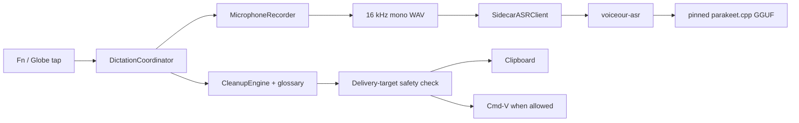

# Architecture

Voiceour is a macOS menu-bar dictation app. It has one production speech path: microphone capture, a local Parakeet sidecar, deterministic cleanup, then a safety-checked delivery to the focused app. Downloading the pinned model is the only network access, and `voiceour-asr` is the only subprocess.



## Targets and products

- `VoiceCore` — domain logic: settings, session state, ASR wire types, cleanup, glossary, history models, failures, safety policy. Foundation only; no AppKit, SwiftUI, or AVFoundation.
- `VoiceMac` — macOS adapters: capture, fake audio, sidecar process management, target tracking, pasteboard delivery, permissions, hotkeys. Imports `VoiceCore` and system frameworks, never SwiftUI.
- `Voiceour` — the app executable: SwiftUI menu, recording overlay, console window, and `DictationCoordinator`. Imports both libraries; nothing imports it.
- `ASRSidecarCore` — model acquisition, WAV loading, the Parakeet context, both backends, and the NDJSON server. Imports `VoiceCore` and `CParakeet`, never `VoiceMac`.
- `VoiceourASR` builds `voiceour-asr`. `ASRSidecarStub` serves process-contract tests. `VoiceourBench` builds `voiceour-bench`, which runs the production path over manifests.
- `CGgml` and `CParakeet` compile the vendored C/C++ under `Vendor/parakeet/`.

## Session flow

```text
idle -> checkingPermissions -> recording -> finalizingAudio -> transcribing -> cleaning
     -> readyToInsert -> pasteAttempted | copiedOnly | insertFailed -> idle
```

`error` and `cancelled` are the other two endings, both returning to `idle`.

Invariants:

- One tap starts one utterance. No wake word, no live transcript.
- One stop performs one final decode. A second tap, the overlay, and auto-stop all finalize exactly one WAV.
- Stale async work is ignored. Each phase takes a token from `AsyncGenerationGate`; a result whose token is no longer current is dropped, not applied to a newer session.
- Cleanup runs exactly once, after ASR.

Each utterance takes two target snapshots: the capture target before recording, which names the record-start "Will paste into X" label, and a fresh delivery target immediately before persistence and insertion. Vocabulary is compiled once per utterance from the glossary alone; a term is active everywhere, never scoped to an app or a project.

Starting and stopping capture blocks, so it runs off the main actor on a serial queue.

Which device records is decided per recording, in `CoreAudioInputDevice.preferredCaptureUID`. A microphone chosen in Settings — persisted as its durable CoreAudio UID plus the name that can still label it while unplugged — wins whenever it is connected. Without one, or when it is unplugged, the automatic policy applies: the system default input, except that a Bluetooth headset default is redirected to a working built-in microphone, because HFP/SCO negotiation replaces the first second of a headset capture with digital zeros. A selection that stops resolving falls back rather than failing the dictation.

`UserFacingDictationFailure` is the single mapping from mechanism to recovery: each failure gets a title, a plain cause, whether retrying can work, and where to fix it.

## Recording overlay renderer
The full derivation, research record, rejected alternatives and measured gates live in
[Procedural mercury renderer](mercury-renderer.md).

`RecordingOverlayController` owns one transparent nonactivating panel, one
`MercuryHitRegion`, and one random session seed. `MercuryRibbon` turns state and the
eleven input levels into `MercurySimulation.Drive`. `MercurySurfaceView` binds one
`CADisplayLink` to the display containing the panel; `MercuryEngine` advances the fixed
120 Hz simulation and writes the resulting `CGImage` directly to its layer. The same
field is published to AppKit mouse routing.

The geometry pipeline has one representation:

1. `MercurySimulation.Geometry` supplies 97 top and bottom contact-line samples.
2. `MercuryField` linearly evaluates their center/radius signed field for pixels and hit
   testing.
3. `MercuryCrown` lifts that field with
   `z = β√(2rφ̃ − φ̃²)`, `β = 0.78`, using a quarter-pixel smooth-positive `φ̃` only to
   regularize the analytic limb. The normal is the total derivative
   `(∂z/∂φ)∇φ + (∂z/∂r)∇r`; omitting the second term lets the outline wiggle while the
   reflection remains mechanically straight.

`MercuryEnvironment` builds three 96² octahedral linear-RGB tables with one analytic
border texel on every edge. Runtime reflection lookup is four taps with no trigonometry,
modulo or seam branch. Room of Ten uses 32 bounded, equal-area-stratified
spherical-Gaussian area sources (log-uniform sharpness 20–600) over 30% neutral bounce.
Per-source log intensity is bounded to ±0.55 and a seed-random
Rec.709-luminance-null opponent supplies at most 7% local chroma; source coefficients
are power-centered, so the sphere mean remains neutral. The room is fixed after
construction. Spectral Weather remains a debug-only alternate draw and is fixed too;
environment motion never competes with the organism.

`MercuryRasterizer` samples the static room in the exact mirror direction. Process-built
tables interpolate the exact unpolarized liquid-mercury conductor Fresnel, bounded
Naka–Rushton response and IEC sRGB transfer; dense oracle tests hold the optical error
below one 8-bit code value. `MercuryCalibration` meters linear `room × Fresnel` samples
pooled over listening and speaking and solves `MercuryDisplayResponse` from two anchors:
p50→0.32 and p98→0.87. Its compiled 0.94 linear-light ceiling is unreachable by finite
radiance; RGB gamut handling preserves mapped Rec.709 luminance while desaturating only
when a channel would leave that ceiling.

The permanent material and speed gate is `make ui-mercury-bench`: 4,096 generated-room
seeds, 64 production rasters, reflected-direction coverage, output bounds, 30 seconds of
surface motion, 1,200 production rasters and 1,200 complete engine-plus-layer
presentations representing ten seconds at 120 Hz. Raster p50/p99 must stay below
0.55/0.70 ms and 6.6% of one core; engine plus layer must stay below 0.65/0.85 ms and
8%. `make ui-mercury` is the non-gating visual bench for states, grounds, worlds,
motion, parameter sweeps and shipping/prototype comparisons.

Physics always advances in exact 1/120-second substeps. Presentation follows the panel's
screen, capped at 120 fps: one substep per ProMotion frame, two per 60 Hz frame, with a
fractional carry for other fixed rates. The view-bound display link stops while hidden or
off-display and is recreated when the panel changes screens. No per-frame value is
published through SwiftUI. Geometry-mode calibration warms during launch; the gate holds
it below 200 ms and first-room plus first-raster latency below 25 ms.

## ASR sidecar protocol

Newline-delimited JSON over the sidecar's stdin and stdout. Stdout carries protocol frames only; logs go to stderr. Every frame carries `protocol_version: 1`, and the client rejects any mismatch.

The sidecar emits `hello` on start and accepts `health`, `transcribe`, and `cancel`. Each request gets exactly one terminal response — `result`, `error`, or `cancelled` — matched by request id. `health` reports readiness, model and cache state, download progress, warmup, and the backend's last unresolved acquisition failure. That failure is a wire error code plus a diagnostic detail, optional in both directions, latched by the backend when a download, verification, disk-space or load attempt fails and cleared by the next successful load. The app takes it over any state it could infer for itself.

`SidecarASRClient` owns one persistent child and multiplexes request ids. The child's environment is an allowlist — `PATH`, `HOME`, `TMPDIR`, the proxy and TLS variables downloading needs, and `VOICEOUR_` names — so no other parent variable crosses the boundary. Registered backends are exactly `parakeet` (production) and `fake` (development, tests, benchmarks), and the recognizer is English-only.

## Model pin

One repository at one revision, holding two conversions of the same checkpoint:

- model: `ggml-org/parakeet-GGUF`
- revision: `35156454d1a39de06863303dd209fd2bed6ee079`
- `f16` — Balanced: `ggml-parakeet-tdt-0.6b-v3-f16.bin`, SHA-256 `833bffc9513b2cae867ee9e51633cfd11e4d51aaa5597c8ac02159385a2b426f`, 1,255,897,319 bytes
- `q8_0` — Compact: `ggml-parakeet-tdt-0.6b-v3-q8_0.bin`, SHA-256 `4d64e9e96c2792186d072fde0034df0ad670cf680a2f53069052ead827fd600e`, 668,757,119 bytes

`f16` is the default and the fallback for an unknown or stale persisted value. The two decode the same text to within what the committed corpus can resolve, so the choice is a footprint trade: `q8_0` saves 587 MB and loads faster, `f16` decodes faster. [performance-roadmap.md](performance-roadmap.md) holds the measurements.

The selection travels one path. Settings persists it as `asr_model_variant`; the app resolves `VOICEOUR_MODEL_VARIANT` first and that setting second, so a harness or benchmark run can pin an artifact without editing the user's settings; the resolved variant is written into the sidecar's launch environment, which picks that variant's cache subdirectory, artifact manifest, and download URL; and every real decode request carries `expected_model.file`, the one field that can distinguish two artifacts of a single revision, so a sidecar still holding the previous selection fails the request instead of transcribing with the wrong weights. Switching therefore takes effect on the next launch, and `DictationCoordinator.activeModelVariant` stays the running sidecar's artifact so Settings can say so.

`ParakeetModelCache.cacheOK` accepts a cached artifact only when the manifest's id, revision, file, digest, and size all equal the selected variant's compiled pin, and the file on disk is exactly that size. Downloads verify the streaming digest. Once the wanted artifact is verified, the other variants' cache directories are removed: only one artifact is ever resident, and `f16` keeps the legacy directory name so an existing install is not orphaned into re-downloading 1.26 GB. To exercise a cold download, point `VOICEOUR_MODEL_CACHE` at an empty directory; that override names one directory for whichever variant is selected, so it neither gains a per-variant subdirectory nor prunes anything. Overriding `HOME` does not move the cache, so a scratch home silently reuses the real artifact and proves nothing.

## Cleanup and glossary

`CleanupEngine` is the only text stage after ASR, and it is deterministic: configured filler removal plus glossary canonicalization, in one pass over the transcript. Its protected terms are the glossary snapshot compiled at the top of the stop path — the capture target names the label, never the vocabulary — and every way of adding a term passes through `VocabularySanitizer`, which rejects an ambiguous alias instead of guessing.

`WordListImporter` is the bulk path into that vocabulary. It reads a JSON array of spellings, a JSON array of `{"term": ..., "heard_as": [...]}` rows, or a newline-delimited list, and returns unprotected `manualImport` terms. The row shape carries the surfaces a model actually produces, which is what a spelling cannot: `derivedAliases` recovers `Swift UI` from `SwiftUI` for free, but nothing derives `Qbectal` from `kubectl`. Spellings and heard-as forms pass the same filters — `VocabularySanitizer.isSafe`, the length cap, case-insensitive de-duplication — and the coordinator validates the whole merged glossary for ambiguity before accepting any of it, so a colliding file is refused rather than partially applied.

## Insertion safety

`InsertionSafetyPolicy` is fail-closed: only a target classified as normal text may receive a synthetic Cmd-V; terminal, code-editor, secure, and unknown targets are clipboard-only. The inserter re-checks target identity before the pasteboard write and again before the keystroke, so a focus race only degrades to copy-only. [permissions.md](permissions.md) owns the target-safety matrix.

## Persistence

Transcripts live in one file, `recent-sessions.json`, newest first, capped at the newest 500. Lifetime totals need a second file, `dictation-activity.json`, because at that cap each new dictation evicts an older one: `DictationStatsLedger` holds aggregates only — sessions, words, seconds, active days, streaks, one bucket per local day and per destination app — and no transcript text or session ids. Settings, transcript, and ledger writes share one detached FIFO tail, keeping write order intact and file I/O off the main actor. A delivered dictation folds both records in one main-actor turn, from the journaled row itself, and only then enqueues the two writes: neither record is ever observable without the other, which matters because Home reads them together and the first-run card retires on either one. An unreadable file is quarantined as `<name>.corrupt-<ISO8601>`, and the reader sees that filename. No audio is retained.

## Console window

`Window("Voiceour", id: "main")` hosts `ConsoleWindowView`, a `TabView` with four tabs.

- Home — lifetime figures, top destination apps, streaks, an activity grid, and the first-run card described below.
- Glossary — learned suggestions, a searchable term list with one term open in its own plate, word-list import.
- History — search, an app filter, day-grouped transcripts, and one open transcript.
- Settings — tap gesture, auto-stop, cleanup, muting, session sounds, the speech-model footprint choice, the debug-only backend picker, then backend and model readiness, permissions, diagnostics, and clear actions.

Preferences lead that last tab and readouts follow it. There is no General tab: a switch and the permission that decides whether the switch can take effect were on two different destinations.

An install that has never completed a dictation opens this window at launch, on Home, and Home carries a first-run card above its figures. A menu-bar app's whole first-run surface is otherwise one status glyph, which cannot state the tap gesture, cannot show that a 1.26 GB model download is running, and cannot say which permissions matter — microphone required and prompted at the first dictation, Accessibility optional and worth the paste rather than a clipboard copy. The card reports those three states through `ConsoleReadiness`, the same values and the same sentences the Settings tab's readiness rows use, and offers the same remediation buttons. It retires at the first dictation that produced a transcript and reached delivery, which is also when the figures beneath it start saying something.

Whether the card is owed is `DictationPolicy.owesFirstRunGuidance`: `Settings.hasCompletedFirstRun` is the app's own record, written once from the stop pipeline, and both durable records — the transcript journal and the lifetime ledger — must additionally be empty. Reading the records is what stops an install that predates the flag from being handed onboarding: an absent key decodes to `false`, because a key that was never written is no evidence a dictation happened, and an install that has dictated has at least one record to prove it did. The flag is set one line outside the branch that writes those records, so a secure delivery target — which reaches neither — retires the card exactly like a journalled one. A refused start, a cancel, and a failed decode never reach that line.

`ConsolePresentation` owns showing that window, and every path goes through it: the menu bar item, the `--show-console` launch notification, `applicationShouldHandleReopen` (a Dock-icon click, `open -a`, a second launch of the bundle), and the window's own `onAppear`. It promotes the process to `.regular` while the console is hosted, drops back to `.accessory` when it closes, and orders the window front and deminiaturizes it on every show.

It also takes two states away from that window, because a menu-bar app cannot recover from either. The window is not miniaturizable: a minimized window is clicked back from a Dock tile, and this app's tile exists only while the console is open, so minimizing and then closing — or changing displays, or quitting — could leave the window parked with nothing left to click. And it is not restorable: AppKit's window restoration carried that parked state across a quit into an `.accessory` launch, which began owning a window that had no surface, no accessibility attributes, and no way to be shown. Frame persistence is unaffected: that is `setFrameAutosaveName`, whose `NSWindow Frame main` entry is written and read independently, so the console still opens where it was left.

[design-bible.md](design-bible.md) owns the visual language.

## No credentials

Voiceour stores no secret: no account, no credential field, no keychain item. `Resources/Voiceour.entitlements` requests audio input only and `scripts/bundle.sh` embeds no provisioning profile, so the data-protection keychain is unavailable to this bundle.
