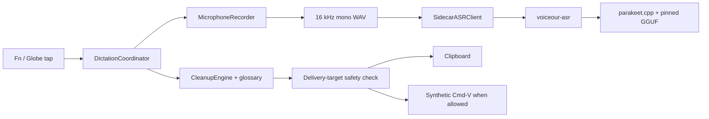

# Architecture

Voiceour is a macOS menu-bar dictation app with one production speech path: microphone capture, a local Parakeet sidecar, deterministic cleanup, glossary canonicalization, and safety-checked delivery. The pinned model download is the only network path. The `voiceour-asr` helper is the only subprocess.



## Swift targets and products

- `VoiceCore` is Foundation-only domain logic: settings, session state, ASR wire types, cleanup, glossary, recent-session models, failure presentation, and target-safety policy.
- `VoiceMac` contains macOS adapters: capture, fake audio, sidecar process management, target tracking, pasteboard delivery, permissions, hotkeys, and system-audio muting.
- `Voiceour` owns the SwiftUI menu, recording overlay, native console window, and `DictationCoordinator` orchestration.
- `ASRSidecarCore` owns model acquisition, WAV loading, the Parakeet context, token mapping, fake and Parakeet sidecar backends, and the NDJSON server.
- `VoiceourASR` builds the `voiceour-asr` executable. `ASRSidecarStub` supports process-contract tests.
- `VoiceourBench` builds `voiceour-bench`, which runs the production ASR-and-cleanup path over manifests.
- `CGgml` and `CParakeet` compile the vendored C/C++ implementation under `Vendor/parakeet/`.

The package products are `Voiceour`, `voiceour-asr`, `voiceour-bench`, `VoiceCore`, and `VoiceMac`.

## Session flow

The observable state machine is:

```text
idle -> checkingPermissions -> recording -> finalizingAudio -> transcribing -> cleaning
     -> readyToInsert -> pasteAttempted | copiedOnly | insertFailed -> idle
```

`error` and `cancelled` are terminal outcomes before the coordinator returns to `idle`.

Each utterance uses two target snapshots. The capture target is taken before recording and selects app-scoped vocabulary. A fresh delivery target is taken immediately before persistence and insertion. The inserter checks identity again before writing the pasteboard and again before posting Cmd-V, so a focus race can only degrade to copy-only.

Stopping always finalizes one WAV and performs one final decode. `CleanupEngine.clean` then removes configured fillers and performs glossary canonicalization. There is no probabilistic text-processing stage after ASR.

### Session cues

Three synthesized cues mark what listening did, and the app makes no other sound: a rising glide when the microphone opens, the same glide mirrored in pitch when capture closes with a transcript on the way, and two clipped tones falling a perfect fourth when the user discards the utterance. `SessionCue`/`SessionCueSynth` in `VoiceCore` are the whole sound design — a cue is a phrase of one or more tones, each an exponential pitch glide with an optional overshoot, a −15 dB second harmonic, a raised-cosine edge at both ends and its own leading silence, rendered to an in-memory 48 kHz mono 16-bit WAV. Nothing is shipped as a resource and nothing is written to disk. `SessionCuePlayer` in `VoiceMac` keeps one prepared `AVAudioPlayer` per cue and latches itself off for the process if the device refuses one, because a missing sound is not a dictation failure.

Cancel is deliberately not a third glide. It has to be recognisable as "discarded" against a falling cue the ear already knows, and pitch direction alone is too thin a difference to carry that for a listener who is looking at their text field, so cancel changes texture instead: a short tone, an audible silence, then a longer tone a fourth below. The two glides carry no interior silence, which is the property that keeps the three apart and the one `SessionCueTests` pins.

Placement is dictated by the muter, not by taste. `SystemAudioMuter` ramps the default output device to zero over 120 ms, so the start cue is played first and the enqueued mute operation then waits one start-cue length (`SessionCue.listeningStarted.totalNanoseconds`) before touching the device — inside the muter's FIFO, so `pendingMuteResult` is still armed synchronously and nothing about capture waits for a sound. A session already decided when that wait expires mutes nothing at all: fading a user's audio down for a capture that is over is worse than not ducking a 140 ms utterance. Both end cues play on the far side of the restore, because `restore()` lifts the hardware mute and only then ramps the volume back, and a cue fired at the tap would swell in from zero — the stop path chains onto the restore task it started and let ramp under transcription, while `cancel()` already awaits its own restore and simply plays afterwards. The end cue fires for `.manual`, `.autoStop` and `.silentCapture` stops alike; the cancel cue fires for Escape, the island's X and a tap during `.checkingPermissions`, and never for a quit or for a cancel that found nothing in flight. `sessionSoundsEnabled` defaults on and removes both the sounds and the mute deferral when off.

## Microphone capture and recorder ownership

`MicrophoneCapture` is an `AVCaptureSession` pinned to a selected input-device UID. It has no output graph, avoiding the measured AUHAL failure where `AVAudioEngine` could not combine a pinned built-in input with Bluetooth output (`kAudioUnitErr_FormatNotSupported`, -10868).

`CoreAudioInputDevice.preferredCaptureUID()` selects that UID. A Bluetooth default input is redirected to the built-in microphone, which skips the HFP/SCO warmup and keeps playback in A2DP. The redirect is withdrawn when the lid is closed: in clamshell the built-in array is enumerated, alive, unmuted and unsuspended, and every sample it delivers is exactly zero (552 of 552 and 366 of 366 all-zero buffers in six-second captures). `LidState` reads `AppleClamshellState` from `IOPMrootDomain` because no audio-stack property reports that state. Non-Bluetooth defaults are never redirected.

Capture callbacks run on a private serial queue. Blocking `startRunning()` and `stopRunning()` run on a second dedicated serial queue; measured startup was 134–216 ms, and serialization prevents a stop overtaking its start.

Liveness means the first buffer containing a non-zero sample, not merely the first callback. In measurements, the built-in microphone produced its first and first-non-zero buffer at 99 ms with 0 all-zero buffers out of 375. Cold AirPods Max produced a first buffer at 143 ms but the first non-zero buffer at 1,422 ms, with 64 all-zero buffers out of 197. The overlay therefore says the microphone is warming until actual signal arrives.

A capture that never becomes live is bounded rather than endless. The coordinator's input-metering loop ends the session after `captureWarmUpDeadline` (6 s) without a non-zero sample, through the ordinary stop path. Nothing else would: `AutoStopDetector` cannot arm until it has heard speech, so a silent device left the session recording zeros indefinitely.

The capture object latches the first `AVCaptureSession.runtimeErrorNotification` or active-device disconnect. `MicrophoneRecorder.stop()` rejects a latched failure, a recording whose capture never heard a non-zero sample, or a recording with zero successfully written frames; it deletes the WAV and reports a capture failure naming the device, and names a closed lid when the silent device was the built-in microphone. Frame counts advance only after a successful WAV write.

Recorder teardown is identity-checked: a stop or discard may clear only the capture it claimed. A failed start removes the newly created WAV. Once finalization begins, the processing pipeline owns cleanup; cancellation cannot race a second discard against it. Audio telemetry analysis runs off the main actor. The launch scavenger removes abandoned temporary recordings.

## ASR protocol v1

The sidecar speaks newline-delimited JSON over stdin/stdout. Stdout is protocol-only; logs go to stderr. Every request and response carries `protocol_version: 1`, and the client rejects every mismatched frame.

The server emits `hello`, accepts `health`, `transcribe`, and `cancel`, and returns one terminal `result`, `error`, or `cancelled` for a decode request. `health` reports readiness, model/cache state, `download_fraction` while acquiring the artifact, and `warming` while loading it. `transcribe` carries the WAV metadata, expected model identity, timeout, and request id. The result carries model identity, transcript data, confidence basis, and load/inference/total timings.

`SidecarASRClient` owns one persistent child and multiplexes request ids. The server reads stdin independently of its serial decode queue so cancellation can reach an active decode. On EOF it marks shutdown, waits up to five seconds for the owned preload thread, and then exits. A successful later load clears an earlier load-failure latch.

The sidecar environment is an allowlist: `PATH`, `HOME`, `TMPDIR`, proxy and TLS variables required for acquisition, and names beginning `VOICEOUR_`. Unrelated parent secrets are not inherited.

Registered backends are exactly `parakeet` and `fake`. `parakeet` is the settings default and registry fallback; `fake` is for development, tests, benchmarks, and the debug-only picker. Retired backend ids normalize to `parakeet` at the launch-options boundary. The shipped recognizer is English-only.

## Model contract and acquisition

The production artifact is:

- model: `ggml-org/parakeet-GGUF`
- revision: `35156454d1a39de06863303dd209fd2bed6ee079`
- file: `ggml-parakeet-tdt-0.6b-v3-f16.bin`
- SHA-256: `833bffc9513b2cae867ee9e51633cfd11e4d51aaa5597c8ac02159385a2b426f`
- size: 1,255,897,319 bytes

`ParakeetModelCache.cacheOK` requires the manifest's model id, revision, file, digest, and size to equal this compiled pin, and the file's on-disk size to equal the pin. Download completion verifies the streaming digest; a load failure forces a rehash. Partial downloads can resume, but an origin that ignores the range request causes a clean restart.

The menu and System tab expose download percentage, warmup, and acquisition failure. Health is repolled while either acquisition or warmup is active. `warmUp()` records failures instead of hiding them.

## Failure presentation

`UserFacingDictationFailure` is the one translation from mechanism to recovery. It maps every one of the twelve `ASRErrorCode` cases plus capture, microphone-permission, and acquisition failures to:

- a short title;
- one plain-language cause;
- whether retrying can plausibly work; and
- a destination: app settings, System Settings, or none.

Sidecar detail remains diagnostic and is not rendered as the cause. During an active model download, `model_not_installed` becomes progress rather than a setup fault. The menu presents the title and sentence, then offers Try Again or the appropriate settings action.

## Cleanup and vocabulary

`CleanupEngine` is the only text-processing stage after ASR. Protected terms are selected from the capture target and canonicalized in one pass over the original string. Candidate matches resolve overlaps longest-first, then leftmost; accepted replacements are applied right-to-left. Replacement templates are escaped, so canonicals containing `$` or `\` remain literal.

Aliases must be unambiguous across canonicals and aliases. Teach, manual add, suggestion acceptance, and import all pass through `VocabularySanitizer`. A collision is rejected rather than assigned an order-dependent meaning. User-confirmed terms remain bounded in the per-utterance active snapshot; ephemeral retrieval candidates stay in memory and never become learned vocabulary without an explicit action.

## Insertion safety and privacy

`InsertionSafetyPolicy` is fail-closed. Only `.normalText` may receive synthetic Cmd-V. Terminal, code-editor, secure, and unknown-risky targets are clipboard-only. Terminal and unknown-risky copies strip exactly one trailing newline so copying a command cannot execute it on paste. Ghostty (`com.mitchellh.ghostty`) is classified as a terminal and Zed (`dev.zed.Zed`) as a code editor.

The app writes only its own transcript and never reads, saves, or restores the previous clipboard. A secure delivery target uses a concealed pasteboard item, remains copy-only, and is never written to history.

## History, stats, and settings persistence

History has one durable file: `recent-sessions.json`. `RecentSessionStore` sorts newest-first and retains the newest 500 transcripts. `RecentSessionJournal` normalizes mutations on the main actor and serializes immutable snapshots through one detached FIFO tail. Settings saves join the same tail, preserving write order and keeping file I/O off the main actor. Clear and delete actions await their exact durable snapshot.

Lifetime statistics have a second durable file, `dictation-activity.json`, because a tally cannot live inside a capped corpus: at the 500-transcript cap every new dictation evicts an old one, so totals read off history plateau and then fall. `DictationStatsLedger` holds aggregates only — total sessions, words and seconds, distinct active days, the longest streak, one bucket per local day, and one bucket per destination app keyed by bundle id — with no transcript text and no session ids. The per-app buckets exist for the same reason the totals do: Home ranks destinations beyond the 500-row cap. Each holds sessions, words, seconds, the last-seen display name and the most recent day key, and they are neither capped nor pruned — the map is bounded by the apps the reader actually dictates into, and evicting one would make its total lie the way the day-pruned totals deliberately do not. `DictationStatsJournal` folds one dictation at exactly the site `RecentSessionJournal` writes the transcript, so the two records cannot disagree about what happened: a secure delivery target reaches neither, and all three delivery dispositions reach both. Its snapshots join the same FIFO tail, so a snapshot queued behind a clear cannot resurrect counts the reader just erased.

Day buckets are keyed `yyyy-MM-dd` in the recording calendar's local day, formatted without a `DateFormatter` so a locale's numbering system cannot key the same day two ways across launches. `record` measures the whole consecutive run a day sits in rather than only the run ending at it — a fold that arrives out of chronological order would otherwise understate the longest streak with no later dictation able to correct it. Buckets older than 400 days are pruned; totals, the active-day count and the longest streak survive pruning, because they are why the file exists. An empty ledger removes the file instead of writing zeroes.

The first launch with no ledger seeds it once from the transcripts still on disk, so an existing user does not open Home to a zero. Backfill is partial by construction (the journal is capped) and rows without a measured `stages.captureMs` contribute their words with zero seconds rather than an assumed speaking rate. A ledger that already exists but carries no app buckets — written before per-app tallies — is seeded a second, narrower time: `backfillAppStats` folds only the app buckets from the rows on disk and leaves the totals and day buckets alone, because the file already counted those same sessions. The gate is `totalSessions > 0 && apps.isEmpty`, so a quarantined ledger that deliberately did not backfill totals does not rank destinations against zeroes, and once the map is non-empty the branch never runs again. `DictationStatsStore` deliberately does not reuse the name `dictation-stats.json`: that belongs to a deleted per-day, per-app subsystem whose file the coordinator still sweeps off disk at launch, and reusing it would both load an incompatible document and cost that sweep its purpose.

Unreadable `settings.json`, `recent-sessions.json`, or `dictation-activity.json` files are moved alongside themselves as `<name>.corrupt-<ISO8601>` before defaults are used. The coordinator reports the reset and the quarantine filename. Save failures are user-visible rather than discarded.

No audio history exists. Successful, cancelled, failed, and scavenged recordings are removed once their owner is done.

## Native console window

`Window("Voiceour", id: "main")` hosts `ConsoleWindowView`, a native `TabView` with five destinations — four `Form(.grouped)` and one page:

1. **Home** — lifetime dictation time, words, time saved against a fixed 40 wpm typing baseline, average speaking speed, the five apps that receive the most dictations, the streak row, and a day-resolution activity grid.
2. **General** — tap gesture, auto-stop and silence, deterministic cleanup, system-audio muting, the session cues, and the debug-only backend picker.
3. **Glossary** — the corrections the last dictation proposed, a search row that also carries an origin filter and `Add Term`, the alphabetical term list with exactly one term open in its own plate, and project word-list import. A row names its term, its scope when it is not global, and the spoken forms it holds; the open term's editor is `ConsoleTermEditor`, the same editor History's ⌘T teach renders, with `Term`, one row per spoken form, an add field, the derived `Also matched` readout, and Save / Cancel / Remove Term. Removal confirms first.
4. **History** — search, an app filter, day-grouped transcripts that name their destination, and the selected transcript opened inside its own day group as a buttonless well the reader clicks to copy and selects from to teach.
5. **System** — backend/model readiness, permissions and remediation, diagnostics copy, and destructive clear actions.

Home is the one non-`Form` tab. Every other tab is a list of settings and readouts, which is what `Form` is for; a page of figures in a grouped form would draw a section plate around each number. It is also the only tab that navigates nowhere, so it takes no selection binding.

The activity grid names the square under the pointer. The grid itself is one `Canvas` and one accessibility element — 210 squares are 210 layout participants and 210 accessibility nodes for a picture that says one thing — so the hover detail is not 210 views carrying `.help(_:)`. `HeatmapTooltipOverlay` is a transparent `NSView` inside the `.accessibilityElement()` collapse holding one AppKit tooltip rect per in-range square, sized to the 14pt cell rather than the 17pt pitch so the gaps stay dead space, and it resolves its string lazily from the hovered point through `StatsFormatting.heatmapTooltip`. Because tooltip rects are tracking regions rather than views, crossing from one square to the next re-resolves the sentence without re-arming the delay, the overlay adds no accessibility node, and it draws nothing — the committed AX dumps and PNG digests are unchanged by it. The sentence leads with the words, which is what the level ladder encodes: `342 words · Mon, Aug 18, 2026`, or `No dictation · Thu, Aug 20, 2026` for an in-range quiet day. Squares the calendar has not reached carry no rect and no tooltip. `VoiceourApp` registers `NSInitialToolTipDelay` at 1 ms: the grid is a data surface where hovering *is* the reading gesture, so AppKit's two-second arming delay was the whole latency of the feature, and the delay is process-wide rather than a property of a rect — which costs nothing, because this grid is the app's only tooltip. It is registered, not set, so nothing is written to the reader's preferences and their own value still outranks it.

History opens a record where the reader clicked it: the open transcript and the row that selected it share a grouped `Section` of their own, emitted inside the day it belongs to and directly under that row. Each day therefore renders as one to three plates — the rows above the open transcript, the open transcript, the rows below it — and the day's heading stays on whichever plate comes first, so the day is named exactly once. The detail was first tried as rows appended to the day group's own plate; a record's detail inside the index's plate reads as more index, and the rows under it looked like part of the transcript above them. A detail placed after the day groups is worse still: it sits below the whole list — with the harness's nine-session fixture at the app's launch height that starts the transcript 211 pt under the fold, and at the retained 500 it is a page-down away from the row that asked for it. While a transcript is open every closed row drops to 0.45 opacity so the page has one subject; Increase Contrast raises that to 0.8, because a reader who asked for more contrast must not be handed less. `selectedSessionID` alone decides which row is open — the row that draws the detail is the row that id names — so a transcript never opens under a row nobody chose. The first visit opens the newest transcript, because a tab whose reason to exist is the transcript should not open on a list of timestamps; after that the reader owns the selection. A reload never reopens what they closed, and a query is a lens rather than an edit, so a search that hides the open transcript leaves it open behind the query and clearing the query shows it again. The one selection `validateSelection` clears on its own is a transcript that no longer exists — deleted here, or erased with the whole history in System.

The detail states nothing the row above it already states, and it carries no action buttons. A closed row is the transcript's heading — stamp, mute mark, outcome mark, word count, the delivery target as its own icon beside its name, and a preview that runs to two lines, because one line of a dictated sentence is rarely enough to recognise it by and the full text of 500 retained transcripts would be 500 paragraphs. The target's icon sits at `Control.inlineIcon`, 13 pt: centred on a `.caption` box that is baseline-aligned with the row's `.body` stamp, an icon taller than about 13.9 pt reaches past the row's own descent, and a row must not change height depending on whether the reader still has the app installed. The open row drops that preview, from its layout and from its accessibility label alike: the well directly under it holds the whole text, so printing the first two lines again immediately above it was the same sentence twice. What the detail adds is what a row cannot hold: the delivery target's class when it was not ordinary text — the one mark the row omits, and the reason a transcript that reads as pasted was in fact only copied — then the text itself, one line about it, and the evidence behind it (timings, the raw pre-cleanup text when cleanup changed it, and the decoder's least sure word with its per-token probability).

The transcript is the control. A plain single click on it copies the whole transcript: `FixTeachTextView.mouseDown` calls back only when the click count is one and `super.mouseDown` has returned with an empty selection, so a drag, a double-click word-select and a right-click all copy nothing. The write is a plain string on the general pasteboard — never transient, never concealed — and the confirmation is a `COPIED TO CLIPBOARD` mark that takes the footer line for 1.4 s plus one `announcementRequested` notification, because a mark somewhere on the page confirms nothing to VoiceOver. The phrase is spelled out rather than reusing the System tab's bare `COPIED` because a clipboard-only delivery already paints an amber `COPIED` outcome mark on the row above, and the same word in two colours is not a state. Selecting words and pressing ⌘T teaches a correction for them; the transcript is an `NSTextView`, so its own context menu also carries `Fix / Teach “word”` for the word under the pointer, and VoiceOver — which can neither click into a text view nor drag a selection — reaches both through the well's named `Copy transcript` and `Teach a correction` actions.

One line under the text carries all of it, in three states: the copy confirmation, otherwise what ⌘T will teach when a selection exists (`Press ⌘T to teach a correction for “…”`, middle-trimmed at 28 characters), otherwise the instruction that names both gestures. It replaced a bar of four buttons because a line of prose can say which words the next keystroke will teach and a button title cannot without becoming a paragraph.

The raw pre-cleanup text is the one evidence row that folds. It is drawn only when cleanup actually changed the transcript, and even then a dictated paragraph of monospaced text is several times the height of every other row in the detail: it pushed the least sure word and the teach editor below the fold of the window for a reading almost nobody asks for. So the row states that raw text exists and differs, in a native `DisclosureGroup` that starts shut on every newly opened transcript — `showsRawTranscript` is reset by the same `onChange(of: selectedSessionID)` that clears the selected surface and the teach editor. The identifier and the accessibility action sit on the group's *label*: measured, the disclosure triangle SwiftUI publishes answers an accessibility press with success and does not change its own state, so without an explicit default action a VoiceOver reader could see the fold and never open it, and an identifier on the whole group is published by two nodes once the group is expanded. The triangle is also exempt from the `control-height` lint rule for the same reason the native switch is: it publishes a 60x16 box whatever the row does — a `.frame(minHeight: 24)` on the label moved the row down 4 pt and left the published box at 16 — so the height is AppKit's, not this project's.

`HistoryInputMonitor` supplies the three inputs SwiftUI never sees, because a grouped `Form` is an `NSScrollView` that consumes them: a click beside the plates closes the transcript, Escape closes it, and ⌘T teaches the current selection. The click test is horizontal only — `NSEvent.locationInWindow` is bottom-left and SwiftUI's global space is top-left, but both share the window's left edge — against the search row's own measured x range widened by one row inset, and inside `contentLayoutRect` so the title bar and tab strip are excluded. Escape is deferred while the teach editor is open, so the editor's own cancel takes it first. The record-level commands — Copy Transcript, Fix / Teach a Word…, Delete Transcript… — are the row's context menu rather than the transcript's, so they cannot shadow the text view's menu, and each selects its row first so the result appears where the click landed.

The scene id and menu open mechanism are unchanged. Home leads the tab bar and is the fresh-launch default; the console still reopens on its last-used tab, stored in `UserDefaults` under `console.last-tab`. The development deep link remains `--console-section=<home|general|glossary|history|system>`: an explicit tab wins for that launch and is never written back, and an unrecognized value means "no override" so the stored tab still decides. Destructive actions use native confirmation dialogs. The console follows the user's appearance and native control behavior; only the menu popover, the recording overlay, and Home's stats islands retain the app's bespoke tint/rim treatment.

Home's islands are app-drawn rather than `.glassEffect` surfaces for the same reason the window ground is not one: element glass cannot sample other glass. They paint `Ink.pane` over a `Ink.void` base, `glassTint`, a specular rim, and an `Alien` neon rim — a blurred stroke, not a drop shadow, because a coloured shadow behind translucent fills showed through the pane and tinted the whole island. Each island publishes its own `surfaceGround` so the harness's contrast lint resolves text against what is actually painted, and stays fixed-dark in both system appearances because it carries its own text ladder.

Home's Top apps island ranks the five destinations that received the most dictations, from the ledger's app buckets rather than from history, so the ranking outlives the 500-row cap. `DictationStatsCalculator.topApps` orders by sessions, then words, then bundle id — a dictionary iterates in an unspecified order, so a partial order would reshuffle the island between launches — and each row's bar is that app's sessions over the leader's, which encodes magnitude as length and therefore needs no Differentiate Without Color branch. The island is absent, not empty, on a Mac with nothing to rank. Each row leads with the app's own icon, bare at badge size: a macOS icon carries its own squircle, so a plate behind it would be a rounded shape around a rounded shape. A monogram of the display name on the island's plate is the fallback for a bundle id this Mac can no longer resolve, since a ledger bucket outlives the app that filled it.

An app is displayed through `AppIdentity`, which resolves one persisted app reference into the name a reader would use for it and, when this Mac still has the app, its icon. The precedence is the installed app's own Finder display name, then the name captured at the delivery boundary and persisted with the row, then the pure `AppDisplayName.label(bundleId:name:)` humanization — the most specific meaningful bundle-id component capitalized, with a trailing `app` component treated as the suffix it is (`com.cmuxterm.app` reads as "Cmuxterm", not "App"). The installed name wins deliberately: it is what the reader calls the app today, where a persisted snapshot can be months old and a row written before names existed has none. The bundle id remains the internal key in the ledger, in `recent-sessions.json` and in History's filter; only the display resolves. `InstalledAppCatalog` in VoiceMac is the one LaunchServices lookup — `urlForApplication(withBundleIdentifier:)`, Finder's display name with a leaked `.app` extension stripped, and `NSWorkspace.icon(forFile:)` — main-actor because its consumers are views and `NSImage` is not `Sendable`, and cached for the process lifetime including misses, because the rows re-render on every History reload. `DictationCoordinator.updateTargetLabel` is the one surface that does not resolve through `AppIdentity`: "Will paste into X" already names the frontmost app from its live `NSRunningApplication.localizedName`. Goldens stay machine-independent because `RenderOverrides.installedApps` pins the catalog, not because nothing asks the workspace.

History's app filter is a `Menu`-wrapped inline `Picker` in the search row, offered only when some row has a delivery target. `RecentSessionQuery.appFacets` builds its options from the rows themselves — count descending, then display label, then bundle id — and takes each app's name from its newest row, so a renamed app is offered under the name the reader last saw. History re-applies that same total order over the labels `AppIdentity` resolves, because an installed app can be named something the rows never persisted, and a menu whose order does not match what it displays is a different menu. The filter and the query are ANDed, the caption reports the same "N of M sessions match" for either lens, and a filter whose last row was deleted or cleared falls away rather than narrowing the list to nothing. A row's context menu carries `Show Only <App>` beside the record-level commands so the filter can be engaged from the row that motivated it.

The window's ground is system glass. `ConsoleGlassGround` is the single decision: `NSGlassEffectView(style: .regular)` on macOS 26, behind-window `NSVisualEffectView(material: .underWindowBackground)` below it, and an opaque `windowBackgroundColor` under Reduce Transparency or `RenderOverrides.forceLegacyGlass`. The material's view clears `NSWindow.isOpaque` and `backgroundColor` — the documented preconditions for `.behindWindow` sampling — and touches nothing else about the window. `.scrollContentBackground(.hidden)` is applied once to the `TabView` and propagates to every `Form`, the History list and its nested scrollers; without it the grouped Forms paint the opaque scroll background and the ground is never seen. Section plates, insets and control styling are untouched, so text sits on native plates rather than on the sampled desktop, and the accessibility tree is unchanged (the ground is `accessibilityHidden`).

SwiftUI `.glassEffect` is deliberately not used here: it is element glass, macOS 26 only, documented for floating controls, and it cannot sample other glass, so a window-filling glass effect over a window-filling material is two blurs arguing.

## Why Voiceour holds no credentials

Voiceour stores no secret and has no credential field, credential environment contract, keychain item, or user-entered provider URL. The sidecar allowlist also prevents unrelated parent credentials from crossing the subprocess boundary.

This is backed by a bundle measurement, not just policy. The macOS data-protection keychain derives an item's access group from a code-signing entitlement authorized by a provisioning profile. Voiceour ships neither: `Resources/Voiceour.entitlements` is audio-input only and `scripts/bundle.sh` embeds no profile. `SecItemAdd` returned `errSecMissingEntitlement` (-34018). Adding `keychain-access-groups` to an ad-hoc signature instead caused AMFI to kill the process as “adhoc signed but contains restricted entitlements.” In this bundle shape, that keychain is not a viable secret store. A future feature must not quietly introduce one.

## Test and release strategy

- `make test` covers protocol fixtures, sidecar cache and lifecycle, capture/recorder ownership, cleanup and glossary invariants, failure mapping, persistence quarantine, hotkeys, safety classification, insertion races, and coordinator behavior.
- `make ui-flow` checks host-independent semantic journals. `make ui-snap` renders accessibility dumps and PNG digests offscreen as an advisory visual gate.
- `swift build && .build/debug/voiceour-asr --prove fixtures/audio/hello_16k_mono.wav` exercises the pinned real model.
- `make bench-gate` compares matching benchmark populations with a maximum +0.35 percentage-point U-WER regression.
- CI separately builds release configuration, bundles the app, and runs `scripts/verify_bundle.sh`.
