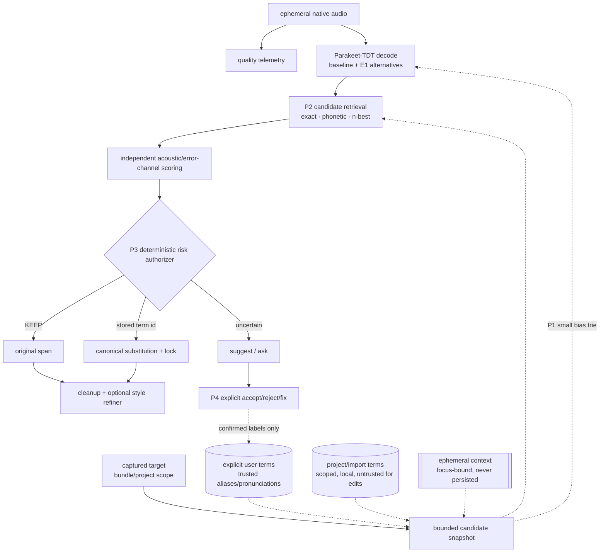
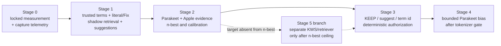

> Archived 2026-08-09. Historical research record; not current documentation. Superseded by [../architecture.md](../architecture.md).

# Keyword & technical-term comprehension (research/design exploration)

> **Status: adopted staged implementation program.** This note is the research, design, and
> decision record for making VoiceOour understand spoken technical terms. Work advances only
> through the measurement and safety gates below; a described mechanism is not shipped merely
> because it appears here. External-paper numbers carry their source, while VoiceOour-specific
> quality and latency deltas remain `[INFERENCE]` until benchmarked. The project policy budget
> is `<= +0.35 pp U-WER`; every other numeric threshold is a proposal to validate.

## Problem — a lossy channel with asymmetric decision costs

The microphone does not understand `kubectl`, `NSPasteboard`, or a project-specific symbol.
It converts pressure into samples. The recognizer then resolves those samples using an
acoustic model whose learned language prior strongly favors common words. Technical-term
comprehension is therefore not one acoustic bug; it is inference over a lossy channel:

\[
p_m(t)=(h_{\mathrm{room}}*p_s)(t)+n_{\mathrm{air}}(t)
\]

\[
x[n]=Q_b\left(\operatorname{clip}\left(A[(h_{\mathrm{mic}}*p_m)(n/F_s)+n_e]\right)\right)
\]

\[
\hat W=\arg\max_W P_\theta(W\mid X)
\]

The end-to-end TDT score \(P_\theta(W\mid X)\) already entangles acoustic evidence with the
model's learned language prior. A domain boost or downstream LLM adds another prior; it does
not create new acoustic evidence.

Five failure classes need different remedies:

1. **Acquisition loss.** Noise, distance, reverberation, clipping, processing artifacts, or
   endpoint truncation destroy phonetic evidence before ASR. Improve capture and retain a raw
   reference path.
2. **Model/search error.** The correct pronunciation is plausible, but greedy TDT search
   selects common-language tokens. Preserve n-best/scores and introduce a small contextual
   candidate set.
3. **Representation collapse.** VoiceOour currently keeps only one text hypothesis. Once
   `kubectl` becomes "cube cuddle", text-only recovery cannot tell an error from genuine
   ordinary speech.
4. **Canonical ambiguity.** Audio cannot distinguish `Rust` from "rust", `C` from
   "sea/see", or casing/separators in `NSPasteboard`. Exact orthography requires side
   information: a trusted lexicon, project context, spelling mode, or confirmation.
5. **Rewrite-authority error.** ASR produced the right term, but cleanup or the optional
   refiner changes it. The glossary already reaches `RefinerPolicy`; the problem is excessive
   free-text authority, not missing vocabulary.

The product decision is consequently asymmetric: a missed technical term is inconvenient;
a plausible false technical substitution can silently change code, commands, names, or
meaning. Candidate retrieval may be permissive. Automatic replacement must be conservative,
calibrated, and able to return **KEEP**.

**Decision spine `[INFERENCE]`:** establish an acoustic quality floor; make novel spelling,
case, and symbols expressible through explicit literal composition; preserve unmodified ASR
alternatives; retrieve a small scoped vocabulary; authorize replacements only when independent
evidence makes replacement lower-risk than KEEP; learn only from explicit user labels.

## State at exploration time (superseded — see "Implementation status" below)

| Layer | File | Behaviour re: terms | Limitation |
|---|---|---|---|
| ASR decode | `asr/.../backends/mlx.py`, `parakeet_mlx/parakeet.py` | `model.generate(mel, DecodingConfig())` — **greedy TDT**, no bias, returns 1-best `.text` | No vocabulary injection; no n-best/confidence surfaced |
| Wire protocol | `Sources/VoiceCore/ASRProtocol.swift` | `ASRTranscribeRequest` = {audio, expectedModel, timeoutMs} (L145-168); `ASRResult` text + optional unused segments; dispatcher accepts only health/transcribe/cancel | **No hints/bias field; no confidence/n-best field**; adding a new request type is a real protocol change |
| Deterministic cleanup | `Sources/VoiceCore/CleanupEngine.swift` + `Glossary.swift` | Fillers/dedupe, then `Glossary.canonicalize`: string-level alias -> canonical, + auto spaced/letter-spaced variants | Exact string match on **hand-authored** aliases; misses unseen mishearings |
| Term model | `Sources/VoiceCore/Models.swift` | `ProtectedTerm{canonical, spokenAliases[], casePolicy, protected}`; default glossary ~8 terms (L142-151) | Flat, global, manual, no pronunciation, no ranking/scope |
| Refiner | `Sources/VoiceMac/RefinerPolicy.swift`, `LLMRefiner.swift` | LLM gets flat `<protected_terms>` block (L104-119) + "repair phonetic variants" instruction (L121); guarded by `RefinementGuards` term/number-lock + faithfulness; **serializes every glossary entry it is handed** | Free-text rewrite authority; a text-prior model resolving an acoustic problem with no acoustic evidence |
| Orchestration | `Sources/VoiceOour/DictationCoordinator.swift` | `target`/`snapshot` captured; `asr.transcribe` -> `rawTranscript` (~L701) -> `CleanupEngine.clean` (L702) -> `refiner.refine` (L730) | `snapshot.safety`/style resolved *after* ASR (~L713-719) though `target` is captured earlier — a **pre-ASR** hook is available but unused |

## Physics, microphones, and macOS capture

### What better capture can and cannot do

- In a free field, direct level falls about 6 dB per distance doubling. Moving from 60 cm to
  15 cm gives roughly +12 dB direct level and usually improves direct-to-reverberant ratio.
- A close directional or headset microphone can preserve weak fricatives, stop releases,
  consonant clusters, and word-final sounds under noise. This helps all speech; no hardware
  mode selectively recognizes technical terms.
- Once speech is clipped, masked, or truncated, downstream text models can only substitute
  prior. They cannot reconstruct the missing evidence.
- A 16 kHz model has an 8 kHz Nyquist limit. Capturing the hardware's native 44.1/48 kHz and
  performing controlled sample-rate conversion may avoid opaque conversion, but it does not
  give Parakeet additional bandwidth after conversion to 16 kHz.
- Ideal 16-bit quantization SNR is approximately 98 dB. Room noise, microphone self-noise,
  gain, clipping, and OS processing are normally the tighter limits.
- Aggressive denoise, AGC, Voice Processing, or Sound Isolation can improve SNR/echo while
  also suppressing unusual phonetic detail. Preserve an unprocessed reference only for the
  live session, delete it after all evidence consumers finish, and treat every enhanced path
  as an experiment rather than a default.

### Capture primitives worth measuring

1. Log the input device, actual sample rate/channels, clipping ratio, active speech level,
   estimated noise floor/SNR, endpoint energy, and possible truncation.
2. Capture the hardware-native format in memory, then convert once with controlled settings
   to the model's required 16 kHz mono PCM.
3. Add conservative endpoint pre/post-roll; begin experiments around 100–200 ms before and
   300–500 ms after detected speech rather than hard-gating short bursts.
4. Offer close-mic/headset guidance only when telemetry shows poor capture. Do not recommend
   hardware from aggregate WER alone.
5. Compare optional enhancement against the same raw utterance. Select it only when measured
   quality predicts a net ASR benefit.

### macOS feasibility and limits

The current default recorder is `AVAudioRecorder` despite the
`AVAudioEngineRecorder` type name. It requests 16 kHz mono Int16 WAV. A future experimental
path can use `AVAudioEngine.inputNode` to observe the hardware format and `AVAudioConverter`
for explicit conversion.

- `AVAudioIONode` Voice Processing is available on supported macOS versions and documents
  playback subtraction plus AGC/bypass controls. AGC is enabled by default; there is no public
  independent Mac noise-suppression or beamformer control.
- `AUSoundIsolation` is available from macOS 13; its High Quality Voice mode is macOS 15+.
  Apple does not document its term/phoneme behavior, model assets, or effective latency.
- iOS microphone orientation/data-source/polar-pattern APIs are unavailable on macOS.
  Hardware array geometry, firmware processing, and beamformer weights remain OS/device
  controlled.
- Hardware sample-rate or channel changes stop and uninitialize `AVAudioEngine`; taps,
  converters, and connections must be rebuilt.
- System Mic Mode can override a purported voice-processing bypass. Experiments must log and
  hold Mic Mode constant.
- Modern Swift `AudioHardware*` APIs require macOS 15 while VoiceOour targets macOS 14.
  AUHAL supports app-local device assignment on earlier systems but carries substantially
  more realtime and route-maintenance risk.

Minimum paired matrix: current raw recorder; native-rate raw engine capture; Voice Processing
with AGC on/off/bypassed; Sound Isolation standard/high-quality where available. Cross each
with quiet, fan/keyboard noise, loudspeaker echo, distance, clipping, Bluetooth HFP, and route
changes. Technical-term accuracy and false term replacements are primary; generic SNR/WER is
secondary.

## Evidence and decision points

Vocabulary is useful at several seams, but each seam has different authority and blast radius.
Context must be computed from the **captured target**, not whichever app is frontmost when
decoding finishes.



- **P1 — Contextual decoder biasing.** Inject a small phrase trie during ASR. It can recover
  paths but perturbs search globally and must retain an unmodified baseline score.
- **P2 — Candidate retrieval.** Exact aliases, G2P/phone similarity, n-best, and scoped
  project terms produce a bounded shortlist. Retrieval has no edit authority.
- **P3 — Risk authorization and application.** Compare KEEP, replace, and suggest using
  calibrated independent evidence; canonical text comes only from an existing local term id.
- **P4 — Vocabulary acquisition.** Explicit correction, accept/reject, pronunciation
  enrollment, and bounded opt-in imports. Never learn from the system's own output.
- **E1 — Preserve ASR evidence.** n-best, timestamps, unmodified path scores, and calibrated
  confidence.
- **E2 — Pronunciation modeling.** Multiple G2P/user pronunciations for retrieval and
  scoring. G2P is not evidence that a retrieved term was spoken.

The keystone is not one blended ranking table. It is a trust-separated vocabulary system:
explicit user records, scoped imported records, and ephemeral untrusted candidates have
different authority, retention, and cloud rules.

## Cross-cutting conclusions

1. **Exact technical orthography is often absent from audio.** A better microphone narrows
   acoustic uncertainty under noise; it cannot determine `Rust` versus "rust", casing,
   separators, or a novel spelling. Side information is mandatory for those cases.
2. **Preserve evidence before adding intelligence.** Waveform -> mel -> encoder -> greedy
   token -> normalized text is a chain of lossy functions. n-best, alignments, and unmodified
   scores preserve more decision-relevant information than 1-best text. A finite beam fixes
   search errors only; it cannot fix missing model support or a wrong learned prior.
3. **Retrieval is not authorization.** G2P distance, text similarity, project presence,
   decoder boost, and LLM confidence are useful candidate features but are not calibrated
   probabilities that the user spoke a term. Candidate-constrained output bounds form, not
   truth.
4. **Source trust dominates list size.** Explicit corrections and imported lexicons are
   valuable. “Appears somewhere in a repository” is a weak prior: dependencies, generated
   symbols, stale branches, and malicious identifiers can inflate or poison the list.
5. **False replacements dominate product risk.** More candidates create a
   multiple-comparisons problem. TurboBias's 20k-list experiment worsened WER 9.86 -> 11.42;
   a massive noisy open-vocabulary list likewise worsened overall accuracy with negligible
   recall gain. Scale requires aggressive pruning and source-stratified calibration.
6. **Generic LLM correction is not the default answer.** Off-the-shelf correction degraded
   strong ASR baselines in the 2026 ECLM study; prompt-only and multi-candidate variants also
   regressed in relevant work. Use an LLM only as a measured challenger to a deterministic
   rule, never as the source of canonical strings or confidence.
7. **Learning requires labels.** Output recency, emitted transcripts, and inferred aliases
   create self-reinforcing loops. Only explicit user acceptance/correction may raise a term's
   authority.

The operational rule is: **preserve acoustics, retrieve broadly enough to find the term,
authorize narrowly enough to protect ordinary speech, and abstain whenever evidence is
missing or ambiguous.**

## parakeet-mlx feasibility (verified against installed v0.5.2 source)

Read from `asr/.venv/.../parakeet_mlx/`. Hard constraints that shape what P1/E1 can be:

| Capability | Status | Evidence |
|---|---|---|
| **Beam search** | **Available — config flip, benefit unmeasured** | `DecodingConfig.decoding: Union[Greedy, Beam]` (parakeet.py:89-92); `Beam(beam_size=5, length_penalty, patience, duration_reward)` (L81-86); real `decode_beam` with hypothesis pruning (L313-525). We hardcode `Greedy()`. Existence != a cheap win for this checkpoint. |
| **Per-token confidence** | **Present but crude/uncalibrated** | `AlignedToken.confidence: float` (alignment.py:12), geometric-mean aggregated (L34-35). Greedy uses normalized entropy; beam uses `exp(token_logprob + duration_logprob)` — **incompatible semantics across modes**, no raw logprob returned. Needs BPE->word aggregation + per-mode calibration before it can gate edits. |
| **n-best readout** | **Discarded inside `decode_beam`; needs fork** | `decode_beam` builds `finished_hypothesis` then selects `best = max(...)` and returns only that (~L470-503). `generate` returning `alignments[0]` indexes the **first batch item**, not the first hypothesis. Fork point is *inside `decode_beam` before `best`* (preserve ranked path scores), then extend `generate`, the Python result model, the Swift wire model, and fixtures. TDT only (RNNT path asserts greedy). |
| **Token/trie logit bias** | **Needs fork** | No context/hotword/logits-processor/prefix API. Add bias to token logits **before the beam `log_softmax` (parakeet.py:389-396)** and **before the greedy `argmax` (L572-577; greedy has no `log_softmax`)**; extend `Hypothesis` with trie state; leave blank/duration unboosted. |
| **Term -> token-id mapping** | **Unsolved prerequisite (not just "not free")** | `tokenizer.py` exposes `decode()` only — **no `encode`/SentencePiece**. A written string cannot be turned into BPE ids without an external tokenizer/model, a validated deterministic segmentation, or enumerating representable decompositions (and rejecting OOV-to-vocab terms). This is an explicit *gate* before any trie compilation (P1). |
| **CTC word spotting on same encoder** | **Blocked** | Pinned `parakeet-tdt-0.6b-v3` is `EncDecRNNTBPEModel` (no CTC/phoneme head). CTC-WS needs a hybrid checkpoint or a *separate* KWS model. |
| **Retrain-dependent (TCPGen, CLAS, adapters, phoneme-biasing)** | **Research branch** | Strong published gains but require training + exportable MLX weights that don't exist for this checkpoint. |

**Verdict:** P1 shallow-fusion biasing is feasible without retraining but requires a
maintained fork of the decode loop, a protocol change, **and** a solution to term->token-id
segmentation. Beam and confidence exist but are unproven/uncalibrated here; n-best is a small
fork. Deep/neural biasing is out of near-term scope.

## Primitive ideas catalog

Grouped by lever. Each records its mechanism, VoiceOour seam, dependencies, evidence, and
blast radius; implementation order comes from the gated ladder rather than effort labels.

### P2 — Post-ASR candidate retrieval  *(safe near-term value; suggestion first)*

- **Multi-pronunciation G2P + weighted phone alignment.** Compile each canonical term to
  provenance-tagged pronunciations using CMUdict, eSpeak-ng/phonemizer, an OOV fallback, and
  explicit camelCase/digit/symbol/acronym rules. Keep user pronunciation overrides.
- Phoneticize plausible 1–5-word spans, retrieve nearby terms, and rank them using weighted
  phone alignment, articulatory substitution costs, source/scope, term risk, and runner-up
  margin. PanPhon/ALINE are useful scoring foundations.
- **Authority boundary:** exact user-confirmed aliases may auto-apply. An unseen phonetic
  match from 1-best text may suggest `kubectl` for "cube cuddle", but it must not authorize
  replacement without independent acoustic or production error-channel evidence. The same
  observed text is compatible with the user genuinely saying “cube cuddle.”
- If edits are eventually authorized, resolve overlapping spans before application, validate
  stale ranges, and apply non-overlapping substitutions right-to-left. Output remains the
  original span or an existing canonical term id.
- At hundreds of terms, a length-bucketed linear scan is simplest. At thousands, use phone
  q-gram/inverted indexes or BK/VP trees for retrieval followed by bounded exact rescoring.
  Legacy phonetic hashes are blockers only, never authorizers.
- A WFST pronunciation lexicon plus a learned Parakeet error-channel transducer is the
  scalable deterministic form, but it needs production correction pairs and macOS-arm64
  packaging. Defer until the vocabulary and labeled error corpus justify it.
- A candidate-constrained neural reranker is also a later option. It must beat the
  deterministic risk baseline, be calibrated by source/noise/backend, and retain KEEP.

*Seam:* between `rawTranscript` and `CleanupEngine.clean`, initially returning candidates and
suggestions rather than autonomous edits. *Unmeasured:* candidate recall, VoiceOour accuracy
gain, calibrated thresholds, and hot-path latency.

### P1 — ASR decoder biasing  *(probabilistic; not candidate-constrained)*
- **MLX-native phrase-trie shallow fusion for TDT (TurboBias/GPU-PB style).** At each
  nonblank token step, `log P' = log P_TDT + lambda * s_trie(token)` with Aho-Corasick failure
  links, depth-increasing score, end-of-phrase bonus, partial-match backoff. Inference-only,
  no retraining, but it perturbs the search — govern with WER/distractor gates, not a
  substitution guard.
  - *Seam:* **pre-ASR** — compute a bounded bias snapshot from the *captured* target, add
    optional `biasPhrases: [{text, weight?}]` fields through a coordinated wire-contract
    change, compile+cache a trie, and fork `decode_beam`/`decode_greedy` at the insertion
    points above. Requires the term->token-id segmentation gate. Enable `Beam` only in a
    measured experiment before considering it for biased production decoding.
  - *Evidence:* NeMo GPU-PB supports RNN-T/TDT greedy+beam; TurboBias greedy keyword-F1 gains
    ranged ~+6 to +28 points across datasets (MultiMed 60.4->66.3, Earnings 56.0->63.3,
    CSTalks 42.5->70.4; WER roughly flat-to-better), beam larger, at 2-5% decode overhead
    (2508.07014); unigram shallow fusion 3.7% rel. rare-word WER with no general regression
    (2012.00133). *Counter-evidence:* 20k-phrase list WER 9.86->11.42.
  - *Feasibility:* Python sidecar/MLX with a maintained decoder extension. sherpa-onnx ships
    the same Aho-Corasick hotword principle for transducers on macOS (beam-only) as a
    reference, not a drop-in.
- **Parallel open-vocabulary CTC/KWS spotter (separate branch, complementary).** A small
  detector on the same in-memory audio patches high-confidence acoustically-aligned spans;
  recovers terms that never survive the TDT search.
  - *Evidence:* CTC word spotter + RNN-T F1 .44->.87, WER 13.06->9.90, recovering
    "Nvidia/DLSS/Kubernetes" (2406.07096); streaming CTC-WS beat GPU-PB on STOP (2605.18222);
    `soniqo/speech-swift` ships a 3M-param Zipformer KWS CoreML model ~26x RT (feasibility only).
  - *Feasibility:* its **own branch** — separate pretrained detector, audio-lifetime handling,
    protocol result-merge, and a higher false-accept gate than P1. Not an optional add-on to
    trie bias.

### E1 — Expose & exploit acoustic evidence  *(highest-leverage enabler)*
A coordinated wire-contract change adds optional timed tokens, per-mode confidence semantics,
and a small ranked hypothesis list with raw path scores to `ASRTranscript`/`ASRSegment`/
`ASRResult`. Backward-compatible protocol-v1 fields versus a clean version bump is decided
from the strict Swift/Python decoder behavior; the shared fixtures remain authoritative.
Then, beyond routing:
- **n-best reranking (no retrain).** Rerank latent TDT hypotheses using preserved path scores
  plus bounded domain evidence. This exploits acoustic alternatives without granting an LLM
  selection authority. *Prerequisite:* raw path/token scores exposed. *Gate:* alternate-
  hypothesis oracle recall and production latency.
- **Forced candidate scoring.** When term->token-id segmentation exists, force-score a small
  candidate-id set over the acoustic span. *Prerequisite:* the tokenizer gate.
- **Suspicious-span routing.** Route only low-confidence spans or n-best disagreements into
  P2/P3 and freeze high-confidence spans. This requires separate calibration for each decoder
  mode and backend before confidence may gate edits.

### P3 — Calibrated risk authorization and deterministic application

For evidence \(e\), latent truth \(z\), and action
\(a \in \{\mathrm{KEEP}, \mathrm{replace}(t), \mathrm{suggest}\}\):

\[
R(a\mid e)=\sum_z L(a,z,\mathrm{target},\mathrm{termRisk})P(z\mid e)
+L_{\mathrm{latency}}+L_{\mathrm{privacy}}+L_{\mathrm{interaction}}
\]

Authorize `replace(t)` only when its calibrated upper-risk bound is strictly below both KEEP
and suggest, and every provenance/span/security guard passes. For a single term with false
replacement cost 100 times a miss, zero correct-action cost implies a probability threshold
above \(100/101 \approx 0.9901\). That number is illustrative: the input must be a calibrated
probability in the relevant source/list-size/backend/noise stratum, not a raw softmax, edit
distance, beam score, boost score, or model-reported confidence.

Required structure:

1. Preserve immutable live-session baseline text, alignments, and zero-boost scores.
2. Retrieve top-K candidates by opaque id.
3. Prefer independent candidate forced scoring or a production-trained
   \(P(\mathrm{ASR\ output}\mid\mathrm{term})\) error channel.
4. Compute KEEP/replace/suggest deterministically with source- and risk-specific thresholds.
5. Resolve the id to a local canonical record; reject controls, unsafe invisible formatting,
   stale spans, overlap, excessive edits, and backend mismatch.
6. On missing evidence, timeout, invalid output, low margin, or ambiguity: KEEP.

A constrained LLM returning `KEEP | candidate-id` may be benchmarked as a selector, but it
does not provide independent acoustic evidence and must not report or supply confidence.
Ship it only if it improves cost-weighted risk beyond the deterministic rule without harming
latency, privacy, calibration, or false-replacement gates.
The optional style refiner remains downstream. Accepted terminology is locked first; the
refiner may style surrounding text but never emit or alter canonical terms. Existing
faithfulness, number, and fallback guards remain mandatory.

### P4 — Vocabulary acquisition, literal composition, personalization, and privacy

- **Literal composition.** Support explicit spell/letter/case/symbol operations such as
  “spell that,” “literal,” “snake case,” “capital N S Pasteboard,” and “dash dash.” Store a
  term only when the user subsequently chooses a persistent scope.
- **Explicit “Fix last dictation.”** The user marks the wrong span, chooses or enters the
  canonical form, and selects global/project scope. One explicit correction may create an
  exact alias immediately. Store the correction pair, never audio.
- **Accept/reject suggestions.** Preserve both labels. A rejection suppresses only the scoped
  mapping; it must not globally penalize an unrelated pronunciation.
- **Optional pronunciation enrollment.** The user says a term two or three times. Derive a
  local pronunciation/acoustic template, discard the waveform, and treat the derived record
  as privacy-sensitive and clearable because it may encode speaker traits.
- **User-imported project lexicon.** Use explicit `NSOpenPanel` consent. Start with manually
  selected word lists/manifests; later add bounded LSP symbols. Store names, not source bodies.
- **App-domain packs.** The captured bundle id may select a small audited pack. It is a scope
  selector, not permission to inspect private document contents.
- **No implicit positive learning.** Do not raise a term prior from VoiceOour's own output,
  refiner output, use count, or unconfirmed recency. That creates a self-reinforcing loop.

Source authority: confirmed user alias > manually imported scoped term > bounded active-project
candidate > ephemeral user-consented context > audited app-domain pack > bundled default.
Only explicit confirmation grants edit authority. Project/context sources remain candidate-only
unless independent evidence clears the risk gate.

### E2 — Pronunciation model
G2P (CMUdict + eSpeak-ng + g2pE) can derive provenance-tagged pronunciations alongside
explicit camelCase, digit, symbol, and acronym rules. It feeds P2 phone retrieval and P3
phonetic candidate features, and may discover written variants such as “cube cuddle” near
`kubectl`. **G2P is not tokenization and not authorization:** it does not solve P1's written-
string-to-BPE-id gate or establish that a candidate was spoken. Keep user pronunciation
overrides for irreducibly ambiguous terms and compute generated variants off the hot path.

### Keystone — trust-separated terminology stores

One SQLite implementation may back the records, but APIs and snapshots must preserve distinct
trust boundaries:

```text
TrustedVocabularyEntry {                       // local, persistent, clearable
  id, canonical, displayCanonical, casePolicy, protected,
  pronunciations: [{phones, locale, source, version}],
  aliases: [{surface, confirmedAt, rejectedAt?}],
  source: explicitCorrection | manualImport | bundled | appProfile,
  scope: global | bundleID(String) | projectID(UUID),
  riskClass, privacyClass, cloudEligible,
  createdAt, expiresAt?, tombstonedAt?
}

ProjectCandidate {                              // local, project-scoped
  id, canonical, pronunciations, sourceFingerprint,
  projectID, trust, expiresAt, cloudEligible = false
}

EphemeralContextCandidate {                     // in memory only
  id, surface, phones, capturedWindowID,
  invalidateOnFocusChange, cloudEligible = false
}
```

Security and retention rules:

- Project import is opt-in. Exclude generated/vendor/dependency/hidden content by default;
  do not follow symlinks outside the selected root; impose count, length, CPU, and time caps.
- Treat repository identifiers as attacker-controlled data. Normalize and reject bidi
  controls, default-ignorable characters, control characters, prompt delimiters, and unsafe
  display/log representations.
- Project-derived candidates never promote globally and never reach cloud prompts or logs.
- Define separate local and cloud snapshot APIs. Filter cloud-ineligible and all ephemeral
  records **before** prompt construction.
- Clearing vocabulary purges rows, pronunciation/retrieval indexes, snapshots, caches, and
  tombstoned sync state. Disconnecting a project removes its index.
- No frequency update from emitted transcripts. Explicit confirmation/rejection is the only
  feedback signal that changes authority.

## Rejected / dominated options (recorded so they aren't re-proposed)

- **Whisper-style `initial_prompt` / TDT predictor priming.** Zero-shot prompting improved
  rare/OOV WER but worsened U-WER 9.1->11.6 and overall WER 10.3->12.1 (2502.11572), far above
  the +0.35 pp gate; Parakeet-TDT has no trained prompt interface, so priming the predictor is
  off-distribution. The principled TDT analogue is trie/logit shallow fusion (P1).
- **Unconstrained whole-transcript LLM rewrite.** It has the largest blast radius and the
  directly relevant correction literature contains regressions and hallucinations.
- **Continuous ASR fine-tuning from retained audio + corrections** — violates the never-persist-audio
  contract; keep the correction *pair*, not the audio.
- **Autonomous 1-best G2P repair.** Keep phonetics for retrieval/suggestions until an
  independent acoustic or production error-channel score can authorize the term.
- **Output-recency learning.** Never treat VoiceOour's own emitted text as a positive label;
  one false choice otherwise increases its own future prior.
- **Default-on recursive project indexing.** Repository presence is weak intent evidence and
  expands privacy, poisoning, stale-scope, and multiple-comparisons risk.
- **Always-on aggressive Voice Processing/Sound Isolation.** Retain only if paired raw-audio
  evaluation shows term benefit without phonetic-detail or route regressions.

## Adopted gated ladder



- **Stage 0 — Locked measurement.** Build the TechTerms benchmark, hard negatives, candidate
  and correction metrics, and current-path capture telemetry. Native-rate recording,
  endpoint padding, Voice Processing, and Sound Isolation are paired challengers in a
  parallel experiment; none blocks terminology work or changes defaults without same-audio
  evidence.
- **Stage 1 — Safe vocabulary product.** Add trust-separated records, explicit literal/
  spell/Fix/Teach actions, accept/reject/tombstones, exact confirmed aliases, bounded
  target-scoped snapshots, project/G2P candidate retrieval, and suggestion UI. Unseen
  phonetic or project matches remain suggestion-only.
- **Stage 2 — Preserve backend evidence.** Fork Parakeet beam to expose ranked hypotheses and
  raw path scores; expose existing alignments; extend Python/Swift wire models and fixtures;
  and measure oracle recall@K. For Apple, preserve SpeechTranscriber alternatives,
  confidence, and time ranges. SpeechTranscriber stays primary; benchmark saved-WAV
  DictationTranscriber with contextual/custom vocabulary only as a separate rescue
  experiment because it measured 10.64% versus 3.74% WER and ran 54% slower.
- **Stage 3 — Risk-controlled resolution.** Resolve only to KEEP, suggestion, or an existing
  term id. Automatic unseen-term replacement requires independent, uncontaminated evidence
  plus hard-negative calibration. Apply exact non-overlapping patches and lock accepted
  terminology before optional style refinement. Apple/Parakeet disagreement is a routing
  signal, never naive voting.
- **Stage 4 — Bounded decoder bias.** Solve validated written-term token segmentation before
  implementing a small active phrase trie. Preserve zero-boost evidence, test list size,
  prefixes and surrounding-word blast radius, and justify the maintained fork through
  incremental recall at the U-WER budget.
- **Stage 5 — Separate detector/retriever.** Evaluate CTC/KWS or another acoustic retriever
  only when the correct term is frequently absent from Parakeet n-best. Production inclusion
  requires incremental recall at the same confidence-bounded false-accept rate and measured
  memory, latency, and maintenance cost.

## Worked decision example

Suppose Parakeet emits:

```text
open the cube cuddle context
```

Candidate retrieval finds:

```json
{
  "span": "cube cuddle",
  "candidates": [
    {
      "term_id": "kubectl",
      "source": "project",
      "phone_similarity": 0.94
    }
  ]
}
```

The phonetic score says `kubectl` is worth considering. It does **not** say the user spoke it.

| Available evidence | Safe action |
|---|---|
| 1-best text + project candidate only | KEEP or show suggestion |
| Explicit confirmed alias `cube cuddle` -> `kubectl` in scope | Deterministic replacement |
| Candidate appears in n-best with calibrated independent margin | Risk authorizer may replace |
| Only boosted score supports the term | KEEP; evidence is circular |
| `kubectl` and another candidate are close | KEEP or ask |
| Span changed, generation stale, or target scope changed | KEEP |

The applicator receives only `KEEP` or an existing opaque term id. It revalidates the original
span, resolves canonical text locally, applies non-overlapping edits right-to-left, and locks
accepted terminology before optional style refinement.

## Measurement contract

Build a permanent **TechTerms** benchmark from the production Parakeet-v3 path with held-out
term, speaker, and acoustic splits:

1. Positive canonical terms: jargon, acronyms, camelCase, symbols, digits, multiword names,
   and user/project coinages.
2. Unseen pronunciation variants and accents.
3. Hard negatives and matched ambiguity pairs: `C/sea/see`, `Rust/rust`, genuine
   “cube cuddle” versus `kubectl`.
4. Wrong-project, stale-project, generated/dependency, malicious Unicode, prompt-delimiter,
   huge-index, and symlink-escape cases.
5. Real speakers across route, distance, angle, reverberation, clipping, quiet/noise/echo,
   and Bluetooth conditions. TTS remains smoke coverage, not the primary proof.
6. Candidate-list sweeps at 0/8/32/100/500/2k/20k where the mechanism supports them.

Use paired same-utterance comparisons for capture/processing and ASR changes. Report:

- Exact canonical term precision/recall/F1 and rare-word WER
- Candidate Recall@1/@5 and n-best oracle coverage
- Selector accuracy conditional on candidate presence
- Accepted-repair precision with measured term prevalence
- False replacements per negative span, per 10k words, and by term/source/risk class
- Reliability plots, ECE/Brier, and risk-coverage curves
- Untouched-span preservation and harmful non-term edits
- Overall WER and the project-policy **U-WER delta <= +0.35 percentage points**
- p50/p95/max end-to-end latency, RTF, energy, warm/cold RSS, and Metal peak
- Capture SNR/noise floor, clip ratio/crest factor, high-band energy, endpoint truncation,
  route/format failures, dropped/zero buffers, and processing latency

Proposed targets such as >=99.5% accepted-repair precision or <=1 false replacement per 10k
negative words must be interpreted with prevalence. At term prevalence 0.001 and sensitivity
0.8, 99.5% precision requires a false-positive rate around \(4\times10^{-6}\). Observing zero
errors in about 30,000 independent negative opportunities gives only a one-sided 95% upper
bound near \(10^{-4}\); correlated words require more utterances, speakers, and projects.

Before testing a selector, report the ceiling: whether the correct canonical is in the
shortlist and whether usable unmodified acoustic support exists. Never calibrate or authorize
on the same intervention-contaminated score used to boost the candidate.

## Privacy constraints

- **Never** read, snapshot, or restore the previous clipboard, including to infer correction.
  Insertion remains write-only.
- **Never** persist session audio. The unprocessed recording may live only until ASR and all
  evidence consumers finish, then existing success/cancel/error cleanup must delete it.
- **Never** collect vocabulary through system-wide keystrokes, event taps, Accessibility text
  values, window titles, screen/OCR, browser or email history. The existing Accessibility
  grant remains scoped to target classification and synthetic paste.
- Project context requires explicit root selection and a previewable bounded importer. It may
  retain approved names, never source bodies, and may not follow symlinks outside the root.
- Cloud prompt construction accepts only cloud-eligible persistent terms. Project-derived,
  ephemeral, pronunciation, audio, embedding, and correction-history records are filtered
  before provider payload construction.
- Recent transcripts and learned vocabulary remain local and clearable. Clearing removes
  rows, aliases, tombstones, pronunciation/retrieval indexes, compiled snapshots, caches, and
  any derived speaker-sensitive records.

## Implementation status (2026-07-19)

All stages of the ladder are implemented and gated. Measured deltas below come from the
16-case `techterms` TTS smoke tier on the production Parakeet-v3 path (M4 Pro) and are
explicitly smoke-only — not the real-speaker proof the release gates require.

- **Stage 0 — done.** Permanent `techterms` benchmark tier (positives across the seven term
  classes plus homophone/minimal-pair/ordinary-language negatives), exact term
  precision/recall/F1, hard-negative false-replacement, no-op preservation, candidate
  Recall@K, n-best oracle coverage, per-mode reliability/ECE/risk-coverage, a `compare --gate`
  U-WER check at 0.0035, capture telemetry (`CaptureTelemetry`), the bench-only
  `voiceoour-capture-bench` challengers (native / Voice Processing / Sound Isolation), and the
  paired capture matrix. Baseline: canonical-term recall 0.636, precision 1.0, hard-negative
  false-replacement 0.0, U-WER 0.067.
- **Stage 1 — done, shipped.** Trust-separated vocabulary model, snapshot compiler, sanitizer,
  literal composition, phonetics, candidate retrieval, exact patch renderer, project import
  (cloud-ineligible), cloud-eligibility filter, Fix/Teach, accept/reject, and clear-learned
  controls. Suggestion-only; no automatic replacement.
- **Stage 2 — done.** Additive evidence wire fields (words, per-mode confidence, ranked
  hypotheses with pre-bias `raw_score`, decoder info). Parakeet exposes greedy
  alignments/confidence and an opt-in beam n-best fork; Apple exposes SpeechTranscriber
  time-range/confidence run attributes. Beam n-best on the smoke tier did **not** beat greedy
  1-best (recall 0.545 vs 0.636); the intended terms were absent from the whole beam.
- **Stage 3 — done, default-off.** Deterministic KEEP/suggest/replace risk authorizer with
  hard vetoes, fail-safe applier, word-boundary term-lock through refinement, and the
  disagreement + threshold-calibration harnesses. `automaticTermCorrectionEnabled` defaults
  false; automatic replacement is disabled pending real-speaker calibration.
- **Stage 4 — done, default-off, fails gates on smoke.** Written-term→BPE segmenter, phrase
  trie, and trie shallow-fusion beam decode that preserves the zero-boost `raw_score`.
  `decoderBiasEnabled` defaults false. Unconditional per-utterance bias on the smoke tier
  produced no recall gain (0.636) while regressing hard-negative false replacement to 0.4 and
  U-WER to 0.192 (+12.5 pp, far past the +0.35 pp budget). Decoder bias therefore stays off;
  it must clear the safety gates on real-speaker data with calibrated per-term boosting before
  any activation.
- **Stage 5 — measured, deferred.** `nbest_absence.py` measures the gate condition: on the
  beam smoke run, 5/11 (0.455) intended terms are absent from the entire n-best, so reranking
  cannot recover them. CTC word-spotting on the same encoder is blocked — the pinned
  `parakeet-tdt-0.6b-v3` is an RNN-T/TDT checkpoint with no CTC head — so a spotter needs a
  separate local model (e.g. a small Zipformer KWS or Acoustic Neighbor Embeddings), which
  adds model-asset memory, a second acoustic pass, latency, and maintenance. Building it is
  **deferred** until real-speaker data confirms frequent n-best absence AND a candidate model
  demonstrates incremental recall at a false-accept rate within the safety gate and within the
  M4 memory/latency budget. The absence harness is in place to re-run that gate on real data.

The single highest-value remaining prerequisite is a consented real-speaker TechTerms corpus:
every automatic-authority decision (Stage 3 replacement, Stage 4 bias, Stage 5 spotting)
is gated on it, and TTS is explicitly not a substitute.

## Open decisions

- **Evidence surface.** Can the parakeet-mlx fork expose stable ranked path scores and
  candidate forced scoring without violating MLX serialization or adding unacceptable tail
  latency?
- **Automatic-authority threshold.** What user-visible costs and real term prevalence justify
  replacement versus suggestion by target and term risk? No universal threshold is assumed.
- **Capture path.** Does native-rate AVAudioEngine capture plus controlled conversion improve
  real TechTerms results over the current recorder? Do Voice Processing or Sound Isolation
  help any measured stratum without deleting rare phonetic detail?
- **Project source boundary.** Which manually selected manifests/LSP sources provide enough
  recall without dependency/generated-symbol poisoning? Automatic full-project indexing
  remains off.
- **Decoder-fork maintenance.** Is small-list phrase bias incrementally better than n-best
  rescoring/risk authorization enough to justify term-token segmentation and a maintained
  decode fork?
- **Parallel KWS ceiling.** How often is the correct term absent from Parakeet n-best, and can
  a second detector recover it at the required false-positive rate within the M4 memory and
  latency budget?
- **Selector model.** A deterministic scorer is the baseline. Reconsider a local specialized
  model only after enough explicit production correction pairs exist; generic prompt-only
  LLM selection is not the default plan.

## Sources

Acoustics and capture:

- ITU-T P.56 active speech level: <https://www.itu.int/rec/T-REC-P.56/en>
- ITU-T P.835 speech/noise/overall quality: <https://www.itu.int/rec/T-REC-P.835/en>
- DNS Challenge: <https://arxiv.org/abs/2303.11510>
- URGENT speech enhancement lessons: <https://arxiv.org/abs/2506.01611>
- Far-field ASR tutorial: <https://arxiv.org/abs/2009.09395>
- Apple AVAudioEngine configuration changes:
  <https://developer.apple.com/documentation/avfaudio/avaudioengineconfigurationchangenotification>
- Apple AVAudioConverter:
  <https://developer.apple.com/documentation/avfaudio/avaudioconverter>
- Apple AVAudioInputNode:
  <https://developer.apple.com/documentation/avfaudio/avaudioinputnode>

Contextual ASR and retrieval:

- TurboBias phrase-trie shallow fusion: <https://arxiv.org/abs/2508.07014>
- CTC word spotting: <https://arxiv.org/abs/2406.07096>
- Streaming CTC word spotting: <https://arxiv.org/abs/2605.18222>
- BR-ASR large-list learned retrieval: <https://arxiv.org/abs/2505.19179>
- Massive open-vocabulary keyword spotting: <https://arxiv.org/abs/2606.11279>
- CLAS: <https://arxiv.org/abs/1808.02480>
- Density-ratio language-prior correction: <https://arxiv.org/abs/2002.11268>

Correction, uncertainty, and personalization:

- Retrieval-augmented named-entity correction: <https://arxiv.org/abs/2409.06062>
- Specialized ECLM/denoising LM v2: <https://arxiv.org/abs/2405.15216v2>
- HyPoradise n-best correction: <https://arxiv.org/abs/2309.15701>
- Prompt-only ASR correction comparison: <https://arxiv.org/abs/2307.04172>
- Selective classification/rejection: <https://arxiv.org/abs/1705.08500>
- Neural-network calibration: <https://arxiv.org/abs/1706.04599>
- Continuous personalization drift/acceptance criteria:
  <https://www.isca-archive.org/interspeech_2021/sim21_interspeech.html>

Pronunciation and security:

- PanPhon: <https://aclanthology.org/C16-1328/>
- CMUdict: <https://github.com/cmusphinx/cmudict>
- eSpeak-ng: <https://github.com/espeak-ng/espeak-ng>
- Indirect prompt injection: <https://arxiv.org/abs/2302.12173>
- Trojan Source/Unicode bidi risk: <https://arxiv.org/abs/2111.00169>
