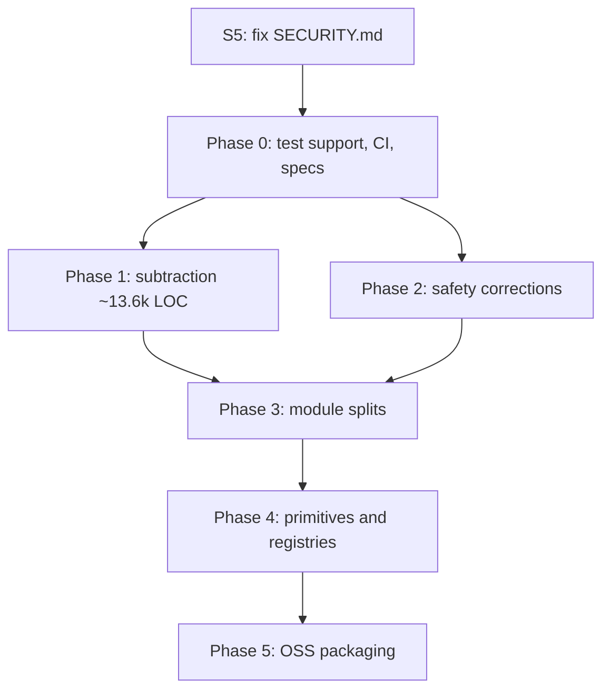

# Open-source readiness: refactor plan

Status: proposal. Nothing in here has been implemented, except the Phase 3 rows explicitly marked **landed**.

Scope: prepare VoiceOour for a public release by removing what does not earn its keep, correcting what is
wrong, and turning the load-bearing seams into primitives an outside contributor can extend. Behavior is
preserved except where a pass is explicitly labelled **BEHAVIOR CHANGE** or **MIGRATION**.

---

## 1. Baseline

Measured before any change, on a clean tree:

| Signal | Value |
|---|---|
| `swift build` | green, **0 warnings** |
| `swift test` | **406 tests / 38 suites pass in 10.2 s** |
| Swift source | 36,663 LOC across 88 files |
| Swift tests | 12,050 LOC across 33 files |
| Rust TUI | 8,634 LOC (src 5,495 / tests 841 / fixtures 461 / manifests 1,837) |
| Python ASR / bench | 3,203 / ~2,000 LOC |
| Tracked files | 463 — of which **96 are vendored `.omp/skills`**, vs 88 in `Sources/` |
| Git history | 112 commits, single author, **no secrets found in any blob**, `.env` never tracked |
| CI | none. No `.github/`, no SwiftLint/SwiftFormat/ruff/clippy config |

Zero build warnings means `-warnings-as-errors` is adoptable as a CI gate on day one, before any refactor.

**Parity anchor for every pass below:** `swift build && swift test` must stay at 406/406 unless the pass
explicitly adds or removes named tests, and each pass must say which.

---

## 2. What is actually wrong

Fifteen parallel subsystem audits produced 83 findings. Six load-bearing claims were then put through
adversarial verification (three independent refuters each, instructed to default to *refuted*). Results,
with the corrections that verification forced:

| # | Claim | Verdict | Correction from verification |
|---|---|---|---|
| C1 | Dictation can be pasted into a secure field via a same-process focus race | **Confirmed** (2 confirmed / 1 partial) | `WorkspaceTargetTracker.stillMatches` (`:22-26`) compares only PID + bundle. `PasteboardInserter.insert` is async and `await`s the permission request, so the window is not sub-millisecond. A browser auto-focusing a password input is a realistic non-manual trigger. **`docs/developer-setup.md:182` and `docs/permissions.md:20-22` promise the opposite behavior.** |
| C2 | Failed AX inspection classifies as safe `.normalText` | **Partially confirmed** (3/3 partial) | Real fail-open in `SafetyClassifier.swift:26-33`, but pasting also needs `synthPaste()`, which is `CGPreflightPostEventAccess() ‖ AXIsProcessTrusted()`. The reachable case is **AX trusted but focused-element lookup fails**, or CG post-event granted while AX is not. A fresh untrusted install is copy-only and safe. |
| C3 | Cmd-V post failure reports `.failed` after overwriting the clipboard | **Confirmed mechanically, impact downgraded** | `CGEvent.post` returns `void`; `postCommandV()` returns false *only* when `CGEvent(...)` construction returns nil. The "unstable Accessibility permission" path never reaches it — the preflight returns `.copiedOnly` first. `SessionState.displayName:44-48` already renders "Copied, paste failed". **This is naming/semantics polish, not the invariant breach it was reported as.** |
| C4 | `ControlSocketServer` chmods a path before rejecting symlinks | **Confirmed** | Real (`:62-74` before `:82-103`), gated behind the opt-in server. **Evaporates entirely under Pass D1** — no fix needed, delete the file. |
| C5 | The stop path compiles two vocabulary snapshots | **Partially confirmed** | Gated behind `settings.decoderBiasEnabled`, which **defaults false and has no UI toggle**, so default installs compile once. Target scope cannot drift (captured once at `:1446-1450`); only glossary/project edits mid-ASR can. A verifier found a **third** compile at `:1976-1989`. Most important: **`stopPathUsesOneHardCappedVocabularySnapshot` does not test its own name** — it never enables decoder bias, and `FakeASR` implements only the 2-arg overload, so it cannot observe bias phrases at all. |
| C6 | The offscreen UI harness is linked into the release binary | **Confirmed for linkage, refuted for execution** | Proven by release `output-file-map.json`, dSYM relocations, and binary strings: all ten harness objects link into the shipping executable. But `VoiceOourApp.swift:18-25` gates execution on `--ui-harness`, so it is dormant. This is binary size and attack surface, **not** a runtime defect. |

**Additionally, found during completeness review and verified directly:**

> `SECURITY.md:3` states "v0 keeps transcript and audio history out of persistent storage by design."
> `RecentSession.text` and `.rawTranscript` (`Sources/VoiceCore/RecentSessionStore.swift:91,94`) are written
> to `recent-sessions.json` (`:230`). The audio half of the sentence is true; the transcript half is false.
> The *feature* is intentional and documented in README and AGENTS.md — the security policy is simply stale.

For a privacy-positioned dictation app, a security policy that misstates data retention is the single
highest-severity open-source blocker in the repository. It is also a one-line fix.

### Structural themes (not individual bugs)

1. **Closed-world switches instead of registries.** Every extension point — ASR backend, refiner provider,
   console pane, harness scene, lint rule — is a set of exhaustive `switch` statements spread across
   4–11 files. Conforming to the protocol is not enough to add anything.
2. **Six files over 900 lines**, led by `DictationCoordinator.swift` (2,024) with 14 distinct responsibilities.
3. **No shared test-double layer.** Two files define separate fake recorders/ASRs; `ControlServiceTests`
   compiles against globals owned by `DictationCoordinatorTests`; three separate `URLProtocol` mocks exist.
4. **A 2,786-line test monolith** (`VoiceMacTests.swift`) covering 14 unrelated topics, while every other
   test file is already correctly topic-scoped.
5. **~2,400 lines of vendor glue** for Oh My Pi, leaking into `VoiceCore`, the coordinator, three UI files,
   the harness fixtures, and the benchmark.

---

## 3. Phase 0 — Build the safety net first

None of these change product behavior. All of them must land **before** Phase 3, because they are what makes
"behavior preserved" a claim rather than a hope.

| Pass | Current behavior | Structural improvement | Validation |
|---|---|---|---|
| **P0.1 Shared test support** | `DictationCoordinatorTests:1415-1519` and `ControlServiceTests:700-764` define separate fake recorders/ASRs; `CloudVocabularyFilterTests` calls helpers defined in `LLMRefinerGateTests`; three `URLProtocol` mocks | One `TestSupport` file per test target: one `FakeRecorder`, `FakeASR`, `Gate`, deterministic clock, one request-capturing `URLProtocol`. Delete the copies and the cross-file global coupling | `swift test` stays 406/406. Run targets individually to prove no file-order dependency remains |
| **P0.2 Fix the lying test** | `stopPathUsesOneHardCappedVocabularySnapshot` asserts a 100-term cap but never enables decoder bias and cannot observe bias phrases | Extend `FakeASR` to capture the `biasPhrases` argument; add a case with `decoderBiasEnabled = true` that asserts one compilation. This test **should fail** on today's code — that is the point | New assertion fails pre-fix, passes after Pass S4. Record it as a red test |
| **P0.3 Retire refactor-blocking assertions** | Tests pin Keychain query internals (`:160-166,195-219,246-267`), OMP exact settings JSON (`:523-554`), process PIDs (`:1099-1124`), FoundationModels session IDs/counters, coordinator call counts | Rewrite each to assert the observable contract instead of the mechanism. Keep every assertion that is genuinely a security or wire contract (Keychain *protection class*, OMP `--no-tools`, NDJSON framing) | Same test count; each rewritten test must still fail when its contract is deliberately broken |
| **P0.4 Characterization tests for untested modules** | No test file exists for `WorkspaceTargetTracker`, `UILint`, `SessionsPane` query/stats, `SystemAudioMuter`, `SystemPermissions` | Add characterization tests for exactly the logic Phase 3/4 will move. Not coverage for its own sake — these are the parity nets for named passes | New suites pass; each names the pass it protects |
| **P0.5 CI** | None | GitHub Actions on macOS 14: `swift build` with `-warnings-as-errors` (already clean), `swift test`, `asr` pytest, `bench` pytest, `make bench-smoke`, `make ui-snap --except os26`. Add a secret scanner. Explicitly exclude anything needing a model, mic, Accessibility grant, macOS 26, or credentials | The workflow passes on a runner with no model cache, no TCC grants, no API keys |
| **P0.6 Formatter + linter** | No config | Adopt `swift-format` with a checked-in config, plus `ruff` for both Python packages. **Run formatting as one isolated commit**, never mixed into a refactor pass | `git diff --stat` on the formatting commit touches only whitespace; `swift test` unchanged |

### Specs to write before Phase 3/4

- `docs/architecture.md` — extend with the **module boundary contract** and one diagram of the session flow.
  It currently describes the flow but not the rules that keep `VoiceCore` pure.
- `docs/extension-points.md` — **new**. The contributor-facing checklist for each of the seven things
  someone might add (Section 6). Write it against today's code *first*; the diff between that document and
  the post-Phase-4 version is the actual measure of whether Phase 4 succeeded.
- `docs/insertion-safety.md` — **new**. The complete decision path from focus to pasteboard, every branch
  that can reach `NSPasteboard`, and the fail-closed rules. This is the spec that Passes S1–S3 implement
  against, and the document a security reviewer will ask for.
- `docs/testing.md` — **new, short**. Which suite covers what, which are env-gated, what CI runs.

---

## 4. Phase 1 — Subtraction

Pure deletion. Highest value per unit of risk in the whole plan.

### D1 · Remove the Rust TUI and the control plane — ~13,600 LOC

Per your instruction, plus the finding that made it unambiguous: **an exhaustive grep proves the Rust TUI is
the control plane's only consumer.** No script, test, doc, or app path uses it otherwise.

- **Current behavior:** a default-off unix-socket NDJSON server (`control.serverEnabled`) serves read-only
  queries plus `dictate.*` and `transcribe.file` to one Rust client.
- **Improvement:** delete both sides. Removes a second language and toolchain, a second protocol to keep in
  three-way sync, a TCC-brokering socket, the `inbox/` file-transcription path, and **Claim C4 outright**.
- **Manifest:**
  - `tui/` — all 33 tracked paths; drop `tui/target/` from `.gitignore`
  - `Sources/VoiceMac/ControlSocketServer.swift` (678), `Sources/VoiceOour/ControlService.swift` (291),
    `Sources/VoiceOour/ControlTranscription.swift` (348), `Sources/VoiceCore/ControlProtocol.swift` (905)
  - `fixtures/control/` — all 22 files (342 LOC)
  - Tests: `ControlServiceTests` (1,003), `ControlSocketServerTests` (348), `ControlProtocolTests` (345).
    **Keep `ProtocolFixtureParityTests` (78) and `fixtures/protocol/`** — those are ASR, not control.
  - Integration removals: `DictationCoordinator` (~143 LOC: `controlInboxURL`, `transcribeFile`,
    `controlStatus/Settings/Diagnostics/Insights`), `VoiceOourApp` (~65), `SystemPane` Terminal Access
    section (~57), `RenderOverrides.controlServerEnabled` (8), `VoicePane:208` (1)
  - Makefile `tui-*` targets, `docs/terminal-ui.md` (363), and reference lines in README, AGENTS,
    CONTRIBUTING, `docs/architecture.md`, `docs/developer-setup.md`, `docs/design-bible.md`
- **The one trap:** `URL.controlSupportDirectory` (`ControlProtocol.swift:885-893`, 9 LOC) is used by
  `SettingsStore:27`, `RecentSessionStore:230`, `OmpRpcRefiner:45`, and `OmpOnboarding:99`. **Relocate it**
  (e.g. `AppSupportPaths.swift`) — do not delete it. Deleting it breaks settings and history.
- **Also do not touch:** unrelated `ControlState`, `VoiceOourMetrics.Control`, `KeyboardShortcuts.control`,
  and the Unicode control-character sanitizer all match a naive `control` grep.
- **Validation:** `swift build` clean; `swift test` drops the **47 declared `@Test` cases** in those three
  files (ControlService 27, ControlProtocol 18, ControlSocketServer 2) and no others; settings and session
  history still load from the existing on-disk paths (the relocation is the risk, so test it explicitly);
  4 system-pane UI goldens re-blessed via `make ui-update`.
- **Split into 3 reviewable commits:** (1) delete `tui/` + Makefile + docs, (2) relocate the path helper,
  (3) delete the Swift control plane + tests + fixtures.

### D2 · Untrack `.omp/skills` — 96 files

- **Current:** 96 vendored third-party agent-harness files carrying five separate MIT licenses from five
  authors, tracked in the product repo, unmentioned by `NOTICE`. More tracked files than `Sources/`.
- **Improvement:** `git rm -r --cached .omp/`, add to `.gitignore`. They are local tooling, not product.
- **Validation:** `git ls-files | wc -l` drops 463 → 367; build and tests unaffected.

### D3 · Small dead weight

`bench/src/bench/` is an empty directory masquerading as a second package namespace — delete it.
Move `ExperimentalAudioEngineRecorder.swift` (694 LOC, self-documented as measurement-only, constructed
only by `VoiceOourCaptureBench`) out of `VoiceMac` into the bench target. *(Migration if `VoiceMac` is
treated as a public library — see Section 7.)*

### D4 · Archive stale docs

`docs/refinement-exploration.md` (references two deleted scripts), `docs/keyword-comprehension-exploration.md`
(self-declared superseded), and the historical sections of `docs/performance-roadmap.md` (describes as
"unshipped" work that shipped, and lists defects it later says are fixed) → `docs/archive/`, each reduced
to a dated decision record. **Validation:** no active doc references a nonexistent script or contradicts code.

### D5 · Decide on `perf_probe.sh`

744 lines of shell with an embedded Perl process supervisor, unreachable from any documented workflow,
requiring a running bundled app and Accessibility. Either promote it (one Make target, documented
permissions, dry-run mode) or archive it. Recommendation: **archive**, keep a short recipe in the docs.

---

## 5. Phase 2 — Safety corrections

**These are BEHAVIOR CHANGES.** They are deliberately separated from every mechanical pass so they can be
reviewed on their merits, and each one changes a test that currently asserts the old behavior.

| Pass | Current behavior | Change | Validation |
|---|---|---|---|
| **S1 · Fail closed on focus identity** (C1) | `stillMatches` compares PID + bundle only; a same-process switch to `AXSecureTextField` after the delivery snapshot passes both checks and receives Cmd-V | Include the safety-relevant focus state in the delivery identity and re-derive it immediately before the pasteboard write and again before Cmd-V. Degrade to copy-only on any change | New test: normal→secure focus change within one PID/bundle must return `.copiedOnly` and never call `postPaste`. Existing `PasteboardSafetyTests` matrix unchanged. **Also correct `docs/developer-setup.md:182` and `docs/permissions.md:20-22`, which currently promise this already works** |
| **S2 · Fail closed on AX inspection failure** (C2) | AX lookup failure yields `(nil, nil)`; a known bundle with nil AX classifies `.normalText` | Introduce an explicit `TargetInspection` result carrying *whether inspection succeeded*. Unknown ⇒ `.unknownRisky` (already copy-only by default), not `.normalText` | New tests for trusted-but-failed lookup and untrusted process. `VoiceCoreTests:74-80` currently asserts the fail-open and must be updated deliberately |
| **S3 · Honest insertion outcomes** (C3) | Post-failure after clipboard write returns `.failed("post_event_failed")` | Return `.copiedOnly(reason:)` for every post-write path that cannot complete Cmd-V, including cancellation-after-copy. Do not clear the clipboard on those paths | Update `postEventFailureReportsFailedAfterClipboardWrite` to expect `.copiedOnly`; add a cancellation-after-copy test. **Low priority** — verification showed this branch is only reachable on `CGEvent` construction failure |
| **S4 · One vocabulary snapshot** (C5) | Up to three `VocabularyCompiler.compile()` calls per utterance (`:1668-1677`, `:1750-1756`, `:1976-1989`); bias caps at 256, refinement at 100 | Compile **one** capture-scoped `VocabularySnapshot` after finalizing audio and before ASR; thread that object through bias, cleanup, authorization, cloud filtering, refinement, and suggestions | The P0.2 red test goes green. Retain `cloudInputExcludesLocalTermsWhileFullGuardStillProtectsThem` and `backendFallbackUsesCurrentFullVocabularyText` to prove the privacy boundary is unchanged |
| **S5 · Correct the security policy** | `SECURITY.md:3` claims no transcript history is persisted; `recent-sessions.json` persists `text` and `rawTranscript` | State the truth: transcripts persist locally in a capped, user-clearable journal; audio does not persist. Add a real reporting contact — the current text offers an email address that does not exist | Read the file against `RecentSessionStore`. **Do this first; it is one paragraph and it is the worst thing in the repo for a public launch** |

---

## 6. Phase 3 — Module splits

Mechanical, behavior-preserving, individually reviewable. Every one is gated on Phase 0.

**Rule for the whole phase:** move code, do not edit it. Renames and logic changes are separate commits.

| Pass | File | Split into | Validation |
|---|---|---|---|
| **M1** | `DictationCoordinator.swift` (2,024, 14 responsibilities) | `RecordingSessionDriver` (permission, recorder, meter, auto-stop, mute FIFO) · `TranscriptProcessingPipeline` (ASR → cleanup → authorization → refine → insert → telemetry) · `RefinerConfigurationController` (identity, reachability, key source, OMP) · `RecentSessionJournal` (FIFO persistence, outcomes, termination drain). Coordinator stays the `@MainActor` façade | Named in the audit: `cancelledSessionLateResultDoesNotResurrectState`, `tempAudioRemovedOn{Success,Cancellation,Error}Path`, `focusSwitchDuringTranscriptionUsesLatestTargetForInsertion`, `firstSessionCheckpointPublishesImmediatelyAndPrecedesInsertion`, `terminationWaitsForPendingSessionCheckpoint`. **Do this as four separate commits, one per extraction** |
| **M2** | `VoiceMacTests.swift` (2,786) | 12 topic files along the boundaries already identified: `KeychainRefinerAPIKeyStoreTests` (149-433), `OmpProfileEnvironmentTests` (481-738), `OmpRpcRefinerTests` (1081-1836), `FoundationModelsRefinerTests` (1887-2072), `AppleSpeechASRTests` (2073-2245), `CaptureTelemetryTests` (2246-2461), `KeyboardShortcutsTests` (2462-2560), etc. Ranges 12-51 and 53-135 fold into the existing dedicated files | Test names and outcomes identical before/after. Preserve `.serialized` only where static/process/Keychain state requires it |
| **M3 — landed** | the 1,565-line monolithic recording-overlay file (7 subsystems) | Shipped as `RecordingOverlayView` · `RecordingOverlayController` · `RecordingOverlayPanel` · `RecordingOverlayLayout` · `RecordingOverlayButtons` · `RecordingOverlayWaveform` · `RecordingOverlayComet` · `RecordingOverlayModel` · `RecordingOverlaySessionState` · `RecordingOverlayFocusTracker`, plus the pure `RecordingOverlayPlacement` beside `RecordingOverlayPlacementTests` | `swift test --filter RecordingOverlayPlacementTests`; `make ui-snap` + `ui-snap-os26` on `overlay.*` scenes |
| **M4 — landed** | the 1,721-line `GlassKit` monolith / `DesignTokens.swift` (678) | Shipped as `GlassWindowChrome` (A11y resolver + window bridge) · `GlassSurfaces` · `GlassMarks` · the per-control style files; `DesignTokens.swift` kept the canonical tokens and moved harness instrumentation to `DesignTokenInstrumentation.swift`. No renames, no access-level changes | `make ui-snap` and `ui-snap-os26` byte-identical; `UISceneCatalogTests` |
| **M5 — landed** | the 977-line harness main file | Shipped as `UIHarnessRunner` · `UIHarnessArtifacts` · `UIHarnessManifest` + `UIHarnessReport` · `UIHarnessDiff`. CLI parsing already lived correctly in `UIHarnessContracts` | `scripts/ui_harness.sh --except os26 --stdout --no-sheet`; manifest, status counts, and exit codes unchanged |
| **M6** | `OmpRpcRefiner.swift` (1,102) / `OmpSupport.swift` (610) | Profile discovery · environment sanitization · RPC runtime actor · one-shot process invocation · termination. Keep the public entry points as the compatibility surface | Existing OMP suite, including `ompRpcLaunchUsesNoToolsAndAlwaysAskApproval` |
| **M7** | `Adapters.swift` (311) / `DictationPolicy.swift` (251) | `Adapters.swift` is a misnomer — it holds DTOs, six protocols, and a no-op muter, while the real adapters are in `VoiceMac`. Split into `CorePorts` + domain models. Move `LaunchOptions` (CLI parsing) out of `VoiceCore` into the executable layer | `DictationPolicyTests`, `VoiceCoreTests`, launch-option parsing via the bench CLI |
| **M8** | `PropertyKit.swift` (623) | `PropertyRow` + accessories · `ConfirmActionRow` · `DependentGroup`. It is a coherent family, just undiscoverable in one file | Harness atom scenes for each primitive |

---

## 7. Phase 4 — Primitives and extension points

This is the part that decides whether the open-source release attracts contributors or just spectators.

For each of the seven extension points, today's checklist versus the target. Counts are files a contributor
must edit *today*:

| Extension point | Files today | Target primitive | Preserving? |
|---|---|---|---|
| **Add an ASR backend** | **10** — `DictationPolicy.validBackend`, `DictationCoordinator.live:885-915`, `VoicePane:43-47`, `ASRModelLabel.swift:8-10`, `BenchMain` ×3, Python `make_backend`, tests, docs | `ASRBackendDescriptor` + `ASRBackendRegistry` in `Sources/VoiceMac/`, owning id, availability, recorder/ASR assembly, mute and permission capability. Consumed by the coordinator, `VoicePane`, and the bench. Mirror with a Python `BackendRegistry` | **Yes** — `Settings.asrBackend` is already a string |
| **Add a refiner provider** | **11** — closed `RefinerProvider` enum in `VoiceCore` with exhaustive metadata/readiness switches, coordinator factory + reachability + key probes, `RefinementPane` conditionals, bench mode, harness fixtures | `RefinerProviderDescriptor` + `RefinerProviderRegistry` in `VoiceMac`, with optional connection/onboarding capabilities so OMP stops leaking into `VoiceCore` and the coordinator | Wrapping the six built-ins is preserving; **first-class third-party IDs need a Codable migration** |
| **Add a settings row** | 4 | Primitives already exist and are good (`SettingsRow`, `PropertyRow`, `ConfirmActionRow`, `DependentGroup`). The gap is one duplicate: `OmpConnectionsView:34-125` hand-rolls the row — wrap it in `SettingsRow` | **Yes** |
| **Add a console pane** | **8** — the pane contract is spread across seven exhaustive switches in `ConsoleView.swift` | `ConsolePaneDescriptor` + registry owning section id, labels, symbol, metrics, and a content builder | **Yes** for today's seven panes |
| **Add a harness scene** | 5 — and `docs/ui-harness.md:101` claims "one edit", which is true only when reusing an existing fixture | `UISceneDescriptor` + `UISceneRegistry`. **Fix the doc regardless** — it currently understates the work | **Yes** |
| **Add a lint rule** | 3 — clean per-rule functions, but `UILint.evaluate:109-137` appends 12 of them by hand, and there are no rule-level tests | `UILintRule` protocol + ordered registry, plus a real `UILintTests` suite | **Yes** |
| **Add a cleanup / glossary rule** | 4–6 — logic buried in private statics, extension order implicit | `CleanupRule` + `CleanupPipeline`; `GlossaryRule` + canonicalization pipeline | **Yes** if the current stage order is retained |

### Cross-cutting primitives worth extracting

- **`AsyncGenerationGate`.** The coordinator hand-rolls five separate generation counters plus task-identity
  and state checks across ~23 guard blocks. One main-actor epoch primitive with named scopes replaces all of
  them. Proven by the existing stale-result and late-cancellation tests.
- **`InsertionSafetyPolicy`.** The safety decision currently spans `SafetyClassifier` → `WorkspaceTargetTracker`
  → `DictationCoordinator` snapshot timing → `PasteboardInserter`. One pure policy over a typed
  `TargetInspection` makes S1 and S2 natural rather than bolted on. **Do this with Phase 2, not after.**
- **NDJSON subprocess runtime.** `SidecarASRClient` and `OmpRpcRefiner` independently implement child launch,
  single reader, stderr drain, timeout, cancellation, descriptor closure, and descendant teardown.
  `ProcessLineIO` only frames lines. One runtime, two message adapters.
- **`RecentSessionQuery`.** `SessionsPane:23-41,177-215,284-315` owns filtering, calendar grouping, and
  period statistics inside a SwiftUI view. Pure, injectable, testable — move to `VoiceCore`.
- **`ActivityBarPlot`.** `HomeDayChart` and `HomeHourChart` duplicate the entire interactive bar-strip engine
  (~250 LOC): keyboard selection, pinning, normalization, accessibility children, focus overlays.

---

## 8. Phase 5 — Open-source packaging

| Item | Finding | Action |
|---|---|---|
| **Attribution** | `NOTICE` omits every `bench` dependency (`datasets`, `jiwer`, `soundfile`, `whisper-normalizer`) and, until D1, all Rust crates. Model attribution names the converted artifact but not the upstream `nvidia/parakeet-tdt-0.6b-v3` or the pinned revision | Generate a `THIRD_PARTY.md` from the lockfiles; add upstream model card + revision; state that weights download at runtime and are not bundled |
| **Contributor bootstrap** | README gives requirements and `swift build`, nothing else. No no-Xcode path, no uv install, no architecture entry point, no per-suite command table | Add bootstrap, a source-tree map pointing at `VoiceOourApp.swift` → `DictationCoordinator`, and the CI-safe vs manual suite table |
| **Security contact** | `SECURITY.md:11` offers "email the project maintainers" with no address | Real contact or a verified advisory URL |
| **Machine-specific content** | `docs/developer-setup.md:20` documents the maintainer's broken `/etc/uv/uv.toml`; `performance-roadmap.md` cites `/tmp/perfexp/` and "the user's own `recent-sessions.json`"; `AGENTS.md:9-13,203-207` hardcodes the private remote and agent push policy | Genericize. Move agent-specific rules out of the public tree |
| **Harness in the release binary** (C6) | All ten harness objects link into the shipping executable | Separate non-shipping target, or gate behind a `UI_HARNESS` configuration used only by `scripts/ui_harness.sh`. **Package migration — see Section 9** |
| **Bundle identity** | `com.voiceoour.app`, entitlements audio-input only, not sandboxed. `bundle.sh` prefers a local `voiceoour-dev` identity and falls back to ad-hoc; `sign_notarize.sh` takes credentials from the environment. **No personal identifiers baked in** | Document what a forker must change. This is already in good shape |
| **First-run network** | Verified: fresh defaults are `asrBackend=fake`, `refinerEnabled=false`. **Zero app-owned network calls on a default launch.** No telemetry, no crash SDK, no update check. Caveat: `live()` eagerly launches the sidecar via `uv run`, which can hit a package registry if the contributor never ran `uv sync` | Document the caveat; consider failing with a clear message instead |
| **Debug output** | 12 `print(` calls, all in self-test / harness / bench CLIs. Zero `NSLog`/`os_log`. Shipping stderr diagnostics only in `AppleSpeechDictationEngine:354,430` | No action needed. Noted so a reviewer does not re-derive it |
| **History hygiene** | **Clean.** 112 commits, one author, `.env` never tracked, no secret-shaped blobs (the only regex hits are literal PEM header text inside vendored `.omp` documentation) | No history rewrite required. Add a secret scanner to CI to keep it that way |

---

## 9. Split out as separate migration tasks

Explicitly **not** part of any refactor pass. Each changes an API, a build graph, or an observable contract:

1. **Harness build isolation** (C6) — changes the SwiftPM target graph and how contributors build the harness.
2. **Third-party refiner provider IDs** — `Settings.refinerProvider` is a Codable enum; accepting arbitrary
   IDs needs a persisted-settings migration plus unknown-provider handling.
3. **`TargetSafetyClass` additions** — the enum is Codable and persisted in session history; adding a case
   touches 11 files and requires a decode migration.
4. **`TermSuggestion` typed spans** — the type documents a "term + span" identity but encodes the span in an
   opaque ID string parsed at `DictationCoordinator:1285-1299`. Fixing it changes a public API.
5. **Moving `ExperimentalAudioEngineRecorder` out of `VoiceMac`** — removes public symbols from a published
   library product.
6. **`VoiceCore`/`VoiceMac` as public libraries** — `Package.swift` publishes both, but 860 public
   declarations have never been curated as an API. Decide: curate and version them, or make them internal to
   the app and publish only the executable. **Recommend deciding this before the first public tag**, because
   after release every `public` symbol is a compatibility promise.
7. **Renaming `VoiceOour` → anything** — measured blast radius: SwiftPM package/products/targets, 33 app
   source files + 7 test files, two Python packages, all scripts, plist, and docs. Critically,
   **user-data-bearing**: the Application Support directory (settings + history), Keychain service
   `com.voiceoour.app.refiner`, `UserDefaults` keys, and the bundle ID that scopes them. A rename without a
   migration orphans every existing user's settings, history, and API keys. The `vociea` remote spelling is
   documented as intentional and appears **only** in `AGENTS.md:10,204` — no code references it.
8. **Wire-contract strictness** — Swift requires `expectedModel`/`timeoutMs` where Python defaults them;
   Python `extra="forbid"` where Swift Codable ignores unknown keys. Fixture parity hides this. Aligning
   acceptance semantics is a protocol change, not a cleanup.
9. **Omp readiness preflight** — selecting OMP without installing it currently triggers probes and a warm-up
   launch that fail gracefully. Making absence fully inert changes displayed readiness.

---

## 10. Sequencing



Order rationale: **S5 first** — it is one paragraph and it is the most damaging inaccuracy in the repo.
Then Phase 0, because everything after it needs the parity net. Phase 1 before Phase 3 so nobody refactors
13,600 lines that are about to be deleted. Phase 2 before Phase 3 so the safety work lands in small files
you can still review, and so `InsertionSafetyPolicy` is designed once rather than extracted then rewritten.

Suggested first slice, independently valuable and low-risk: **S5 + D1 + D2 + P0.5**. That removes ~13,600
lines and 96 vendored files, corrects the security policy, and puts CI in front of everything else.

---

## 11. Deliberately not recommended

- **Rewriting `UIPNG.swift`.** It looks like a hand-rolled encoder; it is not. It builds a profile-free
  bitmap and delegates to `NSBitmapImageRep`, specifically so goldens do not embed the developer's display
  ICC profile. Correct as written.
- **Collapsing `AppleSpeechASRClient` into `AppleSpeechDictationEngine`.** The batch/streaming split is
  semantically real. Extract the shared analyzer setup; do not merge the classes.
- **Deleting the Keychain legacy-migration path.** It looks like dead legacy code. It is an active upgrade
  contract for existing installs, defended by four tests. Retire it in a planned release, not a cleanup.
- **A registry abstraction for everything.** `SettingsRow`/`PropertyKit`, `CleanupEngine`'s stage order, and
  `UILint`'s per-rule functions are already good designs. The problem is discoverability and one duplicate
  call site, not the architecture.
- **Chasing coverage.** The gap that matters is the *shared test-double layer* and four characterization
  suites, not a percentage.
```
